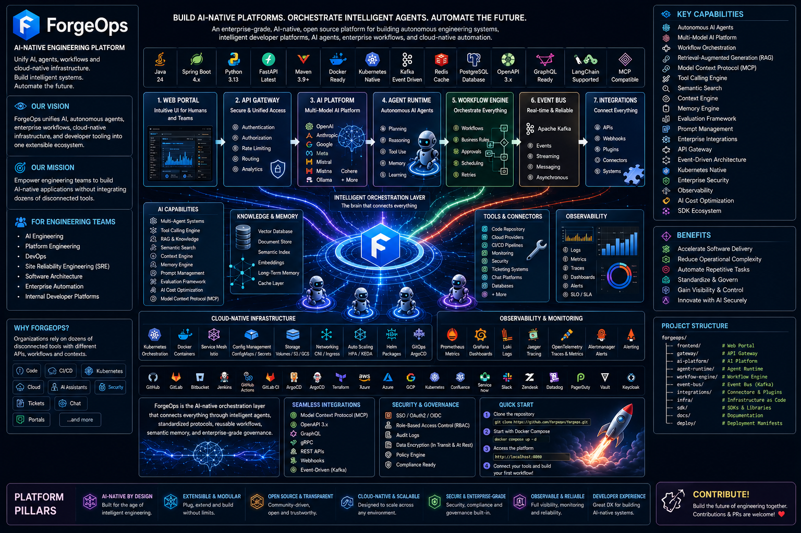
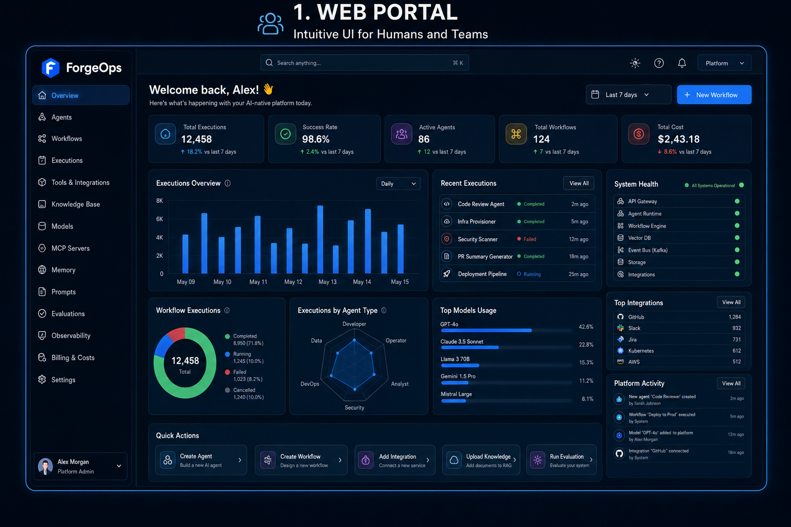
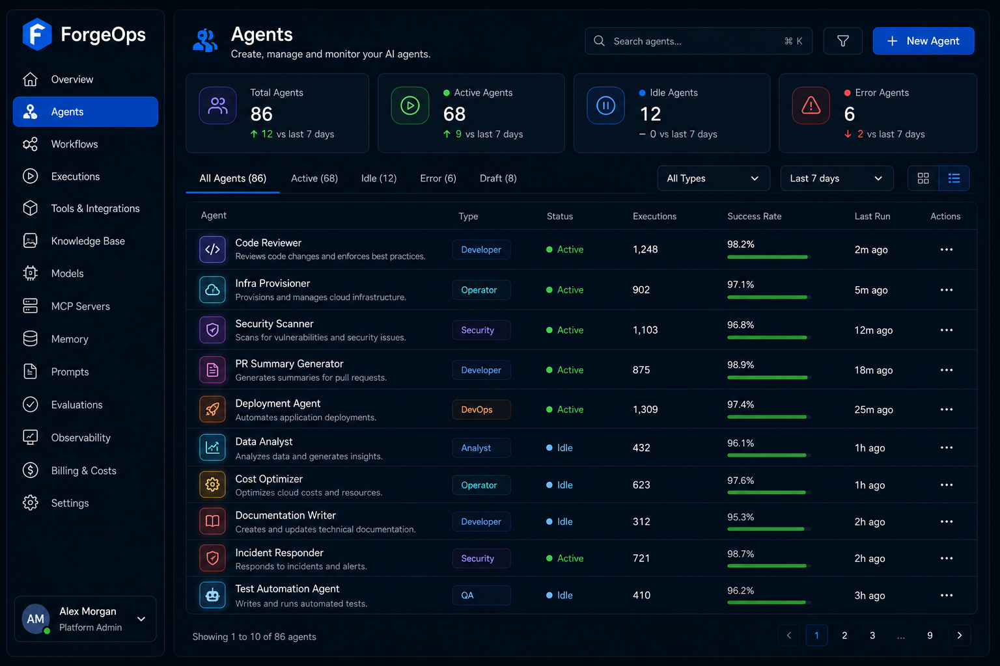
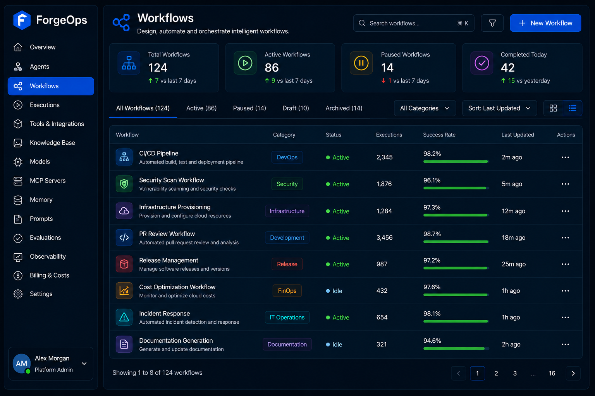
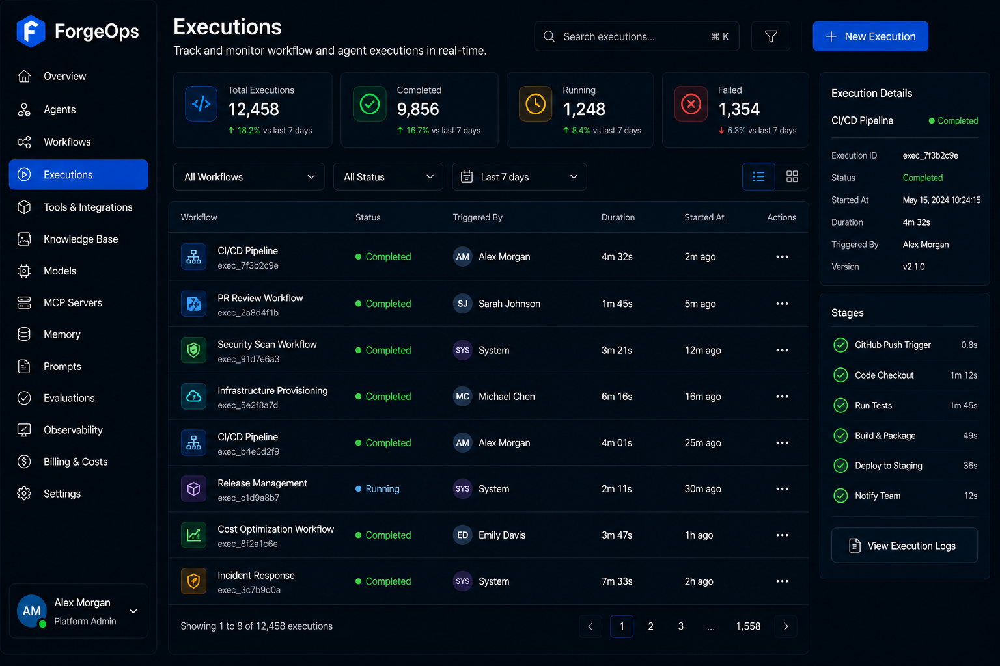

# 🚀 ForgeOps

<p align="center">
  
</p>

<h1 align="center">ForgeOps</h1>

<p align="center">
<strong>Build AI-Native Platforms. Orchestrate Intelligent Agents. Automate the Future.</strong>
</p>

<p align="center">
An enterprise-grade, AI-native, open source platform for building autonomous engineering systems, intelligent developer platforms, AI agents, enterprise workflows, and cloud-native automation.
</p>

<p align="center">

[](LICENSE)
[]()
[]()
[]()
[]()
[]()
[]()
[]()
[]()
[]()
[]()
[]()
[]()
[]()
[]()
[]()
[]()
[]()
[]()
[]()

</p>

---
# Overview








# 🌍 Vision

ForgeOps is an **AI-Native Engineering Platform** that unifies Artificial Intelligence, autonomous agents, enterprise workflows, cloud-native infrastructure, and developer tooling into a single extensible ecosystem.

Instead of acting as a simple AI assistant, ForgeOps provides a complete runtime for designing, orchestrating, executing, and governing intelligent systems capable of automating engineering processes at enterprise scale.

The platform combines modern software architecture with multi-agent systems, Model Context Protocol (MCP), Retrieval-Augmented Generation (RAG), workflow orchestration, observability, and enterprise integrations to create a unified developer experience.

---

# 🎯 Mission

Our mission is to provide a modern open source platform where engineering teams can build AI-native applications without having to integrate dozens of disconnected tools manually.

ForgeOps aims to become the central operating platform for:

* AI Engineering
* Platform Engineering
* DevOps
* Site Reliability Engineering (SRE)
* Software Architecture
* Enterprise Automation
* Intelligent Internal Developer Platforms

---

# 📚 Table of Contents

* Vision
* Mission
* Why ForgeOps
* Key Capabilities
* Platform Architecture
* Core Technologies
* Platform Pillars
* Quick Start
* Project Structure

---

# ❓ Why ForgeOps?

Modern software organizations rely on dozens of isolated platforms:

* Git Repositories
* CI/CD Pipelines
* Kubernetes
* Infrastructure as Code
* Cloud Providers
* Monitoring Platforms
* AI Assistants
* Documentation Systems
* Security Platforms
* Internal Portals
* Ticketing Systems
* Chat Platforms

Each tool has its own API, authentication model, workflow, and operational context.

ForgeOps introduces an AI-native orchestration layer capable of connecting all of these systems through intelligent agents, standardized protocols, reusable workflows, semantic memory, and enterprise-grade governance.

---

# ✨ Key Capabilities

* 🤖 Autonomous AI Agents
* 🧠 Multi-Model AI Platform
* 🔄 Workflow Orchestration
* 📚 Retrieval-Augmented Generation (RAG)
* 🧩 Model Context Protocol (MCP)
* 🛠 Tool Calling Engine
* 🔍 Semantic Search
* 🧠 Context Engine
* 💾 Memory Engine
* 📈 Evaluation Framework
* 📜 Prompt Management
* 🔌 Enterprise Integrations
* 📡 API Gateway
* ⚡ Event-Driven Architecture
* ☁ Kubernetes Native
* 🔒 Enterprise Security
* 📊 Observability
* 💰 AI Cost Optimization
* 🔗 SDK Ecosystem

---

# 🏗 High-Level Architecture

```text
                           +----------------------+
                           |      Web Portal      |
                           +----------+-----------+
                                      |
                           +----------+-----------+
                           |      API Gateway     |
                           +----------+-----------+
                                      |
        +-----------------------------+-----------------------------+
        |                             |                             |
+-------+--------+          +---------+---------+         +---------+--------+
| AI Platform    |          | Agent Runtime     |         | Workflow Engine  |
+----------------+          +-------------------+         +------------------+
        |                             |                             |
        +-----------------------------+-----------------------------+
                                      |
                          +-----------+-----------+
                          | Event Bus / Messaging |
                          +-----------+-----------+
                                      |
     +------------+------------+------------+-------------+------------+
     | Providers  | Integrations | MCP | Observability | Security |
```

---

# 💻 Core Technologies

| Category       | Technology                   |
| -------------- | ---------------------------- |
| Language       | Java 24                      |
| Framework      | Spring Boot                  |
| Build Tool     | Maven                        |
| AI Runtime     | Python 3.13                  |
| AI Frameworks  | LangChain · LangGraph        |
| Protocol       | Model Context Protocol (MCP) |
| Containers     | Docker                       |
| Orchestration  | Kubernetes                   |
| Messaging      | Apache Kafka                 |
| Database       | PostgreSQL                   |
| Cache          | Redis                        |
| APIs           | REST · GraphQL · gRPC        |
| Infrastructure | Terraform                    |
| CI/CD          | GitHub Actions               |

---

# 🚀 Platform Pillars

## 🤖 Artificial Intelligence

Unified access to multiple LLM providers including OpenAI, Anthropic, Google Gemini, Ollama, Azure OpenAI, Amazon Bedrock, Groq, OpenRouter and custom providers.

## 🧠 Autonomous Agents

Agents capable of planning, reasoning, tool calling, memory management, collaboration and autonomous execution.

## 🔄 Intelligent Workflows

Workflow engine for DevOps, Platform Engineering, Infrastructure Automation, Incident Response and Enterprise Processes.

## 🔌 Enterprise Integrations

Native integrations with GitHub, GitLab, Jira, Confluence, Slack, Microsoft Teams, Docker, Kubernetes, Terraform, Jenkins, SonarQube, Prometheus and Grafana.

## ☁ Cloud Native Platform

Designed for Kubernetes, event-driven architectures, microservices, horizontal scalability and enterprise deployments.

---

# 🚀 Quick Start

## Requirements

* Java 24
* Maven 3.9+
* Python 3.13
* Docker
* Docker Compose
* Git

## Clone

```bash
git clone https://github.com/<your-org>/forgeops.git

cd forgeops
```

## Build

```bash
mvn clean install
```

## Run Tests

```bash
mvn test
```

## Start Dependencies

```bash
docker compose up -d
```

---

# 📦 Project Structure

```text
forgeops/
│
├── apps/
├── platform/
├── packages/
├── agents/
├── workers/
├── sdk/
├── connectors/
├── libraries/
├── infrastructure/
├── deployments/
├── configs/
├── docs/
├── scripts/
├── tests/
├── tools/
├── assets/
├── benchmarks/
├── datasets/
│
├── pom.xml
├── README.md
├── ROADMAP.md
├── CHANGELOG.md
├── CONTRIBUTING.md
├── LICENSE
└── .github/
```

---

> ⭐ **If you find ForgeOps valuable, consider giving this repository a star and joining our community. Every contribution—whether code, documentation, ideas, or feedback—helps shape the future of AI-native engineering.**
---

# 🏛 Architecture Overview

ForgeOps adopts a modular, AI-native, cloud-native architecture designed to scale from local development environments to enterprise production deployments.

The platform follows a **Domain-Driven**, **Event-Driven**, and **API-First** approach, where every module has a well-defined responsibility and communicates through standardized APIs, events, and shared contracts.

Core architectural principles include:

* Modular Monolith First
* Evolution to Distributed Services
* API-First Design
* Event-Driven Communication
* AI-Native by Design
* Cloud-Native Infrastructure
* Security by Default
* Observability by Default
* Documentation as Code

Complete architecture documentation is available in:

```text
docs/architecture/
```

---

# 🧩 Platform Modules

ForgeOps is organized into independent modules that can evolve separately while remaining fully integrated.

| Module         | Description                                     |
| -------------- | ----------------------------------------------- |
| Platform       | Core platform services and runtime              |
| AI             | AI providers, models, routing and orchestration |
| Agents         | Autonomous agent runtime                        |
| MCP            | Model Context Protocol implementation           |
| Workflows      | Workflow engine and orchestration               |
| Abilities      | Reusable agent capabilities                     |
| Tools          | Tool execution framework                        |
| Integrations   | External systems connectors                     |
| API            | REST, GraphQL and gRPC services                 |
| Events         | Event-driven communication                      |
| Infrastructure | Cloud-native deployment                         |
| Security       | Authentication and authorization                |
| Observability  | Monitoring, logging and tracing                 |
| Testing        | Quality assurance                               |
| SDK            | Java, Python and TypeScript SDKs                |

---

# 🤖 Artificial Intelligence

ForgeOps was designed from the beginning as an AI-native platform rather than simply integrating AI into an existing application.

The AI Platform includes:

* Multi-provider support
* Model routing
* Prompt management
* Prompt templates
* Prompt versioning
* Context management
* Memory management
* Semantic search
* RAG pipelines
* Embeddings
* Vector databases
* Structured Outputs
* Tool Calling
* Function Calling
* AI Evaluation
* Cost Optimization
* Guardrails
* Observability

Supported providers include:

* OpenAI
* Anthropic
* Google Gemini
* Ollama
* Azure OpenAI
* Amazon Bedrock
* Groq
* OpenRouter
* Custom Providers

Documentation:

```text
docs/ai/
```

---

# 🧠 Autonomous Agents

The Agent Runtime is responsible for executing intelligent autonomous agents capable of reasoning, planning, making decisions, collaborating with other agents, and interacting with external systems.

Agent capabilities include:

* Autonomous Planning
* Multi-step Reasoning
* Tool Calling
* Workflow Execution
* Memory Management
* Context Sharing
* Self Evaluation
* Multi-Agent Collaboration
* Task Delegation
* Event Processing

Documentation:

```text
docs/agents/
```

---

# 🔄 Workflow Engine

The Workflow Engine orchestrates complex automation pipelines.

Typical use cases:

* CI/CD
* DevOps Automation
* Infrastructure Provisioning
* Incident Response
* Platform Engineering
* Documentation Generation
* AI Automation
* Business Automation

Features include:

* Workflow Templates
* Visual Workflow Definitions
* Scheduling
* Retry Policies
* Rollbacks
* Compensation
* Parallel Execution
* Event Triggers
* Human Approval Steps

Documentation:

```text
docs/workflows/
```

---

# 🔌 Model Context Protocol (MCP)

ForgeOps fully embraces the Model Context Protocol to enable standardized communication between AI models and external systems.

Supported concepts:

* MCP Servers
* MCP Clients
* Resources
* Prompts
* Tools
* Sessions
* Authentication
* Authorization
* Discovery
* Routing

Documentation:

```text
docs/mcp/
```

---

# 🔧 Enterprise Integrations

ForgeOps provides first-class integrations with engineering and enterprise ecosystems.

Current integration targets include:

### Source Control

* GitHub
* GitLab
* Bitbucket

### Project Management

* Jira
* Azure DevOps
* Linear

### Documentation

* Confluence
* Notion

### Communication

* Slack
* Microsoft Teams
* Discord

### DevOps

* Jenkins
* GitHub Actions
* ArgoCD

### Infrastructure

* Docker
* Kubernetes
* Terraform
* Helm

### Cloud

* AWS
* Azure
* Google Cloud

### Monitoring

* Prometheus
* Grafana
* Loki
* Tempo
* Jaeger

Documentation:

```text
docs/integrations/
```

---

# 📡 API Platform

ForgeOps exposes a unified API layer for internal modules, SDKs, web applications, integrations, and third-party systems.

Supported technologies:

* REST
* GraphQL
* gRPC
* WebSocket
* Server-Sent Events (SSE)

Features:

* OpenAPI
* Authentication
* Authorization
* Versioning
* Pagination
* Rate Limiting
* API Gateway
* API Documentation

Documentation:

```text
docs/api/
```

---

# 📦 SDK Ecosystem

ForgeOps provides official SDKs to simplify integration with the platform.

Current SDK roadmap:

| SDK        | Status  |
| ---------- | ------- |
| Java       | Planned |
| Python     | Planned |
| TypeScript | Planned |
| Go         | Planned |

SDKs will provide:

* Authentication
* API Clients
* Workflow APIs
* Agent APIs
* Tool APIs
* Event APIs
* Streaming Support
* Type-safe Models

---

# 📚 Documentation

Documentation is treated as a first-class component of the project.

Every subsystem is documented before implementation.

```
docs/

├── architecture/
├── platform/
├── ai/
├── agents/
├── mcp/
├── workflows/
├── abilities/
├── tools/
├── integrations/
├── api/
├── events/
├── infrastructure/
├── deployment/
├── security/
├── observability/
├── testing/
├── development/
├── specifications/
├── modules/
├── reference/
└── roadmap/
```

Each document serves as both technical reference and implementation guide.

---

# 🎯 Design Principles

ForgeOps follows a clear set of engineering principles.

* Clean Architecture
* Domain-Driven Design
* SOLID Principles
* API-First
* Cloud-Native
* Event-Driven
* AI-Native
* Security by Design
* Observability by Default
* Documentation as Code
* Convention over Configuration
* Open Standards First
* Extensibility
* Backward Compatibility
* Developer Experience First

---

# 🌍 Built for the Global Community

ForgeOps is an open source project intended for developers, engineering teams, startups, enterprises, universities, and researchers around the world.

We welcome contributions in areas such as:

* Software Engineering
* Artificial Intelligence
* Platform Engineering
* Cloud Computing
* Documentation
* Security
* Developer Experience
* Testing
* Performance
* Integrations
* Community Building

Together we aim to build one of the most complete open source AI-native engineering platforms available.

---

# 🏗 Technology Stack

ForgeOps combines modern enterprise software engineering with state-of-the-art AI technologies to provide a scalable, extensible, and production-ready platform.

## Backend

| Technology        | Purpose                       |
| ----------------- | ----------------------------- |
| Java 24           | Main Programming Language     |
| Spring Boot       | Enterprise Framework          |
| Spring AI         | AI Integration                |
| Spring Security   | Security                      |
| Spring Data JPA   | Data Access                   |
| Spring Modulith   | Modular Architecture          |
| Spring Validation | Validation                    |
| Spring Actuator   | Monitoring                    |
| Maven             | Dependency Management & Build |
| JUnit 5           | Testing                       |
| Mockito           | Unit Testing                  |
| Testcontainers    | Integration Testing           |
| MapStruct         | Object Mapping                |
| Lombok            | Boilerplate Reduction         |

---

## Artificial Intelligence

| Technology | Purpose                |
| ---------- | ---------------------- |
| LangChain  | LLM Integration        |
| LangGraph  | Agent Workflows        |
| MCP        | Model Context Protocol |
| OpenAI     | LLM Provider           |
| Anthropic  | LLM Provider           |
| Gemini     | LLM Provider           |
| Ollama     | Local Models           |
| OpenRouter | Provider Gateway       |

---

## Infrastructure

| Technology     | Purpose                 |
| -------------- | ----------------------- |
| Docker         | Containers              |
| Kubernetes     | Container Orchestration |
| Helm           | Package Management      |
| Terraform      | Infrastructure as Code  |
| GitHub Actions | CI/CD                   |
| NGINX          | Reverse Proxy           |
| Traefik        | Ingress Controller      |

---

## Data Layer

| Technology | Purpose          |
| ---------- | ---------------- |
| PostgreSQL | Primary Database |
| Redis      | Cache            |
| Kafka      | Event Streaming  |
| MinIO      | Object Storage   |
| pgvector   | Vector Search    |

---

## Observability

| Technology    | Purpose    |
| ------------- | ---------- |
| Prometheus    | Metrics    |
| Grafana       | Dashboards |
| Loki          | Logs       |
| Tempo         | Traces     |
| OpenTelemetry | Telemetry  |

---

# 📂 Monorepo Structure

ForgeOps follows a modular monorepo architecture.

```text
forgeops/
│
├── apps/                  # Applications
├── platform/              # Platform modules
├── packages/              # Shared packages
├── agents/                # Agent implementations
├── workers/               # Python workers
├── sdk/                   # Official SDKs
├── connectors/            # Enterprise integrations
├── infrastructure/        # Infrastructure as Code
├── deployments/           # Kubernetes & Docker
├── configs/               # Configuration files
├── docs/                  # Technical documentation
├── scripts/               # Automation scripts
├── tests/                 # Testing utilities
├── tools/                 # Development tools
├── assets/                # Images and resources
├── benchmarks/            # Performance tests
└── datasets/              # AI datasets
```

---

# 📖 Documentation Philosophy

Documentation is an integral part of ForgeOps.

Every module is documented before implementation.

Every document is intended to answer the following questions:

* Why does this module exist?
* What problem does it solve?
* How does it work?
* Which APIs does it expose?
* Which events does it publish?
* Which services depend on it?
* How should it be tested?
* How should it evolve?

This approach ensures that documentation remains a reliable implementation guide throughout the project lifecycle.

---

# 📋 Documentation Structure

```text
docs/

architecture/
platform/
ai/
agents/
mcp/
workflows/
abilities/
tools/
integrations/
api/
events/
deployment/
infrastructure/
security/
observability/
testing/
operations/
development/
modules/
specifications/
reference/
roadmap/
templates/
diagrams/
assets/
```

---

# 🚦 Development Workflow

The project follows a structured Git workflow to keep development organized.

## Main Branches

| Branch  | Purpose                      |
| ------- | ---------------------------- |
| main    | Stable production-ready code |
| develop | Main development branch      |

---

## Feature Branches

Every new feature starts from `develop`.

Examples:

```text
feature/agent-runtime
feature/context-engine
feature/memory-engine
feature/rag-engine
feature/model-router
feature/workflow-engine
feature/mcp-server
feature/github-connector
feature/admin-ui
feature/api-gateway
```

---

## Release Branches

```text
release/1.0.0
release/1.1.0
release/2.0.0
```

---

## Hotfix Branches

```text
hotfix/1.0.1
```

---

# 🔖 Versioning

ForgeOps follows **Semantic Versioning (SemVer)**.

```text
MAJOR.MINOR.PATCH
```

Example:

```text
1.4.2
```

Where:

* **MAJOR** → Breaking changes
* **MINOR** → New features
* **PATCH** → Bug fixes

---

# 🧪 Quality Standards

Every contribution should maintain the project's quality standards.

## Static Analysis

* Checkstyle
* SpotBugs
* PMD

## Formatting

* Spotless
* EditorConfig

## Security

* OWASP Dependency Check
* CodeQL
* Dependabot

## Testing

* Unit Tests
* Integration Tests
* Contract Tests
* End-to-End Tests

## Coverage

Target:

* Minimum 80% overall coverage
* Critical modules above 90%

---

# ⚙️ Build System

ForgeOps uses **Apache Maven** as its official build system.

Typical commands:

```bash
mvn clean install

mvn test

mvn verify

mvn spring-boot:run
```

Future automation will include:

* Multi-module builds
* Docker image generation
* Native image support
* Automated releases
* Dependency updates
* Documentation generation

---

# 🔒 Security First

Security is a foundational principle.

The platform includes:

* Authentication
* Authorization
* RBAC
* OAuth2
* OpenID Connect
* JWT
* Secret Management
* Audit Logs
* Encryption
* Secure Defaults

Every module is expected to follow secure-by-design practices.

---

# 📊 Observability by Default

All platform services are designed to expose telemetry from day one.

Supported capabilities:

* Metrics
* Distributed Tracing
* Structured Logging
* Health Checks
* Dashboards
* Alerts
* Performance Metrics
* AI Usage Metrics
* Cost Metrics
* Agent Execution Metrics

Observability is treated as a built-in capability rather than an optional add-on.

---

# 🗺 Roadmap

ForgeOps is developed incrementally with a strong focus on stability, extensibility, and enterprise readiness.

Our roadmap is divided into major milestones that progressively introduce new platform capabilities.

| Version | Milestone               | Status         |
| ------- | ----------------------- | -------------- |
| 0.1     | Repository Foundation   | 🚧 In Progress |
| 0.2     | Platform Core           | ⏳ Planned      |
| 0.3     | AI Platform             | ⏳ Planned      |
| 0.4     | Agent Runtime           | ⏳ Planned      |
| 0.5     | Workflow Engine         | ⏳ Planned      |
| 0.6     | MCP Support             | ⏳ Planned      |
| 0.7     | Enterprise Integrations | ⏳ Planned      |
| 0.8     | Administration Portal   | ⏳ Planned      |
| 0.9     | SDK Ecosystem           | ⏳ Planned      |
| 1.0     | First Stable Release    | 🎯 Target      |

Complete roadmap:

```text
ROADMAP.md
docs/roadmap/
```

---

# 🚀 Planned Features

ForgeOps is designed as a long-term platform. Planned capabilities include:

### Artificial Intelligence

* Multi-provider orchestration
* Prompt management
* Prompt versioning
* Context Engine
* Memory Engine
* Semantic Search
* Retrieval-Augmented Generation (RAG)
* AI Evaluations
* Model Routing
* Token Optimization
* Cost Management
* Fine-Tuning Support
* AI Guardrails

---

### Autonomous Agents

* Agent Runtime
* Agent Registry
* Multi-Agent Collaboration
* Autonomous Planning
* Long-Term Memory
* Reflection
* Goal Management
* Human-in-the-Loop
* Scheduling
* Task Delegation

---

### Workflow Automation

* Workflow Designer
* Workflow Templates
* Parallel Execution
* Conditional Execution
* Compensation
* Rollback
* Human Approval
* Scheduled Workflows
* Event-Based Triggers

---

### Enterprise Platform

* RBAC
* Organizations
* Teams
* Multi-Tenant Support
* Audit Logs
* API Keys
* Usage Analytics
* Administration Portal
* Marketplace
* Plugin System

---

# 📈 Performance Goals

ForgeOps is designed to support production workloads.

Target objectives include:

| Metric                    | Goal  |
| ------------------------- | ----- |
| API Availability          | 99.9% |
| Horizontal Scalability    | Yes   |
| High Availability         | Yes   |
| Zero-Downtime Deployments | Yes   |
| Distributed Architecture  | Yes   |
| Kubernetes Native         | Yes   |
| Multi-Cloud               | Yes   |
| Event-Driven              | Yes   |

Performance benchmarking will be continuously improved as the platform evolves.

---

# 🔬 Testing Strategy

Quality is a core principle of ForgeOps.

Testing is performed at multiple levels:

* Unit Tests
* Integration Tests
* Contract Tests
* End-to-End Tests
* Performance Tests
* Load Tests
* Stress Tests
* Security Tests
* AI Evaluation Tests

Testing technologies include:

* JUnit 5
* Mockito
* Testcontainers
* Spring Boot Test
* REST Assured
* Playwright
* Gatling
* OWASP ZAP

Documentation:

```text
docs/testing/
```

---

# 🤝 Contributing

Contributions are welcome from developers, architects, AI engineers, platform engineers, DevOps engineers, SREs, technical writers, designers, and anyone interested in building the future of AI-native engineering.

There are many ways to contribute:

* Report bugs
* Suggest new features
* Improve documentation
* Submit Pull Requests
* Review code
* Improve performance
* Enhance security
* Create integrations
* Develop SDKs
* Build examples and tutorials

Please read:

```text
CONTRIBUTING.md
CODE_OF_CONDUCT.md
SECURITY.md
```

before submitting contributions.

---

# 💬 Community

The ForgeOps community is built around openness, collaboration, and continuous learning.

Community resources include:

* GitHub Issues
* GitHub Discussions
* Pull Requests
* Documentation
* Architecture Decision Records (ADRs)
* Roadmaps
* Technical Design Documents

As the project grows, additional communication channels may be introduced.

---

# ❓ Frequently Asked Questions

## Is ForgeOps another AI chatbot?

No.

ForgeOps is an engineering platform that provides the infrastructure required to build AI-native systems, autonomous agents, workflows, integrations, and enterprise automation.

---

## Is ForgeOps production-ready?

The project is currently under active development.

The roadmap targets enterprise-grade production readiness through incremental releases.

---

## Which programming languages are used?

Primary languages:

* Java
* Python

Additional SDKs:

* TypeScript
* Go

---

## Does ForgeOps support multiple LLM providers?

Yes.

The platform is designed around a provider abstraction layer supporting multiple commercial and open-source models.

---

## Does ForgeOps support local AI models?

Yes.

Support for Ollama and other self-hosted providers is part of the platform architecture.

---

## Is ForgeOps cloud-native?

Yes.

The platform is designed for Kubernetes, containerized deployments, and cloud-native environments from the beginning.

---

# 🙏 Acknowledgements

ForgeOps is inspired by the outstanding work of the open source community and by technologies that continue to shape modern software engineering.

Special inspiration comes from projects such as:

* Spring
* Kubernetes
* Backstage
* OpenTelemetry
* LangChain
* LangGraph
* Apache Kafka
* Docker
* Terraform
* PostgreSQL

We are grateful to every contributor and maintainer who helps advance the open source ecosystem.

---

# 📄 License

ForgeOps is released under the **MIT License**.

See the complete license text in:

```text
LICENSE
```

---

# ⭐ Support the Project

If ForgeOps helps you or your organization, you can support the project by:

* ⭐ Starring the repository
* 🍴 Forking the project
* 🐛 Reporting issues
* 💡 Suggesting improvements
* 📖 Improving documentation
* 🔧 Contributing code
* 📢 Sharing the project with your network

Every contribution, no matter how small, helps build a stronger open source ecosystem.

---

# ❤️ Join Us

ForgeOps is more than a software project.

It is an initiative to create an open, extensible, enterprise-grade platform for AI-native engineering.

Whether you are a software developer, platform engineer, DevOps engineer, AI engineer, architect, researcher, student, or open source enthusiast, you are invited to participate in shaping its future.

Together, we can build one of the most complete open source AI-native engineering platforms for the global community.

---

<p align="center">

**⭐ If you like ForgeOps, give this repository a Star.**

**🚀 Build AI-Native Platforms. Orchestrate Intelligent Agents. Automate the Future.**

Made with ❤️ by the ForgeOps Community.

</p>
