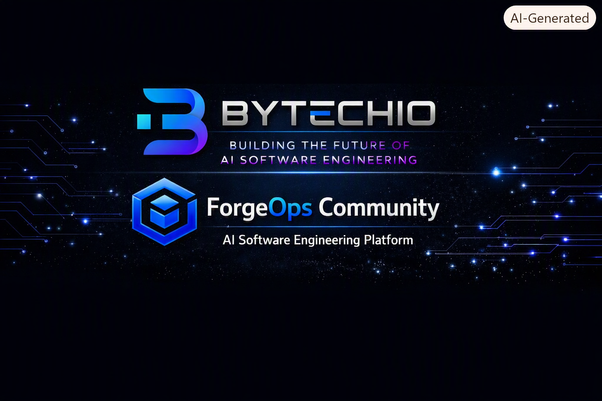
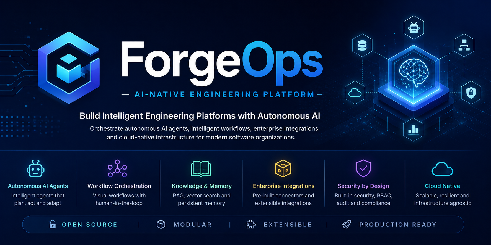

<a name="top"></a>

<p align="center">



</p>

<br>

<p align="center">



</p>


<h1 align="center">

ForgeOps Community

</h1>


<h3 align="center">

AI-Native Software Engineering Platform

</h3>


<p align="center">

Building the foundation for a future AI-Native Software Engineering Platform
designed to explore autonomous AI engineering capabilities.

</p>


<br>


<div align="center">


</div>


<br>


<div align="center">

| 🌐 Website | 📚 Documentation | 💬 Community | 🐛 Issues |
|:----------:|:---------------:|:------------:|:---------:|
| Coming Soon | Foundation Phase | Open Source | GitHub |

</div>


---

<a name="navigation"></a>

# 🧭 Navigation


| Section | Link |
|---|---|
| 🚀 Introduction | [Introduction](#introduction) |
| 🚧 Project Status | [Project Status](#project-status) |
| 🌌 Vision | [Vision](#vision) |
| ❓ Why ForgeOps? | [Why ForgeOps](#why-forgeops) |
| 🎯 MVP 1 Goals | [MVP 1 Goals](#mvp-1-goals) |
| ⚡ Core Capabilities | [Core Capabilities](#core-capabilities) |
| 🏗 Architecture | [Architecture Overview](#architecture-overview) |
| 🛠 Technology | [Technology Direction](#technology-direction) |
| 📚 Documentation | [Documentation Foundation](#documentation-foundation) |
| 🚀 Roadmap | [Roadmap](#roadmap) |
| 🤝 Contributing | [Contributing](#contributing) |
| 📜 License | [License](#license) |
| 💙 Bytechio | [About Bytechio](#about-bytechio) |


⬆️ [Back to Top](#top)


---


<a name="introduction"></a>

# 🚀 Introduction


ForgeOps Community is an open-source initiative focused on exploring and
building the foundations of an **AI-Native Software Engineering Platform**.


The project investigates how future AI engineering systems can collaborate
with software engineers to support activities such as understanding,
analyzing, documenting and evolving complex software systems.


ForgeOps is currently in the **Foundation Phase** and is being developed
from zero toward its first MVP release.


The current development focus includes:


- 🏗 Platform architecture foundations
- 📚 Documentation standards
- 🤖 AI engineering concepts
- 🔍 Software understanding models
- ⚙️ Technical architecture definition
- 🌎 Open-source collaboration practices


The objective is to establish the foundation required for future AI-native
engineering capabilities.


⬆️ [Back to Top](#top)

🧭 [Back to Navigation](#navigation)


---


<a name="project-status"></a>

# 🚧 Project Status


ForgeOps is currently under active development.


The platform is **not yet implemented as a complete system**.
The current phase focuses on creating the architecture, documentation
foundation and engineering standards required for future implementation.


The main milestone is **MVP 1**, which represents the first evolution step
toward the ForgeOps vision.


---

## 📊 Current Development Stage


| Area | Status |
|---|:---:|
| 🏗 Platform Architecture | 🚧 In Progress |
| 📚 Documentation Foundation | ✅ Completed |
| 📂 Repository Structure | ✅ Completed |
| 📝 Engineering Standards | 🚧 In Progress |
| 🎯 MVP 1 Definition | 🚧 In Progress |
| 🤖 AI Agent Runtime | 📅 Planned |
| 🧠 Knowledge Engine | 📅 Planned |
| 🔄 Workflow Automation | 📅 Future |
| ☁️ Cloud Native Platform | 📅 Future |


---


## ✅ Completed Foundations


The project has established the initial engineering foundation:


- Documentation architecture
- Repository organization
- Engineering conventions
- Markdown standards
- Architecture documentation model
- Contribution guidelines
- Open-source repository structure


---


## 🚧 Current Focus


The MVP 1 development cycle focuses on:


- Defining the initial platform architecture
- Establishing engineering standards
- Creating documentation models
- Designing future AI capabilities
- Preparing the foundation for future implementations


---


## 📅 Future Evolution


Future development phases may explore:


- AI Software Engineers
- Multi-agent collaboration
- Repository intelligence
- Engineering workflow automation
- AI-assisted documentation
- Knowledge management systems
- Cloud-native execution environments


ForgeOps will evolve incrementally through engineering experimentation,
open-source collaboration and continuous improvement.


⬆️ [Back to Top](#top)

🧭 [Back to Navigation](#navigation)

---


<a name="vision"></a>


<a name="vision"></a>

# 🌌 Vision


ForgeOps explores a future where Artificial Intelligence becomes a
collaborative partner in software engineering.


The long-term vision is to create an ecosystem where AI systems can help
engineers understand, analyze, document and evolve complex software systems
throughout their lifecycle.


ForgeOps is not a finished platform yet.

The project is currently establishing the engineering foundations required
to gradually build this future vision.


---


<div align="center">

## Building the Future of AI Software Engineering

</div>


The ForgeOps vision combines four fundamental pillars:


<table>

<tr>

<td width="25%" align="center">


## 🤖

### Artificial Intelligence


Future AI capabilities designed to support engineering activities.


</td>


<td width="25%" align="center">


## 📚

### Engineering Knowledge


Structured information that can be understood by humans and future AI systems.


</td>


<td width="25%" align="center">


## 🏗️

### Software Architecture


Strong engineering principles for building reliable and scalable systems.


</td>


<td width="25%" align="center">


## 🌎

### Open Collaboration


Community-driven evolution through open-source development.


</td>


</tr>

</table>


---


## Long-Term Vision


The future evolution of ForgeOps may support engineering activities such as:


```text
Software Idea
      |
      ▼
Architecture Design
      |
      ▼
Development Support
      |
      ▼
Testing Assistance
      |
      ▼
Documentation Generation
      |
      ▼
Deployment Support
      |
      ▼
Continuous Evolution


<a name="core-capabilities"></a>

# ⚡ Core Capabilities


ForgeOps is being designed around foundational capabilities required for a
future AI-Native Software Engineering Platform.


During MVP 1, the focus is not delivering the complete platform, but creating
the engineering foundations that will enable future capabilities.


---


# 🏗 Foundation Capabilities


<table>

<tr>


<td width="25%" align="center">


## 📚

### Engineering Knowledge


Creation of structured documentation and knowledge models that support
engineers today and future AI systems.


</td>


<td width="25%" align="center">


## 🤖

### AI Engineering Foundations


Research and preparation for future AI-assisted engineering capabilities.


</td>


<td width="25%" align="center">


## 🏛️

### Architecture Intelligence


Architecture models, diagrams and standards that improve software understanding.


</td>


<td width="25%" align="center">


## ⚙️

### Engineering Automation


Future automation concepts designed to reduce repetitive engineering work.


</td>


</tr>

</table>


---


# 🌱 Future Capabilities


Future development phases may explore:


| Capability | Purpose |
|---|---|
| 🤖 AI Software Engineers | Assist engineers with software activities |
| 🔍 Repository Intelligence | Understand and analyze software repositories |
| 📚 Knowledge Systems | Organize and retrieve engineering knowledge |
| 🔄 Workflow Automation | Support engineering processes |
| 🏗 Architecture Assistance | Help analyze software architecture |
| 📝 Documentation Intelligence | Generate and maintain documentation |


These capabilities represent the future direction of ForgeOps and will evolve
incrementally as the platform matures.


⬆️ [Back to Top](#top)

⬆️ [Navigation](#navigation)

---


<a name="core-capabilities"></a>

# ⚡ Core Capabilities


ForgeOps is being designed around foundational capabilities required for a
future AI-Native Software Engineering Platform.


During MVP 1, the focus is not delivering the complete platform, but creating
the engineering foundations that will enable future capabilities.


---


# 🏗 Foundation Capabilities


<table>

<tr>


<td width="25%" align="center">


## 📚

### Engineering Knowledge


Creation of structured documentation and knowledge models that support
engineers today and future AI systems.


</td>


<td width="25%" align="center">


## 🤖

### AI Engineering Foundations


Research and preparation for future AI-assisted engineering capabilities.


</td>


<td width="25%" align="center">


## 🏛️

### Architecture Intelligence


Architecture models, diagrams and standards that improve software understanding.


</td>


<td width="25%" align="center">


## ⚙️

### Engineering Automation


Future automation concepts designed to reduce repetitive engineering work.


</td>


</tr>

</table>


---


# 🌱 Future Capabilities


Future development phases may explore:


| Capability | Purpose |
|---|---|
| 🤖 AI Software Engineers | Assist engineers with software activities |
| 🔍 Repository Intelligence | Understand and analyze software repositories |
| 📚 Knowledge Systems | Organize and retrieve engineering knowledge |
| 🔄 Workflow Automation | Support engineering processes |
| 🏗 Architecture Assistance | Help analyze software architecture |
| 📝 Documentation Intelligence | Generate and maintain documentation |


These capabilities represent the future direction of ForgeOps and will evolve
incrementally as the platform matures.


⬆️ [Back to Top](#top)

⬆️ [Navigation](#navigation)

---

<a name="roadmap"></a>

# 🚀 Roadmap


ForgeOps is being developed incrementally.


The roadmap represents the evolution of the project from engineering
foundations toward future AI-native software engineering capabilities.


---


# 🏗 Phase 1 — Foundation (Current)


**Status: In Progress 🚧**


Current focus:


- ✅ Repository structure
- ✅ Documentation foundation
- ✅ Engineering standards
- ✅ Contribution model
- 🚧 Architecture definition
- 🚧 MVP 1 development planning


Objective:


Establish the technical and organizational foundation required for future
platform development.


---


# 🤖 Phase 2 — AI Engineering Foundations


**Status: Planned 📅**


Future focus:


- AI agent concepts
- Engineering knowledge models
- Repository understanding experiments
- AI-assisted engineering workflows


Objective:


Explore how AI technologies can support software engineering activities.


---


# ⚙️ Phase 3 — Platform Evolution


**Status: Future 📅**


Potential focus:


- AI execution environments
- Workflow orchestration
- Knowledge systems
- Platform integrations
- Cloud-native capabilities


Objective:


Evolve ForgeOps toward a complete AI-native engineering ecosystem.


---


# 🌎 Phase 4 — Open Source Ecosystem


**Status: Future 📅**


Potential focus:


- Community growth
- External contributors
- Ecosystem integrations
- Shared engineering practices


Objective:


Build an open platform together with the community.


---


<div align="center">

### Build the foundation.

### Evolve the intelligence.

### Grow the ecosystem.

</div>


⬆️ [Back to Top](#top)

⬆️ [Navigation](#navigation)

---
