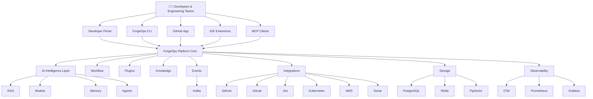
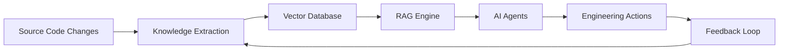
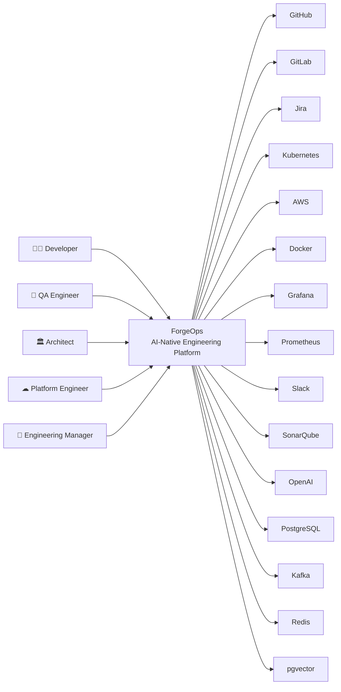
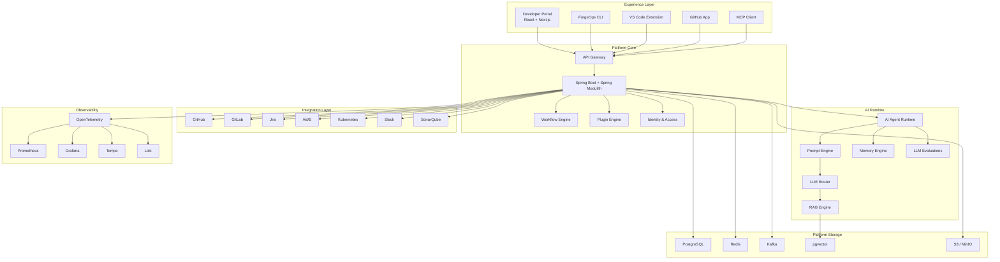
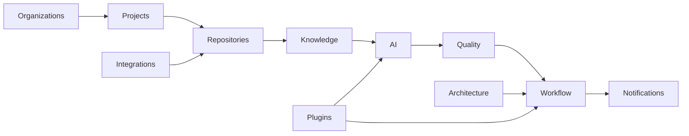

<div align="center">


# ForgeOps

### AI-Native Engineering Platform for Modern Software Teams

<p align="center">

**Build Better Software. Automate Everything. Engineer with Intelligence.**

</p>

<p align="center">

ForgeOps is an open-source AI-native engineering platform designed to transform the entire software development lifecycle by combining Platform Engineering, Developer Experience (DevEx), Quality Engineering, AI Agents, LLMOps, Observability, and Cloud-Native technologies into a single extensible ecosystem.

</p>

---

[](#)
[](#)
[](#)
[](#)
[](#)
[](#)
[](#)
[](#)
[](#)

[](#)
[](#)
[](#)
[](#)
[](#)
[](#)

[](#)
[](#)
[](#)
[](#)
[](#)

[](#)
[](#)
[](#)
[](#)
[](#)
[](#)
[](#)
[](#)
[](#)

---

### 🚀 Engineering Intelligence for the Entire Software Development Lifecycle

From code review to deployment, from documentation to observability, from AI agents to platform engineering—ForgeOps helps engineering teams build, validate, deploy, monitor, and continuously improve software using intelligent automation.

---

### ✨ Core Pillars

| | |
|:---|:---|
| 🤖 | AI Agents |
| 🧠 | LLMOps |
| 🔍 | Retrieval-Augmented Generation (RAG) |
| 🛠 | Platform Engineering |
| 💻 | Developer Experience (DevEx) |
| ✅ | Quality Engineering |
| 🔬 | Intelligent Test Generation |
| 🧪 | AI-Powered Regression Analysis |
| 📊 | Observability |
| 📈 | Engineering Analytics |
| ☁️ | Cloud-Native Architecture |
| ☸️ | Kubernetes |
| 🔐 | Security by Design |
| ⚡ | Event-Driven Architecture |
| 🔌 | Plugin Ecosystem |
| 📦 | Modular Monolith → Microservices |
| 🌐 | Open Standards |
| 🚀 | Enterprise Ready |

---

### 🌎 Built for Everyone

ForgeOps is designed for:

**Software Engineers • Platform Engineers • DevOps Engineers • SREs • QA Engineers • AI Engineers • Technical Leaders • Architects • Open Source Contributors • Engineering Organizations**

---

### 💡 Vision

> **ForgeOps aims to become the leading open-source AI-native Engineering Platform, enabling organizations worldwide to build, test, secure, deploy, and operate software through intelligent automation, modern platform engineering, and AI-powered developer experiences.**

---

<p align="center">

**"Software Engineering is evolving. ForgeOps is designed for what's next."**

</p>

</div>

---

<p align="center">

# The Open Source AI-Native Engineering Platform

### Transforming the Software Development Lifecycle with Artificial Intelligence

</p>

---

```text
                                          ┌─────────────────────────────────────────────┐
                                          │                 Developers                  │
                                          │                                             │
                                          │  Backend • Frontend • Mobile • Platform     │
                                          └──────────────────┬──────────────────────────┘
                                                             │
                                                             ▼
                           ┌──────────────────────────────────────────────────────────────┐
                           │                 Source Code Providers                        │
                           │                                                              │
                           │  GitHub • GitLab • Bitbucket • Azure DevOps • Local Git     │
                           └───────────────────────┬──────────────────────────────────────┘
                                                   │
                                                   ▼
┌─────────────────────────────────────────────────────────────────────────────────────────────────────────────┐
│                                           ForgeOps Platform                                                 │
├─────────────────────────────────────────────────────────────────────────────────────────────────────────────┤
│                                                                                                             │
│  AI Agents │ Platform Engineering │ Quality Engineering │ DevEx │ Security │ Observability │ Analytics      │
│                                                                                                             │
├─────────────────────────────────────────────────────────────────────────────────────────────────────────────┤
│                                                                                                             │
│  🤖 AI PR Review Agent                                                                                      │
│  🧪 AI Test Generator                                                                                       │
│  📈 AI Coverage Analyzer                                                                                    │
│  🔍 AI Regression Analyzer                                                                                  │
│  📚 AI Documentation Generator                                                                              │
│  🏛 AI Architecture Reviewer                                                                                │
│  🔒 AI Security Analyzer                                                                                    │
│  🚀 AI Release Assistant                                                                                    │
│  📦 AI Dependency Analyzer                                                                                  │
│  📊 AI Engineering Analytics                                                                                │
│                                                                                                             │
├─────────────────────────────────────────────────────────────────────────────────────────────────────────────┤
│                                                                                                             │
│                    AI Core Platform                                                                         │
│                                                                                                             │
│   LLM Gateway │ Prompt Engine │ MCP │ RAG │ Embeddings │ Evaluation │ Memory │ Knowledge Base              │
│                                                                                                             │
├─────────────────────────────────────────────────────────────────────────────────────────────────────────────┤
│                                                                                                             │
│                 Platform Services                                                                           │
│                                                                                                             │
│ Projects │ Repositories │ Workflows │ Plugins │ Notifications │ Identity │ Configuration                 │
│                                                                                                             │
├─────────────────────────────────────────────────────────────────────────────────────────────────────────────┤
│                                                                                                             │
│                 Infrastructure                                                                              │
│                                                                                                             │
│ PostgreSQL │ pgvector │ Redis │ Kafka │ OpenTelemetry │ Prometheus │ Grafana │ Loki │ Tempo               │
│                                                                                                             │
└─────────────────────────────────────────────────────────────────────────────────────────────────────────────┘
                                                   │
                                                   ▼
                               AWS • Kubernetes • Docker • Helm • Terraform
```

---

# Why ForgeOps?

Modern software engineering has become increasingly complex.

Engineering teams are expected to deliver software faster, maintain higher quality standards, improve security, reduce operational costs, increase developer productivity, adopt Artificial Intelligence, operate distributed systems, and maintain cloud-native infrastructures—all simultaneously.

However, most engineering organizations still rely on dozens of disconnected tools:

| Category | Traditional Tools |
|----------|-------------------|
| Source Control | GitHub, GitLab |
| CI/CD | Jenkins, GitHub Actions |
| Code Quality | SonarQube |
| Documentation | Confluence |
| Architecture | Draw.io |
| Monitoring | Grafana |
| Logging | Kibana |
| Tracing | Jaeger |
| Testing | JUnit, Playwright |
| AI | ChatGPT, Claude |
| Security | Snyk |
| Dependency Management | Dependabot |
| Project Management | Jira |

Each tool solves only a small part of the engineering lifecycle.

As organizations grow, these tools become increasingly disconnected, requiring engineers to manually switch contexts, duplicate information, and spend significant time on repetitive engineering tasks.

---

# The Problem

Engineering teams spend thousands of hours every year performing repetitive work that could be automated.

Examples include:

- Reviewing Pull Requests
- Writing unit tests
- Maintaining integration tests
- Updating documentation
- Reviewing architectural decisions
- Detecting regressions
- Searching technical documentation
- Investigating incidents
- Analyzing logs
- Creating release notes
- Measuring test coverage
- Reviewing dependencies
- Checking coding standards
- Finding duplicated code
- Explaining complex systems to new developers

Most of these activities are repetitive, time-consuming, and ideal candidates for intelligent automation.

---

# Our Vision

ForgeOps introduces a new engineering paradigm.

Instead of providing isolated tools, ForgeOps acts as an **AI-native Engineering Platform** capable of understanding software projects as complete engineering systems.

Rather than simply analyzing source code, ForgeOps continuously builds contextual knowledge about:

- Source code
- Software architecture
- APIs
- ADRs
- Documentation
- Test suites
- Pull Requests
- Git history
- Issues
- Infrastructure
- Deployments
- Runtime telemetry
- Business workflows

This contextual understanding enables ForgeOps to provide intelligent assistance across the entire Software Development Lifecycle (SDLC).

---

# Engineering Intelligence

ForgeOps is built around a simple principle:

> **AI should not replace engineers. AI should amplify engineering teams.**

Instead of replacing developers, ForgeOps continuously assists them by providing contextual insights, automation, recommendations, and engineering intelligence exactly when needed.

Examples include:

- Generate missing unit tests
- Explain architectural decisions
- Detect risky Pull Requests
- Suggest code improvements
- Identify security risks
- Predict regression impacts
- Recommend documentation updates
- Detect architectural violations
- Optimize CI/CD execution
- Improve developer productivity

---

# Design Principles

ForgeOps is designed around a set of engineering principles that guide every architectural and technical decision.

## AI First

Artificial Intelligence is a core capability of the platform—not an afterthought.

---

## Platform Engineering

Engineering teams should consume internal developer platforms instead of manually managing infrastructure.

---

## Developer Experience

Developers should spend their time building software—not configuring tools.

---

## Open by Default

ForgeOps embraces open standards, open protocols, and open-source technologies whenever possible.

---

## Modular Architecture

Every capability should be independently extensible through plugins and modules.

---

## Cloud Native

The platform is designed for containerized, distributed, and scalable environments.

---

## Observability Everywhere

Everything is observable.

Every request.

Every AI interaction.

Every workflow.

Every deployment.

Every engineering event.

---

## Automation by Default

If an engineering task is repetitive, ForgeOps should automate it.

---

# What Makes ForgeOps Different?

Instead of being another DevOps tool…

Instead of being another AI wrapper…

Instead of being another testing framework…

Instead of being another documentation generator…

ForgeOps combines all engineering disciplines into a single intelligent platform.

It brings together:

- Artificial Intelligence
- Platform Engineering
- Developer Experience
- Quality Engineering
- Software Architecture
- Cloud Engineering
- Observability
- Security
- Automation
- Knowledge Management
- AI Agents
- MCP
- Retrieval-Augmented Generation
- LLMOps

into one cohesive engineering ecosystem.

---

---

# 📚 Table of Contents

- [🚀 Introduction](#-introduction)
- [🎯 Mission](#-mission)
- [🌍 Vision](#-vision)
- [💡 Why ForgeOps?](#-why-forgeops)
- [🎯 Objectives](#-objectives)
- [🔥 Core Principles](#-core-principles)
- [🏗 Platform Overview](#-platform-overview)
- [🧠 Engineering Philosophy](#-engineering-philosophy)
- [✨ Features](#-features)
- [🧩 Platform Modules](#-platform-modules)
- [🤖 AI Agents](#-ai-agents)
- [🧠 Artificial Intelligence Core](#-artificial-intelligence-core)
- [🔎 Retrieval-Augmented Generation (RAG)](#-retrieval-augmented-generation-rag)
- [📡 Model Context Protocol (MCP)](#-model-context-protocol-mcp)
- [💻 Developer Experience (DevEx)](#-developer-experience-devex)
- [✅ Quality Engineering](#-quality-engineering)
- [🏛 Software Architecture](#-software-architecture)
- [🔐 Security](#-security)
- [📊 Observability](#-observability)
- [☁️ Cloud Native](#-cloud-native)
- [☸ Kubernetes](#-kubernetes)
- [☁ AWS Reference Architecture](#-aws-reference-architecture)
- [📦 Monorepo Structure](#-monorepo-structure)
- [⚙ Technology Stack](#-technology-stack)
- [🚀 Installation](#-installation)
- [⚡ Quick Start](#-quick-start)
- [📚 Documentation](#-documentation)
- [📈 Roadmap](#-roadmap)
- [🤝 Contributing](#-contributing)
- [🏛 Architecture Decision Records (ADR)](#-architecture-decision-records-adr)
- [🧪 Testing Strategy](#-testing-strategy)
- [📦 Release Strategy](#-release-strategy)
- [🛣 Future Vision](#-future-vision)
- [👥 Community](#-community)
- [📜 License](#-license)

---

# 🚀 Introduction

Software Engineering is changing faster than ever.

Artificial Intelligence is transforming the way software is designed, developed, tested, reviewed, deployed and operated.

However, despite the rapid evolution of AI models, engineering teams still rely on dozens of disconnected tools to perform everyday tasks.

Developers jump between:

- Source Control
- CI/CD
- Testing Platforms
- Documentation
- Monitoring
- Code Review
- Security Scanning
- Architecture Documentation
- AI Assistants
- Incident Management

Every context switch reduces productivity.

Every disconnected tool creates another information silo.

Every manual process increases engineering costs.

ForgeOps was created to solve this problem.

Instead of introducing another isolated engineering tool, ForgeOps provides a unified AI-native Engineering Platform capable of understanding software systems, automating engineering workflows and assisting developers throughout the entire Software Development Lifecycle (SDLC).

---

## 🌍 A Platform, Not Another Tool

ForgeOps is intentionally designed as an Engineering Platform.

Its goal is not simply to generate code or review Pull Requests.

Instead, ForgeOps continuously builds contextual knowledge about your engineering ecosystem and uses Artificial Intelligence to automate repetitive engineering work while providing intelligent recommendations.

This allows engineering teams to focus on solving business problems rather than maintaining engineering processes.

---

## 🚀 Engineering Intelligence

ForgeOps combines multiple engineering disciplines into a single extensible platform.

These disciplines include:

- Artificial Intelligence
- Platform Engineering
- Developer Experience
- Quality Engineering
- Cloud Engineering
- Software Architecture
- Security Engineering
- Observability
- AI Agents
- Knowledge Management
- Continuous Delivery
- Engineering Analytics
- Internal Developer Platforms
- Retrieval-Augmented Generation
- Model Context Protocol

Each capability is designed as part of a cohesive engineering ecosystem rather than an isolated feature.

---

## 🌎 Who Is ForgeOps For?

ForgeOps is designed for organizations of all sizes.

Whether you are:

- An individual developer
- A startup
- A software consultancy
- A growing engineering team
- A large enterprise
- An open-source community
- A platform engineering team
- A DevOps organization
- A Site Reliability Engineering team
- An AI Engineering team

ForgeOps adapts to your workflows through a modular architecture and plugin ecosystem.

---

## 🚀 Design Goals

From day one, ForgeOps is being designed with the following goals:

- AI-first engineering platform
- Modular architecture
- Cloud-native by design
- Kubernetes ready
- Enterprise ready
- Extensible plugin ecosystem
- Vendor-neutral integrations
- Multi-language support
- High observability
- Security by default
- Developer-first experience
- Open standards
- Event-driven architecture
- Scalable deployment model
- Production-grade documentation

These principles guide every architectural and technical decision made throughout the project.

---

---

# 🎯 Mission

ForgeOps exists to redefine how modern software engineering teams build, test, operate, and evolve software systems.

Our mission is to empower developers, platform engineers, DevOps teams, QA engineers, architects, and technical leaders with an intelligent engineering platform capable of automating repetitive work, improving software quality, and accelerating engineering productivity through Artificial Intelligence.

Instead of forcing engineers to adopt disconnected tools and fragmented workflows, ForgeOps provides a unified engineering ecosystem where AI continuously collaborates with humans throughout the entire Software Development Lifecycle (SDLC).

We believe engineers should spend their time solving business problems—not manually maintaining engineering processes.

ForgeOps transforms engineering knowledge into intelligent automation.

---

## Our Mission Statement

> **Empower every engineering team to build better software through AI-native platform engineering, intelligent automation, and open collaboration.**

---

## What This Means

Our mission goes beyond creating another developer tool.

ForgeOps aims to become the engineering platform where AI actively assists teams during every stage of software development.

Examples include:

- Understanding business domains
- Reviewing Pull Requests
- Generating tests
- Improving documentation
- Detecting architectural violations
- Predicting regressions
- Explaining complex codebases
- Automating engineering workflows
- Increasing developer productivity
- Reducing operational costs

Artificial Intelligence should become an engineering partner—not just a chatbot.

---

# 🌍 Vision

Software Engineering is entering a new era.

The future will not belong to organizations with the largest engineering teams.

It will belong to organizations capable of amplifying engineers through intelligent platforms.

ForgeOps envisions a world where engineering platforms understand software systems as deeply as the engineers who build them.

Instead of isolated automation, ForgeOps continuously learns from source code, documentation, architecture, infrastructure, runtime telemetry, and engineering workflows to provide contextual assistance across the entire development lifecycle.

Our long-term vision is to establish ForgeOps as the leading open-source AI-native Engineering Platform adopted by startups, enterprises, universities, research organizations, and open-source communities worldwide.

---

## Long-Term Vision

We envision ForgeOps becoming the central engineering intelligence layer inside modern software organizations.

A platform capable of:

- Understanding complete software ecosystems
- Connecting engineering knowledge across teams
- Eliminating repetitive engineering work
- Continuously improving software quality
- Accelerating developer onboarding
- Preserving architectural knowledge
- Enabling AI-powered engineering decisions
- Providing engineering insights at scale

ForgeOps should become as essential to engineering organizations as Kubernetes became to cloud-native infrastructure.

---

## Vision Statement

> **Build the world's most intelligent open-source engineering platform for the AI era.**

---

## Future Outlook

In the coming years, software engineering will increasingly rely on:

- AI Agents
- Context-aware systems
- Intelligent automation
- Knowledge graphs
- Engineering analytics
- Self-improving workflows
- Autonomous quality systems

ForgeOps is being designed today with that future in mind.

---

# 🎯 Objectives

ForgeOps has both technical and strategic objectives.

Every feature developed within the platform should contribute to at least one of these objectives.

---

## Primary Objectives

### AI-Powered Engineering

Provide AI capabilities that assist—not replace—software engineers.

Artificial Intelligence should augment engineering teams through intelligent recommendations and contextual automation.

---

### Improve Software Quality

Reduce defects before they reach production by introducing intelligent quality gates throughout the development lifecycle.

Examples include:

- AI code reviews
- Automated test generation
- Regression analysis
- Coverage analysis
- Architecture validation

---

### Improve Developer Experience

Reduce cognitive load by simplifying engineering workflows.

Developers should focus on delivering value rather than navigating multiple disconnected systems.

---

### Build an Open Engineering Platform

ForgeOps will be completely modular.

Organizations should be able to extend the platform through plugins, SDKs, APIs, MCP tools, AI Agents, and custom integrations.

---

### Become Cloud Native

Every component should be deployable in modern cloud environments.

Supported deployment models include:

- Docker Compose
- Kubernetes
- AWS
- Azure
- Google Cloud
- On-Premises
- Hybrid Cloud

---

### Encourage Engineering Excellence

ForgeOps should encourage engineering best practices rather than simply enforcing rules.

The platform should teach, explain, and guide developers whenever possible.

---

### Build an Open Community

ForgeOps is designed as an open-source ecosystem.

Community participation is fundamental to the project's success.

Contributors should be able to:

- Build plugins
- Create AI agents
- Publish integrations
- Improve documentation
- Propose architectural improvements
- Share engineering knowledge

---

## Strategic Goals

The long-term strategic goals of ForgeOps include:

- Becoming the reference platform for AI-native engineering
- Supporting engineering organizations of every size
- Providing enterprise-grade capabilities
- Maintaining an open-source governance model
- Building a sustainable plugin ecosystem
- Promoting interoperability through open standards
- Integrating seamlessly with modern engineering tools
- Advancing AI-assisted software engineering

---

## Success Metrics

The success of ForgeOps will not be measured only by downloads or GitHub stars.

Instead, we aim to maximize engineering impact.

Examples include:

- Reduced engineering lead time
- Increased deployment frequency
- Improved software quality
- Faster developer onboarding
- Lower operational costs
- Higher test coverage
- Reduced manual engineering work
- Increased developer satisfaction
- Better architectural consistency
- Faster incident resolution

These outcomes represent the real value ForgeOps seeks to deliver.

---

---

# 🚨 Problem Statement

Software engineering has never evolved as fast as it is evolving today.

Organizations are expected to release software faster, improve quality, reduce operational costs, adopt Artificial Intelligence, increase developer productivity, secure applications, modernize infrastructure, and continuously innovate—all at the same time.

While software systems continue to grow in complexity, engineering tools remain largely disconnected.

A typical engineering organization may use dozens of independent platforms:

- GitHub
- GitLab
- Jira
- Jenkins
- GitHub Actions
- SonarQube
- Confluence
- Slack
- Microsoft Teams
- Grafana
- Prometheus
- Kibana
- Datadog
- Sentry
- Docker
- Kubernetes
- Terraform
- AWS
- OpenAI
- Claude
- Gemini

Each tool solves one problem.

Very few understand the engineering ecosystem as a whole.

As a result, engineers constantly switch context, duplicate information, and manually coordinate engineering activities that should already be automated.

---

## Engineering Has Become Fragmented

Modern engineering workflows are spread across multiple systems.

```text
                  Source Code

                       │

        ┌──────────────┼──────────────┐

        ▼              ▼              ▼

   Documentation    CI/CD       Monitoring

        ▼              ▼              ▼

 Security        Architecture      Testing

        ▼              ▼              ▼

     AI Tools     Project Mgmt    Cloud
```

Every system owns only part of the engineering knowledge.

No system understands everything.

---

## Engineering Knowledge Is Scattered

Imagine a simple question:

> "Why was this class implemented this way?"

The answer may exist in:

- Git history
- Pull Requests
- ADRs
- Jira
- Confluence
- Slack
- Architecture diagrams
- Team discussions
- Senior engineers' knowledge

There is no single source of engineering intelligence.

---

## AI Alone Is Not Enough

Large Language Models are powerful.

However, LLMs without engineering context are limited.

Without context an AI cannot reliably answer questions such as:

- Which services are affected by this Pull Request?
- Which APIs consume this endpoint?
- Which architectural decision explains this implementation?
- Which tests should run after this change?
- Which production incidents are related?
- Which documentation must be updated?
- Which services depend on this component?

True engineering intelligence requires context.

ForgeOps exists to provide that context.

---

# ❓ Why Existing Tools Are Not Enough

Today's engineering platforms are excellent at solving individual problems.

However, software engineering is no longer composed of isolated problems.

It is a connected ecosystem.

---

## Traditional Engineering Stack

| Area | Common Tools |
|-------|--------------|
| Source Control | GitHub, GitLab |
| CI/CD | Jenkins, GitHub Actions |
| Documentation | Confluence |
| Architecture | Draw.io |
| Monitoring | Grafana |
| Logs | ELK |
| Tracing | Jaeger |
| Security | Snyk |
| Quality | SonarQube |
| Testing | JUnit, Playwright |
| Project Management | Jira |
| AI Assistants | ChatGPT, Claude |

These tools are excellent.

But they rarely collaborate.

---

## Current AI Assistants

Current AI assistants can:

- Explain code
- Generate snippets
- Review simple Pull Requests
- Write documentation
- Suggest refactorings

But they usually do not know:

- Your architecture
- Your ADRs
- Your business rules
- Your runtime behavior
- Your production incidents
- Your deployment topology
- Your engineering standards

ForgeOps is designed to understand all of these.

---

## Modern Engineering Needs Context

Instead of isolated prompts, engineering teams need continuous contextual intelligence.

ForgeOps continuously learns from:

- Source code
- Pull Requests
- Architecture
- Documentation
- APIs
- Runtime telemetry
- Test suites
- Infrastructure
- Engineering workflows

This transforms static AI into Engineering Intelligence.

---

# ⭐ ForgeOps Differentiators

ForgeOps is not another AI coding assistant.

It is not another CI/CD platform.

It is not another testing framework.

It is not another observability platform.

ForgeOps connects every engineering discipline into a single AI-native platform.

---

## AI-Native Architecture

Artificial Intelligence is part of the platform's foundation.

Every module is designed to leverage AI capabilities whenever they provide meaningful engineering value.

AI is not an optional plugin.

It is a core architectural component.

---

## Engineering Context

ForgeOps continuously builds engineering context.

This includes:

- Source code
- Documentation
- Architecture
- APIs
- Infrastructure
- Runtime behavior
- Engineering metrics
- Historical changes

This context enables intelligent decision-making across the platform.

---

## Platform Engineering First

ForgeOps embraces Internal Developer Platform principles.

Instead of expecting developers to configure dozens of tools manually, ForgeOps provides a unified engineering experience through standardized workflows and reusable platform capabilities.

---

## Modular by Design

Every capability is implemented as an independent module.

Organizations can enable only the features they need.

Examples include:

- AI Agents
- RAG
- MCP
- Documentation
- Security
- Architecture Analysis
- Observability
- Analytics

Future modules can be added without changing the platform core.

---

## Plugin Ecosystem

ForgeOps is designed to be extensible.

Developers will be able to create plugins for:

- Languages
- Frameworks
- AI Providers
- Cloud Providers
- CI/CD Systems
- IDEs
- Internal Platforms

The platform grows with its community.

---

## Engineering Knowledge Platform

ForgeOps continuously transforms engineering artifacts into searchable knowledge.

Examples include:

- Architecture Decision Records
- Runbooks
- OpenAPI Specifications
- UML Diagrams
- Source Code
- Pull Requests
- Infrastructure Definitions
- Engineering Standards

Knowledge becomes accessible through AI.

---

## Enterprise Ready

ForgeOps is designed for production environments.

Future enterprise capabilities include:

- Multi-tenancy
- RBAC
- SSO
- Audit Logs
- Organization Management
- API Keys
- Plugin Marketplace
- Enterprise AI Policies

---

## Open Source at Its Core

ForgeOps is committed to an open ecosystem.

The platform will prioritize:

- Open Standards
- Open Protocols
- Open APIs
- Community Contributions
- Transparent Governance

The project is designed to grow with its community rather than around a single vendor.

---

## Our Promise

ForgeOps is built on one simple promise:

> **Every engineering task that can be understood should eventually be automated.**

Not to replace engineers.

But to allow engineers to focus on creativity, architecture, innovation, and solving real business problems.

That is the future ForgeOps is being built for.

---

---

# 🏛 Engineering Philosophy

ForgeOps is more than a software platform.

It is an engineering philosophy built around the belief that software development should become progressively more intelligent, automated, observable, and enjoyable.

Rather than replacing engineers, ForgeOps augments engineering teams by transforming engineering knowledge into intelligent automation.

Every architectural decision, every AI capability, every module, and every workflow follows a consistent set of engineering principles.

These principles define the identity of ForgeOps.

---

## Principle 01 — Engineers Always Stay in Control

Artificial Intelligence should never become a black box making irreversible engineering decisions.

ForgeOps assists engineers.

It explains its reasoning.

It provides evidence.

It suggests improvements.

The final decision always belongs to the engineering team.

AI is a collaborator—not an authority.

---

## Principle 02 — Context Before Intelligence

An AI model without engineering context is simply a text generator.

ForgeOps continuously builds contextual knowledge by understanding:

- Source code
- Software architecture
- APIs
- Pull Requests
- Documentation
- ADRs
- Infrastructure
- Runtime telemetry
- Business domains
- Engineering workflows

Only after building this context do AI agents begin making recommendations.

Understanding always comes before automation.

---

## Principle 03 — Platform Engineering Instead of Tool Proliferation

Engineering organizations already use dozens of tools.

Adding another isolated tool increases complexity.

ForgeOps embraces Platform Engineering.

Instead of replacing existing tools, it connects them through a unified engineering platform.

Developers should experience a single engineering ecosystem regardless of how many underlying technologies are involved.

---

## Principle 04 — Modular by Default

Every capability inside ForgeOps should be independently replaceable.

Nothing should require a complete platform rewrite.

Modules communicate through stable contracts.

This enables:

- Independent evolution
- Plugin development
- Custom deployments
- Enterprise extensions
- Community contributions

The architecture should evolve naturally over time.

---

## Principle 05 — Cloud Native From Day One

ForgeOps is designed for modern distributed environments.

Every component should be deployable using:

- Docker
- Kubernetes
- Helm
- Terraform
- AWS
- Azure
- Google Cloud
- On-Premises

Cloud-native is not an optional deployment model.

It is a foundational architectural principle.

---

## Principle 06 — Everything Is Observable

Every engineering event should produce telemetry.

Examples include:

- AI interactions
- Prompt execution
- Tool invocation
- Git operations
- Pull Request analysis
- Test execution
- Architecture validation
- Plugin lifecycle
- Workflow execution

If the platform performs an action, it should be observable.

Observability is considered a first-class engineering capability.

---

## Principle 07 — Documentation Is Code

Documentation should evolve together with the software.

ForgeOps treats documentation as an engineering artifact.

This includes:

- Architecture
- ADRs
- OpenAPI
- UML
- C4 Models
- Runbooks
- Tutorials
- Standards
- API References

Whenever possible, documentation should be generated, validated, or enriched automatically.

---

## Principle 08 — Automation Should Be Progressive

Automation should never surprise engineers.

ForgeOps introduces automation gradually.

For example:

Step 1

Suggest improvements.

↓

Step 2

Offer automated execution.

↓

Step 3

Allow approval workflows.

↓

Step 4

Support autonomous execution.

Teams decide how much automation they are comfortable adopting.

---

## Principle 09 — Open Standards First

Whenever possible, ForgeOps adopts open technologies instead of proprietary protocols.

Examples include:

- OpenTelemetry
- OpenAPI
- AsyncAPI
- OAuth 2.1
- OpenID Connect
- Kubernetes APIs
- MCP
- REST
- GraphQL

Open ecosystems create sustainable engineering platforms.

---

## Principle 10 — Community Before Vendor

ForgeOps is designed to become a community-driven project.

Every architectural decision should favor:

- Extensibility
- Transparency
- Community governance
- Contributor experience
- Public documentation
- Stable APIs

The platform should continue evolving regardless of who maintains it.

---

# 🧭 Engineering Values

Every contribution to ForgeOps should reinforce the following values.

| Value | Description |
|--------|-------------|
| Simplicity | Prefer simple solutions before introducing complexity. |
| Clarity | Code and documentation should be easy to understand. |
| Reliability | Engineering platforms must be trustworthy. |
| Automation | Repetitive engineering work should be automated whenever possible. |
| Learning | The platform should teach engineers, not only execute tasks. |
| Collaboration | AI and humans work together. |
| Openness | Build on open standards and open collaboration. |
| Quality | Engineering excellence is never optional. |
| Security | Security is designed into the platform from the beginning. |
| Evolution | The architecture must support continuous evolution. |

---

# 🎯 Engineering Goals

ForgeOps aims to become an engineering platform capable of assisting software teams across the complete Software Development Lifecycle.

The platform is designed to:

- Understand software systems.
- Preserve engineering knowledge.
- Improve software quality.
- Increase developer productivity.
- Reduce operational overhead.
- Automate repetitive engineering tasks.
- Accelerate onboarding.
- Improve architectural consistency.
- Enable AI-assisted engineering decisions.
- Become the engineering intelligence layer inside modern organizations.

---

## The ForgeOps Mindset

We believe the future of software engineering is not defined by replacing developers.

The future belongs to engineering teams that combine:

- Human creativity
- Software craftsmanship
- Platform Engineering
- Artificial Intelligence
- Observability
- Automation
- Open collaboration

ForgeOps exists to make that future practical.

---

> **Build software with intelligence.**
>
> **Engineer platforms with confidence.**
>
> **Empower developers through AI.**

---

---

# 🏗 Platform Overview

ForgeOps is an **AI-Native Engineering Operating System** designed to orchestrate the entire Software Development Lifecycle (SDLC).

Instead of functioning as a standalone application or another engineering tool, ForgeOps acts as the central intelligence layer connecting developers, repositories, AI models, cloud infrastructure, engineering knowledge, and operational telemetry.

The platform continuously observes engineering activities, understands engineering context, coordinates intelligent automation, and assists teams throughout the complete software lifecycle.

Its architecture is modular, extensible, cloud-native, and designed for organizations ranging from individual developers to large enterprises.

---

# Engineering Operating System

Traditional engineering platforms focus on isolated capabilities.

Examples include:

- Source Control
- CI/CD
- Documentation
- Code Quality
- Monitoring
- AI Chatbots
- Security Scanners

ForgeOps introduces a different approach.

Instead of another isolated engineering product, it becomes the operating layer responsible for coordinating engineering intelligence across every stage of software development.

```text
                     Engineering Team

                            │

                            ▼

                   ForgeOps Engineering OS

        ┌───────────────────────────────────────┐

        AI

        Platform Engineering

        Developer Experience

        Software Architecture

        Quality Engineering

        Security Engineering

        Documentation

        Knowledge Management

        Observability

        Engineering Analytics

        Internal Developer Platform

        AI Agents

        MCP

        RAG

        Plugin Platform

        Workflow Engine

        └───────────────────────────────────────┘

                            │

                            ▼

          Existing Engineering Ecosystem
```

ForgeOps does not replace your engineering tools.

It connects them.

---

# High-Level Architecture

The platform is organized into independent architectural layers.

Each layer has a clearly defined responsibility.

```text
┌──────────────────────────────────────────────────────────────┐
│                     User Interfaces                          │
├──────────────────────────────────────────────────────────────┤
│ Dashboard │ CLI │ GitHub App │ VS Code │ MCP │ REST │ GraphQL│
└──────────────────────────────────────────────────────────────┘

                         │

┌──────────────────────────────────────────────────────────────┐
│                 Engineering Platform Core                    │
├──────────────────────────────────────────────────────────────┤
│                                                             │
│ AI Agents                                                   │
│ Platform Services                                            │
│ Workflow Engine                                              │
│ Plugin Engine                                                │
│ Knowledge Engine                                             │
│ Event Bus                                                    │
│ Security                                                     │
│ Identity                                                     │
│                                                             │
└──────────────────────────────────────────────────────────────┘

                         │

┌──────────────────────────────────────────────────────────────┐
│                     AI Intelligence Layer                    │
├──────────────────────────────────────────────────────────────┤
│                                                             │
│ Prompt Engine                                                │
│ Model Router                                                 │
│ RAG                                                          │
│ Embeddings                                                   │
│ MCP                                                          │
│ Evaluation                                                   │
│ Memory                                                       │
│ Knowledge Graph                                               │
│ AI Providers                                                  │
│                                                             │
└──────────────────────────────────────────────────────────────┘

                         │

┌──────────────────────────────────────────────────────────────┐
│                Engineering Integrations                      │
├──────────────────────────────────────────────────────────────┤
│                                                             │
│ GitHub                                                       │
│ GitLab                                                       │
│ Jira                                                         │
│ Kubernetes                                                   │
│ Docker                                                       │
│ AWS                                                          │
│ SonarQube                                                    │
│ OpenAPI                                                      │
│ Slack                                                        │
│ Grafana                                                      │
│ Prometheus                                                   │
│                                                             │
└──────────────────────────────────────────────────────────────┘

                         │

┌──────────────────────────────────────────────────────────────┐
│                      Infrastructure                          │
├──────────────────────────────────────────────────────────────┤
│                                                             │
│ PostgreSQL                                                   │
│ Redis                                                        │
│ Kafka                                                        │
│ pgvector                                                     │
│ OpenTelemetry                                                │
│ Grafana                                                      │
│ Loki                                                         │
│ Tempo                                                        │
│ S3                                                           │
│                                                             │
└──────────────────────────────────────────────────────────────┘
```

---

# Core Architectural Layers

ForgeOps is composed of five primary architectural domains.

## 1. Experience Layer

Responsible for every interaction between engineers and the platform.

Interfaces include:

- Web Dashboard
- CLI
- REST API
- GraphQL API
- GitHub App
- IDE Extensions
- MCP Server

---

## 2. Engineering Core

The heart of ForgeOps.

Coordinates engineering workflows and business capabilities.

Examples include:

- Project Management
- Repository Management
- AI Orchestration
- Plugin System
- Workflow Automation
- Notifications
- Security
- Configuration

---

## 3. AI Intelligence Layer

Provides every AI capability available in the platform.

Responsibilities include:

- Prompt execution
- Context retrieval
- Agent orchestration
- Model routing
- Evaluation
- Memory
- Tool invocation
- RAG pipelines

---

## 4. Integration Layer

Responsible for connecting ForgeOps with external systems.

Examples:

- GitHub
- GitLab
- Azure DevOps
- AWS
- Kubernetes
- Docker
- Slack
- Jira
- SonarQube
- Grafana

---

## 5. Infrastructure Layer

Provides platform persistence and runtime infrastructure.

Including:

- Databases
- Message brokers
- Object storage
- Vector storage
- Metrics
- Logs
- Traces
- Caching

---

# Architectural Characteristics

ForgeOps is designed following modern distributed systems principles.

| Characteristic | Description |
|---------------|-------------|
| Modular | Independent modules with stable contracts |
| Cloud Native | Kubernetes-first deployment model |
| Event-Driven | Internal asynchronous communication |
| AI Native | AI embedded across every platform layer |
| Extensible | Plugin-first architecture |
| Observable | Full telemetry through OpenTelemetry |
| Secure | Security integrated by design |
| Scalable | Horizontal scaling of services and workers |
| Portable | Runs locally, on-premises or in any cloud |
| Vendor Neutral | Supports multiple AI providers and cloud vendors |

---

> ForgeOps is not a collection of tools.

> It is the operating system for modern software engineering.


---

# 🚀 Platform Capabilities

ForgeOps is designed as a complete AI-native Engineering Platform.

Instead of focusing on a single engineering discipline, the platform integrates software architecture, platform engineering, quality engineering, artificial intelligence, cloud-native infrastructure, developer experience, observability, and security into a unified ecosystem.

The following capability matrix provides an overview of the major platform domains.

---

# Capability Matrix

| Domain | Description | Status |
|---------|-------------|--------|
| 🤖 AI Agents | Intelligent autonomous engineering agents | 🚧 Planned |
| 🧠 LLM Gateway | Multi-provider AI routing | 🚧 Planned |
| 📚 RAG Platform | Retrieval-Augmented Generation | 🚧 Planned |
| 🔌 MCP Server | Model Context Protocol implementation | 🚧 Planned |
| 💻 Developer Portal | Central engineering dashboard | 🚧 Planned |
| 📦 Internal Developer Platform | Platform Engineering capabilities | 🚧 Planned |
| 🏛 Architecture Center | Architecture documentation and validation | 🚧 Planned |
| 📖 Documentation Hub | AI-assisted documentation | 🚧 Planned |
| 🧪 Quality Engineering | Testing intelligence | 🚧 Planned |
| 🔍 Code Analysis | Static and semantic code analysis | 🚧 Planned |
| 🔐 Security Center | Secure software engineering | 🚧 Planned |
| 📈 Engineering Analytics | SDLC metrics and insights | 🚧 Planned |
| 📊 Observability | Metrics, logs and traces | 🚧 Planned |
| ☁ Cloud Integrations | AWS, Azure, GCP support | 🚧 Planned |
| ☸ Kubernetes Platform | Native Kubernetes integration | 🚧 Planned |
| ⚙ Workflow Engine | Event-driven workflow orchestration | 🚧 Planned |
| 🔔 Notification Center | Engineering notifications | 🚧 Planned |
| 🛒 Plugin Marketplace | Community extensions | 🚧 Planned |
| 👥 Organization Management | Multi-tenant administration | 🚧 Planned |
| 🔑 Identity & Access | Authentication and authorization | 🚧 Planned |

---

# AI Capabilities

Artificial Intelligence is the foundation of ForgeOps.

The platform embeds AI into engineering workflows instead of exposing it as a standalone chatbot.

## AI Code Review

- Pull Request analysis
- Coding standards validation
- Design pattern suggestions
- Security recommendations
- Refactoring opportunities
- Risk scoring
- Performance insights

---

## AI Test Engineering

- Unit test generation
- Integration test generation
- Contract testing
- API testing
- Regression test generation
- Test maintenance
- Coverage optimization

---

## AI Documentation

- README generation
- ADR generation
- Architecture documentation
- OpenAPI documentation
- Runbooks
- Changelogs
- Release notes
- UML descriptions

---

## AI Architecture

- Architecture review
- Layer validation
- Dependency analysis
- Circular dependency detection
- Domain boundary validation
- Microservice recommendations
- Event-driven analysis

---

## AI DevEx

- Developer onboarding
- Repository explanation
- Business rule discovery
- Context-aware assistance
- Repository Q&A
- Coding guidance

---

## AI Operations

- Incident explanation
- Root cause analysis
- Deployment validation
- Log summarization
- Trace analysis
- Runtime diagnostics

---

## AI Knowledge Platform

ForgeOps continuously builds an engineering knowledge base.

Knowledge sources include:

- Source code
- Git history
- Pull Requests
- ADRs
- OpenAPI
- AsyncAPI
- UML
- C4 diagrams
- Markdown documentation
- Wikis
- Runbooks
- Incident reports

Every engineering artifact becomes searchable through AI.

---

# Platform Domains

ForgeOps is organized into specialized engineering domains.

## Platform Engineering

Capabilities include:

- Internal Developer Platform
- Golden Paths
- Service Templates
- Platform APIs
- Self-Service Infrastructure
- Developer Catalog
- Service Registry

---

## Quality Engineering

Capabilities include:

- AI Test Generation
- Test Coverage
- Regression Detection
- Flaky Test Detection
- Quality Gates
- Test Analytics
- CI Quality Insights

---

## Software Architecture

Capabilities include:

- ADR Management
- Architecture Review
- Architecture Validation
- Dependency Visualization
- C4 Documentation
- UML Generation
- Architecture Metrics

---

## Developer Experience

Capabilities include:

- Repository Explorer
- AI Assistant
- Developer Portal
- Engineering Dashboard
- Local Development Toolkit
- CLI
- VS Code Extension

---

## Observability

Capabilities include:

- Metrics
- Logs
- Distributed Tracing
- AI Agent Telemetry
- Prompt Observability
- Workflow Monitoring
- Platform Health

---

## Security

Capabilities include:

- Secret Detection
- Dependency Analysis
- SBOM Generation
- Vulnerability Reporting
- Secure Coding Review
- Policy Validation

---

## Analytics

Capabilities include:

- DORA Metrics
- SPACE Metrics
- Engineering KPIs
- Deployment Analytics
- Team Productivity
- AI Usage Metrics
- Quality Trends

---

# Platform Highlights

ForgeOps combines technologies that are traditionally isolated.

| Traditional Tool | ForgeOps Capability |
|------------------|--------------------|
| SonarQube | AI-native Code Intelligence |
| Confluence | AI Knowledge Platform |
| Swagger UI | Intelligent API Center |
| Jenkins | AI-aware Workflow Engine |
| Backstage | AI-native Developer Platform |
| ChatGPT | Context-aware Engineering Assistant |
| Grafana | Engineering Intelligence Dashboard |
| Jira | Engineering Workflow Insights |

ForgeOps does not aim to replace every tool.

Instead, it orchestrates them through a unified AI-native engineering platform.

---

# Engineering Coverage

ForgeOps spans the entire Software Development Lifecycle.

```text
Planning
    │
    ▼
Architecture
    │
    ▼
Development
    │
    ▼
Code Review
    │
    ▼
Testing
    │
    ▼
Security
    │
    ▼
CI/CD
    │
    ▼
Deployment
    │
    ▼
Observability
    │
    ▼
Incident Response
    │
    ▼
Continuous Improvement
```

Every stage of the SDLC can be enhanced by AI-powered engineering capabilities.

---

> **One platform. Every engineering discipline. AI at the core.**

---

# 🏗 High-Level Architecture

ForgeOps follows a layered, modular and event-driven architecture.

Rather than implementing all capabilities inside a single application, the platform is organized into independent domains that collaborate through APIs, events, workflows and AI agents.



---

# 🧠 Platform Mental Model

ForgeOps should be understood as an Engineering Operating System.

Instead of exposing isolated features, the platform continuously transforms engineering artifacts into knowledge.

```text

                 Engineering Knowledge

                         ▲

                         │

      Source Code    Pull Requests    Documentation

             ▲              ▲              ▲

             │              │              │

         Architecture   Infrastructure   APIs

             ▲              ▲              ▲

             └──────────────┼──────────────┘

                            │

                     Knowledge Engine

                            │

                            ▼

                    AI Intelligence Layer

                            │

             ┌──────────────┼───────────────┐

             ▼              ▼               ▼

        AI Agents      Workflows       Recommendations

             ▼              ▼               ▼

                  Engineering Teams

```

The platform is constantly learning.

Every commit.

Every deployment.

Every Pull Request.

Every incident.

Every document.

Everything contributes to the engineering knowledge graph.

---

# 🔄 Continuous Engineering Intelligence

Unlike traditional developer tools, ForgeOps does not execute isolated commands.

It continuously observes engineering activities.



This creates a continuous learning cycle where the platform becomes progressively smarter as engineering activity increases.

---

# ⚙ Internal Platform Layers

```text

┌──────────────────────────────────────────────┐

 Developer Experience

────────────────────────────────────────────────

 Developer Portal

 CLI

 GitHub App

 IDE Extensions

 MCP

────────────────────────────────────────────────

 AI Platform

────────────────────────────────────────────────

 AI Agents

 Prompt Engine

 Model Router

 RAG

 Evaluations

 Memory

────────────────────────────────────────────────

 Platform Services

────────────────────────────────────────────────

 Projects

 Repositories

 Workflows

 Plugins

 Notifications

 Users

 Organizations

────────────────────────────────────────────────

 Infrastructure

────────────────────────────────────────────────

 PostgreSQL

 Redis

 Kafka

 pgvector

 Object Storage

 OpenTelemetry

```

Each layer evolves independently.

Each layer exposes stable interfaces.

Each layer can scale independently.

---

# 📦 Event-Driven Engineering

Everything inside ForgeOps is modeled as engineering events.

Examples include:

| Event | Description |
|---------|------------|
| Repository Imported | New repository registered |
| Pull Request Opened | AI review triggered |
| Commit Received | Knowledge updated |
| Documentation Changed | RAG reindex started |
| Deployment Finished | Runtime validation executed |
| Incident Created | AI investigation initiated |
| Test Failed | Root cause workflow executed |
| Architecture Updated | Dependency graph rebuilt |

This event-driven model allows modules to remain loosely coupled while enabling powerful engineering workflows.

---

# 🤖 AI-First Execution Model

ForgeOps is not built around REST endpoints alone.

Every engineering capability is exposed through multiple interaction models.

```text

REST API

        │

GraphQL

        │

CLI

        │

GitHub App

        │

MCP

        │

AI Agents

        │

Workflow Engine

        │

Platform Services

```

This enables developers to interact with the platform using the interface that best fits their workflow.

---

# 🎯 Architectural Goals

The architecture has been designed to satisfy the following principles:

| Goal | Description |
|------|-------------|
| AI Native | Artificial Intelligence is a core architectural concern. |
| Modular | Independent domains with clear boundaries. |
| Event-Driven | Loose coupling through asynchronous events. |
| Extensible | Plugin-first architecture. |
| Cloud Native | Kubernetes-ready deployment model. |
| Observable | Full telemetry using OpenTelemetry. |
| Secure | Security integrated into every layer. |
| Scalable | Independent horizontal scaling. |
| Portable | Deploy anywhere. |
| Open | Open APIs, protocols and standards. |

---

> **Architecture is not only about components.**
>
> **It is about enabling engineering teams to evolve software systems with confidence, intelligence and autonomy.**


---

# 📦 Monorepo Overview

ForgeOps is developed as a **polyglot monorepo**, bringing together platform services, AI components, infrastructure, documentation, frontend applications, SDKs, plugins and developer tooling in a single repository.

This approach provides a consistent developer experience, centralized governance, shared tooling and a unified release strategy.

The monorepo is intentionally organized to support long-term evolution—from a modular monolith to independently deployable services—without requiring disruptive architectural changes.

---

# Repository Philosophy

The repository is organized around **business capabilities**, not technologies.

Instead of grouping files by framework or language, each module represents a coherent engineering capability.

For example:

- AI Review
- AI Testing
- Knowledge Platform
- Developer Portal
- Architecture Center
- Workflow Engine

Each capability owns its own code, tests, documentation and APIs.

---

# Architectural Evolution

ForgeOps will evolve through four architectural stages.

```text
Phase 1

Modular Monolith

        │

        ▼

Phase 2

Modular Monolith
+
Event-Driven Communication

        │

        ▼

Phase 3

Service Extraction

        │

        ▼

Phase 4

Cloud Native Microservices
```

This strategy minimizes operational complexity during the early stages while preserving a clear migration path toward a distributed architecture.

---

# Repository Structure

```text
forgeops
│
├── apps/
│
│   ├── dashboard/
│   ├── github-app/
│   ├── cli/
│   ├── vscode-extension/
│   └── desktop/
│
├── platform/
│
│   ├── core/
│   ├── workflow/
│   ├── projects/
│   ├── repositories/
│   ├── notifications/
│   ├── identity/
│   ├── organizations/
│   ├── plugins/
│   ├── analytics/
│   └── gateway/
│
├── ai/
│
│   ├── agents/
│   ├── rag/
│   ├── prompt-engine/
│   ├── evaluations/
│   ├── embeddings/
│   ├── model-router/
│   ├── memory/
│   ├── knowledge/
│   └── mcp/
│
├── quality/
│
│   ├── review/
│   ├── testing/
│   ├── coverage/
│   ├── regression/
│   ├── flaky-tests/
│   └── quality-gates/
│
├── architecture/
│
│   ├── adr/
│   ├── c4/
│   ├── uml/
│   ├── drawio/
│   ├── diagrams/
│   └── decisions/
│
├── integrations/
│
│   ├── github/
│   ├── gitlab/
│   ├── bitbucket/
│   ├── jira/
│   ├── aws/
│   ├── kubernetes/
│   ├── sonar/
│   ├── slack/
│   └── openapi/
│
├── sdk/
│
│   ├── java/
│   ├── python/
│   ├── typescript/
│   └── go/
│
├── plugins/
│
│   ├── official/
│   ├── community/
│   └── experimental/
│
├── infrastructure/
│
│   ├── docker/
│   ├── compose/
│   ├── helm/
│   ├── terraform/
│   ├── kubernetes/
│   ├── aws/
│   ├── monitoring/
│   └── local-dev/
│
├── docs/
│
│   ├── architecture/
│   ├── adr/
│   ├── guides/
│   ├── tutorials/
│   ├── api/
│   ├── ai/
│   ├── quality/
│   ├── platform/
│   ├── observability/
│   ├── security/
│   └── roadmap/
│
├── scripts/
│
├── tools/
│
├── examples/
│
├── benchmark/
│
├── .github/
│
└── README.md
```

---

# Technology Strategy

ForgeOps intentionally embraces a polyglot architecture.

Each language is selected according to its strengths.

| Technology | Responsibility |
|------------|----------------|
| Java 21 | Core Platform |
| Spring Boot | Backend Services |
| Spring Modulith | Modular Architecture |
| Spring AI | AI Integration |
| Python | AI Pipelines and ML |
| LangGraph | Agent Orchestration |
| LlamaIndex | RAG |
| TypeScript | Frontend & Extensions |
| React | Dashboard |
| Next.js | Documentation Portal |
| PostgreSQL | Operational Database |
| pgvector | Vector Storage |
| Redis | Cache |
| Kafka | Event Bus |
| Docker | Containers |
| Kubernetes | Deployment |
| Helm | Packaging |
| Terraform | Infrastructure |
| OpenTelemetry | Observability |

---

# Why a Monorepo?

The decision to adopt a monorepo is intentional.

Benefits include:

- Unified developer experience
- Shared architecture
- Shared coding standards
- Centralized documentation
- Atomic changes
- Simplified dependency management
- Easier code navigation
- Better refactoring support
- Consistent CI/CD
- Simplified onboarding

As the platform evolves, individual modules may be extracted into independent repositories without changing their internal architecture.

---

# Documentation Organization

Documentation is treated as a first-class engineering artifact.

```text
docs/

Architecture

AI

Platform

Quality

Security

Observability

API

Guides

Tutorials

Roadmap

Release Notes

ADRs

RFCs
```

Every engineering decision should be documented.

Every architectural evolution should be traceable.

Every public API should be documented.

---

# Engineering Governance

The repository follows a documentation-first development model.

Every major feature follows this lifecycle:

```text
Idea

↓

RFC

↓

Architecture Discussion

↓

ADR

↓

Implementation

↓

Testing

↓

Documentation

↓

Release

↓

Continuous Improvement
```

This ensures that architectural decisions remain transparent and reproducible.

---

# Looking Ahead

The repository structure presented here is only the foundation.

The following sections of this README will explore each domain in detail, including:

- Complete architecture
- Technology stack
- AI platform
- Quality platform
- MCP
- RAG
- Cloud-native deployment
- AWS architecture
- Kubernetes strategy
- Developer workflow
- Release model
- Roadmap

Each topic has its own dedicated documentation within the `docs/` directory.

---

> **The repository is more than a place to store code.**

> **It is the living knowledge base of the ForgeOps ecosystem.**

---
---

# 🏛 Part II — Architecture

> *"Good architecture enables change. Great architecture embraces it."*

ForgeOps is designed as an **AI-Native Engineering Operating System** built upon modern software architecture principles.

The platform is not intended to be a collection of independent services or isolated AI tools.

Instead, ForgeOps is an extensible engineering platform where every component contributes to a shared engineering intelligence layer capable of understanding software systems, automating engineering workflows, and continuously improving software quality.

This section describes the architectural vision that guides every technical decision throughout the project.

From package organization to cloud deployment, from AI orchestration to platform engineering, every component follows the same architectural principles.

---

# 02.01 Architectural Vision

## Why Architecture Matters

Software platforms rarely fail because of programming languages.

They rarely fail because of frameworks.

They rarely fail because of databases.

Most platforms fail because their architecture cannot evolve as business requirements evolve.

Engineering organizations continuously face new challenges:

- More developers
- More repositories
- More services
- More deployments
- More AI models
- More cloud providers
- More compliance requirements
- More operational complexity

An architecture that solves today's problems but prevents tomorrow's evolution quickly becomes technical debt.

ForgeOps is designed with a different philosophy.

Instead of optimizing for the first release, the platform is optimized for the next ten years of evolution.

---

## Our Architectural Mission

The primary architectural mission of ForgeOps is simple:

> **Build an engineering platform capable of evolving continuously without requiring architectural rewrites.**

Every module, interface, API, workflow, AI agent and infrastructure component must be designed with evolution in mind.

Architecture is treated as a long-term investment rather than a short-term implementation detail.

---

# Vision Statement

ForgeOps aims to become the **Engineering Intelligence Layer** that sits between developers and the software delivery lifecycle.

Instead of replacing existing engineering tools, ForgeOps connects them into a unified ecosystem.

```text
                     Developers

                          │

                          ▼

             ForgeOps Engineering Platform

                          │

      AI • Knowledge • Quality • Platform

                          │

                          ▼

 Existing Engineering Ecosystem

 GitHub

 GitLab

 Jira

 Kubernetes

 AWS

 Docker

 Grafana

 SonarQube

 Slack

 OpenAPI

 Terraform

 CI/CD
```

The platform becomes the intelligence layer capable of understanding engineering context across every connected system.

---

# Long-Term Architectural Goals

Every architectural decision should move ForgeOps closer to the following goals.

## AI Native

Artificial Intelligence is a foundational architectural capability.

AI is embedded throughout the platform rather than implemented as a standalone feature.

Every module should be capable of interacting with AI services whenever meaningful.

---

## Context Aware

Context is the foundation of engineering intelligence.

The platform continuously builds contextual knowledge from:

- Source Code
- Git History
- Pull Requests
- Architecture
- Documentation
- APIs
- Runtime Telemetry
- Infrastructure
- Business Knowledge

Every AI capability depends on this contextual understanding.

---

## Platform First

ForgeOps is an engineering platform.

Individual applications such as the Dashboard, CLI or GitHub App are simply different interfaces exposed by the platform.

Business capabilities always belong inside the platform core.

User interfaces remain thin.

---

## Modular Evolution

Modules should evolve independently.

Adding a new capability should never require changing unrelated modules.

Architecture should encourage independent evolution through clear boundaries and stable contracts.

---

## Cloud Native

Every architectural decision assumes distributed execution.

Although the platform initially starts as a Modular Monolith, it should naturally evolve toward cloud-native deployments.

Containers.

Kubernetes.

Event-driven communication.

Horizontal scaling.

Infrastructure as Code.

These are architectural assumptions—not optional features.

---

## Observable

Every architectural layer produces telemetry.

Examples include:

- HTTP requests
- AI prompts
- Agent execution
- Workflow execution
- Event processing
- Plugin lifecycle
- Database interactions

Observability is part of the architecture rather than an operational concern.

---

## Secure by Design

Security should never be added after implementation.

Instead, every architectural component should consider:

- Authentication
- Authorization
- Auditability
- Encryption
- Secret Management
- Least Privilege
- Supply Chain Security

Security is treated as an architectural quality attribute.

---

## Extensible

ForgeOps should become an ecosystem.

Organizations must be able to extend the platform through:

- Plugins
- AI Agents
- MCP Tools
- SDKs
- APIs
- Event Consumers
- Custom Workflows

The architecture should encourage extension rather than modification.

---

# Architecture Principles

The following principles guide every architectural decision made within ForgeOps.

| Principle | Description |
|-----------|-------------|
| Domain-Driven Design | Business capabilities define architectural boundaries. |
| Modular Monolith First | Simplicity before distribution. |
| Hexagonal Architecture | Infrastructure remains replaceable. |
| Event-Driven | Loose coupling through domain events. |
| AI Native | AI integrated across the platform. |
| API First | Every capability is exposed through stable APIs. |
| Cloud Native | Kubernetes-ready deployment model. |
| Open Standards | Prefer open protocols and specifications. |
| Observability First | Metrics, logs and traces are mandatory. |
| Documentation First | Architecture evolves together with documentation. |

---

# Architectural Quality Attributes

ForgeOps prioritizes several non-functional requirements.

| Attribute | Priority |
|----------|----------|
| Maintainability | ⭐⭐⭐⭐⭐ |
| Extensibility | ⭐⭐⭐⭐⭐ |
| Scalability | ⭐⭐⭐⭐⭐ |
| Reliability | ⭐⭐⭐⭐⭐ |
| Security | ⭐⭐⭐⭐⭐ |
| Observability | ⭐⭐⭐⭐⭐ |
| Testability | ⭐⭐⭐⭐⭐ |
| Performance | ⭐⭐⭐⭐☆ |
| Portability | ⭐⭐⭐⭐⭐ |
| Simplicity | ⭐⭐⭐⭐⭐ |

These quality attributes influence every architectural decision across the platform.

---

# Evolution Instead of Perfection

One of the most important principles of ForgeOps is that architecture should evolve continuously.

Instead of attempting to predict every future requirement, the platform is designed to accommodate change through modularity, explicit boundaries, stable contracts and incremental evolution.

Architecture is never considered finished.

It continuously adapts as the platform grows.

---

> **Architecture is the foundation upon which engineering intelligence is built.**

> **Everything else is an implementation detail.**

---

---

# 02.02 Architecture Principles

Architecture is not defined by frameworks.

It is defined by the decisions that remain valid as the platform evolves.

ForgeOps adopts **Evolutionary Architecture**, where architectural decisions are continuously evaluated, documented and refined without compromising the stability of the platform.

The principles described in this section are mandatory for every module, service, integration and contribution.

---

# Architecture Drivers

Every architecture is driven by a set of forces.

Before choosing technologies, frameworks or deployment models, ForgeOps identifies the drivers that influence architectural decisions.

## Primary Drivers

| Driver | Why It Matters |
|----------|----------------|
| AI-Native Engineering | AI is a core platform capability rather than an external integration. |
| Platform Engineering | The platform must improve developer productivity at scale. |
| Extensibility | New capabilities should be added without modifying the platform core. |
| Cloud Native | Deploy consistently across local, on-premises and public cloud environments. |
| Open Source | Encourage community contributions and transparent governance. |
| Enterprise Readiness | Support large organizations without creating separate architectures. |
| Long-Term Evolution | The platform should evolve for years without major rewrites. |

---

# Architectural Characteristics

ForgeOps is intentionally designed around a small set of architectural characteristics.

These characteristics have higher priority than individual implementation choices.

---

## Maintainability

Every component should be understandable by contributors joining the project.

Maintainability takes precedence over premature optimization.

Indicators include:

- Small modules
- Clear APIs
- Comprehensive documentation
- Stable contracts
- Automated testing
- Architecture Decision Records

---

## Evolvability

The platform must evolve continuously.

Adding a feature should not require changing unrelated modules.

Architecture should enable change rather than resist it.

---

## Modularity

Business capabilities define module boundaries.

Modules expose contracts.

Modules do not expose implementation details.

Internal implementation should remain replaceable.

---

## Loose Coupling

Communication between modules should rely on contracts instead of direct implementation dependencies.

Whenever appropriate, asynchronous communication should be preferred.

Examples include:

- Domain Events
- Message Brokers
- Workflow Engine
- Event Bus
- Plugin Contracts

---

## High Cohesion

Each module should have a single engineering responsibility.

Examples:

✔ AI Review

✔ Knowledge Platform

✔ Workflow Engine

✔ Identity

✔ Notifications

Avoid generic "utils" modules or modules with multiple unrelated responsibilities.

---

## Testability

Every architectural component must support automated testing.

Expected testing levels include:

- Unit Tests
- Integration Tests
- Architecture Tests
- Contract Tests
- AI Evaluation Tests
- End-to-End Tests

Testing should be considered during architecture design rather than after implementation.

---

## Observability

Every architectural layer produces telemetry.

Minimum telemetry includes:

- Metrics
- Logs
- Traces

Additional AI telemetry includes:

- Prompt execution
- Token usage
- Latency
- Model selection
- Evaluation scores

No architectural component should behave as a black box.

---

## Security

Security is an architectural quality attribute.

Every module should consider:

- Authentication
- Authorization
- Auditability
- Encryption
- Secrets
- Input Validation
- Supply Chain Security

Security should not depend on deployment topology.

---

# Design Principles

The following principles define how software is built inside ForgeOps.

---

## Domain-Driven Design

Business domains define software boundaries.

Technology should never define architecture.

The codebase should reflect engineering capabilities instead of technical layers.

---

## Hexagonal Architecture

Infrastructure must remain replaceable.

Business logic must not depend directly on frameworks, databases or external providers.

Dependencies always point inward.

---

## API First

Every platform capability should expose stable APIs.

Supported interaction models include:

- REST
- GraphQL
- MCP
- CLI
- Events

Future interfaces should consume the same contracts.

---

## Event First

Business events represent facts.

Instead of tightly coupling modules through synchronous calls, ForgeOps encourages event-driven collaboration.

Examples:

RepositoryImported

↓

KnowledgeIndexed

↓

AIReviewRequested

↓

WorkflowStarted

↓

NotificationSent

Each module reacts independently.

---

## Documentation First

Architecture is part of the product.

Every relevant engineering decision must be documented before implementation.

Required artifacts include:

- ADRs
- Diagrams
- API Specifications
- Domain Models
- Sequence Diagrams
- RFCs

---

# Architectural Constraints

Certain architectural constraints are intentionally imposed.

These constraints improve long-term consistency.

| Constraint | Reason |
|------------|--------|
| Java 21 | Long-term LTS support |
| Spring Boot | Mature enterprise ecosystem |
| Spring Modulith | Modular architecture |
| Python | AI ecosystem maturity |
| PostgreSQL | Reliable relational foundation |
| OpenTelemetry | Vendor-neutral observability |
| Docker | Consistent execution |
| Kubernetes | Standard deployment platform |
| Terraform | Infrastructure as Code |
| GitHub Actions | Open source automation |

Future changes require an ADR.

---

# Decision-Making Process

Major architectural decisions follow a standardized process.

```text
Problem

↓

Alternatives

↓

Trade-off Analysis

↓

Architecture Review

↓

ADR

↓

Implementation

↓

Architecture Tests

↓

Continuous Evaluation
```

Every important decision becomes traceable.

---

# Trade-Off Philosophy

There is no perfect architecture.

Every architectural decision introduces trade-offs.

ForgeOps explicitly documents these trade-offs.

Example:

Decision

Modular Monolith

Advantages

✔ Faster development

✔ Easier testing

✔ Simpler onboarding

✔ Lower operational cost

Disadvantages

✖ Single deployment unit

✖ Shared runtime

Future extraction into microservices remains possible.

---

# Evolutionary Architecture

Architecture should continuously evolve.

Instead of periodic rewrites, ForgeOps promotes incremental architectural evolution.

```text
Architecture

↓

Measure

↓

Evaluate

↓

Improve

↓

Document

↓

Repeat
```

This feedback loop allows the platform to grow without accumulating unnecessary technical debt.

---

# Architecture Governance

Architecture is everyone's responsibility.

Every Pull Request affecting architecture should answer:

- Does this respect module boundaries?
- Does this introduce unnecessary coupling?
- Is documentation updated?
- Is an ADR required?
- Are architecture tests affected?
- Does this improve evolvability?

Governance is enforced through documentation, reviews and automated validation.

---

# Technology Is Temporary

Technologies evolve.

Frameworks change.

Programming languages improve.

Cloud providers introduce new services.

Architecture should survive those changes.

ForgeOps intentionally prioritizes architectural principles over technology choices.

Technologies are implementation details.

Architecture is the long-term asset.

---

> **Great software is built by disciplined engineering decisions, not by choosing the latest framework.**

---
---

# 02.03 C4 Model — System Context

## Why C4?

As software platforms grow, understanding their architecture becomes increasingly difficult.

Traditional UML diagrams often focus on implementation details rather than communication, responsibilities and system boundaries.

ForgeOps adopts the **C4 Model** as its primary architectural visualization standard because it emphasizes clarity, scalability and communication.

The C4 Model organizes architectural documentation into four progressively detailed views:

| Level | Description |
|--------|-------------|
| **Level 1** | System Context |
| **Level 2** | Container Diagram |
| **Level 3** | Component Diagram |
| **Level 4** | Code Diagram |

This section presents the **System Context**, providing a high-level overview of how ForgeOps interacts with users and external systems.

---

# System Context

ForgeOps is positioned as the central Engineering Intelligence Platform within the software delivery ecosystem.

Rather than replacing existing engineering tools, it connects them, enriches them with contextual intelligence, and orchestrates engineering workflows across the Software Development Lifecycle (SDLC).

At this level, ForgeOps is viewed as a single system.

Implementation details are intentionally omitted.

---

## Primary Actors

ForgeOps serves multiple engineering personas.

Each interacts with the platform through different capabilities.

| Actor | Responsibilities |
|--------|------------------|
| 👨‍💻 Software Developer | Writes code, reviews AI suggestions, runs workflows |
| 🧪 Quality Engineer | Creates and validates testing strategies |
| 🏛 Software Architect | Reviews architecture, ADRs and dependencies |
| ☁ Platform Engineer | Manages infrastructure and platform services |
| 🚀 DevOps / SRE | Operates deployments, observability and reliability |
| 🔐 Security Engineer | Reviews vulnerabilities and compliance |
| 🤖 AI Engineer | Develops prompts, agents and AI workflows |
| 👥 Engineering Manager | Monitors engineering metrics and governance |

---

# External Systems

ForgeOps integrates with multiple categories of systems.

### Source Control

- GitHub
- GitLab
- Bitbucket
- Azure DevOps

---

### CI/CD

- GitHub Actions
- Jenkins
- GitLab CI
- Argo CD

---

### Cloud Platforms

- AWS
- Microsoft Azure
- Google Cloud Platform

---

### Container Platforms

- Kubernetes
- Docker

---

### Communication Platforms

- Slack
- Microsoft Teams
- Discord

---

### Engineering Platforms

- Jira
- Confluence
- SonarQube
- Backstage

---

### Observability

- Prometheus
- Grafana
- Loki
- Tempo
- Jaeger

---

### AI Providers

- OpenAI
- Anthropic Claude
- Google Gemini
- Ollama
- Azure OpenAI

---

### Knowledge Sources

- ADRs
- Markdown Documentation
- OpenAPI Specifications
- UML Diagrams
- C4 Models
- Runbooks
- RFCs
- Architecture Decisions

---

# Context Diagram



---

# System Boundary

ForgeOps owns the engineering intelligence layer.

Its responsibilities include:

- AI orchestration
- Engineering knowledge
- Workflow automation
- Platform governance
- Quality engineering
- Architecture intelligence
- Developer experience
- Engineering analytics

The platform does **not** replace external engineering tools.

Instead, it extends them through AI, automation and contextual understanding.

---

# Interaction Model

Every interaction with ForgeOps follows a common pattern.

```text
Engineering Activity
          │
          ▼
  Context Collection
          │
          ▼
 Knowledge Processing
          │
          ▼
 AI Reasoning
          │
          ▼
 Workflow Execution
          │
          ▼
 Recommendations
          │
          ▼
 Engineer Decision
```

This interaction model ensures that engineering decisions remain transparent and explainable.

---

# Engineering Intelligence Flow

ForgeOps continuously transforms engineering events into actionable knowledge.

```text
Repositories
      │
      ▼
Documentation
      │
      ▼
Architecture
      │
      ▼
Infrastructure
      │
      ▼
Runtime Telemetry
      │
      ▼
Knowledge Graph
      │
      ▼
AI Context
      │
      ▼
Engineering Intelligence
      │
      ▼
Recommendations
```

The platform becomes progressively more valuable as additional engineering artifacts are connected.

---

# Context Responsibilities

Within the system context, ForgeOps is responsible for:

- Connecting engineering tools
- Building contextual knowledge
- Orchestrating AI workflows
- Providing engineering insights
- Automating repetitive engineering tasks
- Preserving engineering knowledge
- Supporting governance and compliance
- Improving developer productivity

External systems remain responsible for their own domains, while ForgeOps provides orchestration and intelligence across them.

---

# Architectural Scope

The System Context intentionally excludes implementation details.

Topics such as:

- Services
- Databases
- Internal APIs
- Modules
- Packages
- Components

are described in the following C4 levels.

This separation keeps architectural documentation focused and easy to navigate.

---

> **The System Context answers one question:**
>
> **"How does ForgeOps fit into the engineering ecosystem?"**

---

---

# 02.04 C4 Model — Container Diagram

## Purpose

The **Container Diagram** decomposes ForgeOps into its primary executable units.

Unlike the System Context Diagram, which treats ForgeOps as a single system, this level shows the major applications, services, runtimes, databases and infrastructure components that collaborate to deliver the platform.

A **container** is an independently deployable or executable unit.

Examples include:

- Web Applications
- Backend Services
- AI Runtime
- Databases
- Message Brokers
- CLI Applications
- MCP Servers

The goal is to understand responsibilities and communication patterns—not implementation details.

---

# High-Level Container View



---

# Container Responsibilities

Each container has a single primary responsibility.

## Developer Portal

**Technology**

- React
- Next.js
- TypeScript

Responsibilities:

- Engineering Dashboard
- Repository Explorer
- AI Chat
- Architecture Visualization
- Analytics
- Administration

---

## API Gateway

Responsibilities:

- Authentication
- Authorization
- Rate Limiting
- API Routing
- API Versioning
- Request Validation
- API Documentation

Future versions may support GraphQL federation and service discovery.

---

## Platform Core

Technology:

- Java 21
- Spring Boot
- Spring Modulith

Responsibilities:

- Business Rules
- Project Management
- Repository Management
- Workflow Coordination
- Domain Events
- Engineering Services
- Plugin Lifecycle

The Platform Core represents the business heart of ForgeOps.

---

## Workflow Engine

Responsibilities:

- Long-running workflows
- Automation pipelines
- Event orchestration
- Human approval steps
- AI workflow execution

Examples:

- AI Pull Request Review
- Regression Analysis
- Documentation Generation
- Architecture Validation

---

## Plugin Engine

Provides the extensibility model for the platform.

Supports:

- Internal plugins
- Community plugins
- Enterprise extensions
- Marketplace integrations

---

## Identity Service

Responsibilities:

- Authentication
- Authorization
- RBAC
- Organizations
- Teams
- API Keys
- Service Accounts

---

# AI Runtime

The AI Runtime is intentionally isolated from the Platform Core.

Reasons:

- Independent scaling
- GPU support
- AI framework evolution
- Model experimentation
- Better fault isolation

Technology:

- Python
- FastAPI
- LangGraph
- Spring AI integration
- LlamaIndex

---

## AI Agent Runtime

Coordinates autonomous engineering agents.

Examples:

- Review Agent
- Test Agent
- Architecture Agent
- Documentation Agent
- Security Agent
- Refactoring Agent

---

## Prompt Engine

Responsible for:

- Prompt templates
- Prompt versioning
- Context injection
- Prompt optimization
- Prompt testing

---

## LLM Router

Provides model abstraction.

Supported providers include:

- OpenAI
- Claude
- Gemini
- Ollama
- Azure OpenAI
- Future providers

Routing decisions may consider:

- Cost
- Latency
- Quality
- Availability
- Privacy policies

---

## RAG Engine

Responsibilities:

- Document ingestion
- Embeddings
- Context retrieval
- Semantic search
- Knowledge enrichment

Knowledge sources include:

- Source Code
- ADRs
- OpenAPI
- Documentation
- Pull Requests
- Runbooks

---

## Memory Engine

Stores conversational and execution context for AI agents.

Supports:

- Short-term memory
- Long-term memory
- Session context
- Agent state

---

## Evaluation Engine

Measures AI quality through:

- Prompt evaluations
- Hallucination detection
- Regression testing
- Benchmark suites
- Model comparison

---

# Data Containers

## PostgreSQL

Primary transactional database.

Stores:

- Projects
- Users
- Organizations
- Workflows
- Configurations
- Metadata

---

## Redis

Provides:

- Caching
- Session storage
- Distributed locks
- Rate limiting
- Queue support

---

## Kafka

Acts as the platform event backbone.

Examples of events:

- RepositoryImported
- PullRequestOpened
- AIReviewCompleted
- DocumentationUpdated
- DeploymentFinished

---

## pgvector

Stores vector embeddings used by the RAG engine.

Supports semantic search across engineering artifacts.

---

## Object Storage

Stores:

- Documents
- Diagrams
- Reports
- AI artifacts
- Generated files
- Backup assets

Compatible with:

- Amazon S3
- MinIO
- Other S3-compatible providers

---

# Observability Containers

Every container exports telemetry using OpenTelemetry.

Collected signals include:

- Metrics
- Logs
- Traces
- AI execution telemetry
- Workflow telemetry
- Infrastructure health

This provides end-to-end visibility across the entire platform.

---

# Communication Patterns

ForgeOps intentionally combines synchronous and asynchronous communication.

| Pattern | Usage |
|---------|-------|
| REST | External APIs |
| GraphQL | Developer Portal |
| MCP | AI tool integration |
| Kafka | Domain events |
| WebSocket | Live dashboard updates |
| gRPC *(future)* | High-performance internal communication |

---

# Deployment Philosophy

Containers are designed to support multiple deployment strategies.

| Environment | Deployment |
|------------|------------|
| Local Development | Docker Compose |
| Team Environment | Kubernetes |
| Production | Kubernetes + Helm |
| Enterprise | Multi-cluster Kubernetes |
| Edge / Air-gapped | On-Premises |

---

> **The Container Diagram answers the question:**

> **"What are the major executable building blocks of ForgeOps, and how do they collaborate?"**

---


---

# 02.05 C4 Model — Component Diagram

## Purpose

The **Component Diagram** describes the internal structure of the ForgeOps Platform Core.

While the Container Diagram presented the major executable units of the platform, this level explains how the Platform Core is decomposed into cohesive business modules.

Each module represents a business capability rather than a technical layer.

ForgeOps intentionally avoids organizing the codebase around frameworks or infrastructure concerns.

Instead, every component owns its business rules, APIs, domain model, events and integrations.

---

# Platform Core Overview

```mermaid
flowchart TB

subgraph PlatformCore["ForgeOps Platform Core"]

Identity["Identity"]
Organizations["Organizations"]
Projects["Projects"]
Repositories["Repositories"]
Knowledge["Knowledge"]
AI["AI Coordination"]
Quality["Quality"]
Architecture["Architecture"]
Workflows["Workflows"]
Analytics["Analytics"]
Notifications["Notifications"]
Plugins["Plugin Engine"]
Observability["Observability"]

Identity --> Organizations
Organizations --> Projects
Projects --> Repositories
Repositories --> Knowledge
Knowledge --> AI
AI --> Quality
Quality --> Architecture
Architecture --> Workflows
Workflows --> Notifications
Workflows --> Analytics
Plugins --> AI
Plugins --> Quality
Observability --> PlatformCore

end
```

---

# Component Responsibilities

Each component owns a clearly defined business responsibility.

No component should become a generic utility layer.

---

## Identity

Responsible for:

- Authentication
- Authorization
- RBAC
- API Keys
- OAuth 2.1
- OpenID Connect
- Service Accounts
- User Profiles

Owns the platform security model.

---

## Organizations

Responsible for:

- Organizations
- Teams
- Members
- Roles
- Permissions
- Billing (future)
- Multi-tenancy

Defines organizational boundaries.

---

## Projects

Responsible for:

- Engineering Projects
- Project Configuration
- Project Metadata
- Labels
- Templates
- Settings

Acts as the entry point for engineering assets.

---

## Repositories

Responsible for:

- Git Repositories
- Branches
- Pull Requests
- Commits
- Releases
- Repository Metadata

Provides a unified abstraction over source control providers.

---

## Knowledge

The Knowledge module is one of the core domains of ForgeOps.

Responsibilities include:

- Documentation indexing
- ADR ingestion
- API specifications
- Semantic search
- Knowledge graph
- Embedding lifecycle
- Engineering context

Every engineering artifact eventually becomes knowledge.

---

## AI Coordination

This module orchestrates AI capabilities.

Responsibilities:

- Agent orchestration
- Prompt orchestration
- Context injection
- Model routing
- Tool execution
- AI workflows
- Evaluation coordination

Business logic remains in the Platform Core, while heavy AI processing is delegated to the AI Runtime.

---

## Quality

Responsible for:

- Test intelligence
- AI review requests
- Regression analysis
- Coverage metrics
- Quality gates
- Test generation
- Engineering quality insights

Quality becomes a platform capability rather than a standalone tool.

---

## Architecture

Responsible for:

- Architecture validation
- Dependency analysis
- ADR management
- UML generation
- C4 documentation
- Architecture metrics
- Technical debt analysis

This module continuously evaluates architectural health.

---

## Workflows

Coordinates long-running engineering processes.

Examples:

- Pull Request Review
- Documentation Generation
- Architecture Review
- Release Validation
- Incident Investigation

The Workflow Engine reacts to domain events rather than direct method invocations whenever possible.

---

## Notifications

Responsible for communicating engineering events.

Supports:

- Slack
- Email
- Teams
- GitHub Comments
- Webhooks
- Dashboard notifications

---

## Analytics

Provides engineering metrics.

Examples include:

- DORA Metrics
- SPACE Metrics
- Deployment Analytics
- AI Usage
- Repository Health
- Platform KPIs

---

## Plugin Engine

The Plugin Engine extends platform capabilities without modifying the core.

Supported extension points include:

- AI Agents
- Integrations
- Workflows
- UI Components
- CLI Commands
- Quality Rules

Plugins communicate through stable contracts.

---

## Observability

Provides internal telemetry.

Includes:

- Metrics
- Logs
- Traces
- Health Checks
- Audit Events
- AI Telemetry

Every component emits standardized telemetry.

---

# Component Communication

Components collaborate through well-defined mechanisms.

| Communication Type | Usage |
|--------------------|-------|
| Direct API Calls | Synchronous business operations |
| Domain Events | Business state changes |
| Kafka Events | Cross-container communication |
| Workflow Engine | Long-running processes |
| Plugin Contracts | Extensibility |
| MCP | AI tool invocation |

Direct dependencies between unrelated components should be avoided.

---

# Internal Dependency Rules

ForgeOps enforces strict architectural boundaries.

### Components MAY:

- Publish domain events
- Consume public APIs
- Consume public events
- Expose stable contracts

### Components MUST NOT:

- Access another component's database tables
- Use internal implementation classes
- Bypass public APIs
- Depend on infrastructure details
- Share mutable internal state

These rules are validated through architecture tests.

---

# Dependency Direction

```text
          UI

           │

           ▼

     Application

           │

           ▼

        Domain

           ▲

           │

 Infrastructure
```

Dependencies always point toward the domain model.

Business rules never depend on infrastructure.

---

# Evolution Strategy

Each component is intentionally designed so that it can be extracted into an independent microservice in the future.

Extraction should require:

- Minimal code changes
- Stable contracts
- Existing event interfaces
- Independent persistence (when appropriate)

This approach preserves flexibility without introducing distributed system complexity prematurely.

---

> **The Component Diagram answers the question:**

> **"How is the Platform Core internally organized, and how do its business capabilities collaborate?"**

---


---

# 02.06 Domain-Driven Design (DDD)

## Why Domain-Driven Design?

ForgeOps is not built around frameworks.

It is built around engineering capabilities.

As the platform grows, new technologies, AI providers, cloud services and integrations will inevitably evolve.

Business capabilities, however, remain significantly more stable than implementation technologies.

For this reason, ForgeOps adopts **Domain-Driven Design (DDD)** as its primary architectural modeling approach.

DDD allows the platform to express software using the language of engineering rather than the language of infrastructure.

Instead of asking:

> "Which controller should own this endpoint?"

ForgeOps asks:

> "Which business capability owns this engineering responsibility?"

This distinction influences every architectural decision throughout the platform.

---

# Ubiquitous Language

ForgeOps establishes a common engineering vocabulary shared by developers, architects, QA engineers, AI engineers and platform engineers.

Every module, API, ADR and workflow should use this language consistently.

## Core Concepts

| Term | Meaning |
|------|---------|
| Organization | A company or engineering organization using ForgeOps |
| Workspace | Logical boundary containing projects and repositories |
| Project | Engineering initiative managed by ForgeOps |
| Repository | Version-controlled software project |
| Knowledge Asset | Any engineering artifact that contributes contextual knowledge |
| AI Agent | Autonomous engineering capability |
| Workflow | Long-running engineering process |
| Prompt | Versioned instruction executed by an AI model |
| Evaluation | Measurement of AI quality |
| Plugin | Extension of platform functionality |
| Integration | External system connected to ForgeOps |
| Architecture Decision | Formal engineering decision (ADR) |
| Domain Event | Immutable business event published by a module |

This vocabulary should remain stable over time.

---

# Strategic Design

ForgeOps is divided into **Core Domains**, **Supporting Domains**, and **Generic Domains**.

This classification helps prioritize investment and engineering effort.

## Core Domains

These domains represent the primary value proposition of ForgeOps.

- Engineering Knowledge
- AI Coordination
- Quality Engineering
- Workflow Automation
- Architecture Intelligence

Innovation is concentrated here.

---

## Supporting Domains

These domains enable the core capabilities but are not unique differentiators.

Examples include:

- Projects
- Repositories
- Organizations
- Notifications
- Analytics

---

## Generic Domains

These capabilities are essential but commonly available.

Examples:

- Identity
- Authentication
- Authorization
- Email
- Audit Logging
- Object Storage

Where appropriate, mature open-source solutions should be adopted instead of building custom implementations.

---

# Bounded Contexts

Each bounded context owns a clearly defined business responsibility.

Communication occurs through explicit contracts.

```text
┌──────────────────────────────────────────────┐
│               Organization                   │
└──────────────────────────────────────────────┘
                    │
                    ▼
┌──────────────────────────────────────────────┐
│                  Workspace                   │
└──────────────────────────────────────────────┘
                    │
                    ▼
┌──────────────────────────────────────────────┐
│                   Project                    │
└──────────────────────────────────────────────┘
                    │
                    ▼
┌──────────────────────────────────────────────┐
│                 Repository                   │
└──────────────────────────────────────────────┘
                    │
        ┌───────────┼────────────┐
        ▼           ▼            ▼
 Knowledge      Architecture   Quality
        │           │            │
        └───────────┼────────────┘
                    ▼
             AI Coordination
                    │
                    ▼
               Workflow Engine
```

No bounded context should directly manipulate another context's internal state.

---

# Domain Map

The following domains compose the Platform Core.

| Domain | Category | Responsibility |
|---------|----------|----------------|
| Identity | Generic | Authentication and authorization |
| Organizations | Supporting | Organizational structure |
| Workspaces | Supporting | Logical engineering boundary |
| Projects | Supporting | Engineering projects |
| Repositories | Supporting | Source code management abstraction |
| Knowledge | Core | Engineering knowledge platform |
| AI Coordination | Core | AI orchestration and context |
| Quality | Core | Software quality intelligence |
| Architecture | Core | Architecture governance and validation |
| Workflows | Core | Engineering automation |
| Integrations | Supporting | External system adapters |
| Notifications | Supporting | Communication channels |
| Analytics | Supporting | Engineering metrics |
| Plugins | Supporting | Extensibility platform |
| Observability | Generic | Telemetry and health |

---

# Aggregate Design

Each bounded context owns one or more aggregates.

Aggregates enforce business consistency.

Examples:

## Project Aggregate

```text
Project
 ├── Metadata
 ├── Repository References
 ├── Labels
 ├── Settings
 ├── Members
 └── Configuration
```

---

## Repository Aggregate

```text
Repository
 ├── Branches
 ├── Pull Requests
 ├── Commits
 ├── Releases
 ├── Integrations
 └── Webhooks
```

---

## Knowledge Aggregate

```text
Knowledge Asset
 ├── Source
 ├── Embeddings
 ├── Metadata
 ├── Relationships
 ├── Tags
 └── Index Status
```

---

## AI Agent Aggregate

```text
Agent
 ├── Configuration
 ├── Prompt Templates
 ├── Memory
 ├── Tools
 ├── Evaluations
 └── Execution History
```

---

# Entities

Entities possess identity throughout their lifecycle.

Examples include:

- Organization
- Workspace
- Project
- Repository
- User
- Agent
- Workflow
- Plugin
- Prompt
- Evaluation
- Knowledge Asset

Each entity should expose behavior rather than act as a simple data container.

---

# Value Objects

Value Objects describe immutable concepts.

Examples include:

- RepositoryUrl
- PromptVersion
- EmailAddress
- AIModel
- EmbeddingVectorReference
- TokenUsage
- SemanticScore
- WorkflowStatus
- PullRequestNumber
- ArchitectureScore

Value Objects should be immutable and validated upon creation.

---

# Domain Services

Some business operations do not naturally belong to a single entity.

These are implemented as Domain Services.

Examples:

- RepositorySynchronizationService
- KnowledgeIndexingService
- ArchitectureValidationService
- PromptEvaluationService
- AIRecommendationService
- DependencyAnalysisService

Domain Services coordinate behavior without becoming generic utility classes.

---

# Domain Events

ForgeOps heavily relies on Domain Events.

Events represent facts that have already occurred.

Examples:

```text
OrganizationCreated

WorkspaceCreated

ProjectCreated

RepositoryImported

RepositoryIndexed

KnowledgeUpdated

PullRequestOpened

AIReviewRequested

AIReviewCompleted

WorkflowStarted

WorkflowFinished

PromptEvaluated

ArchitectureValidated

PluginInstalled

DeploymentValidated
```

Events are immutable.

Events describe the past.

Events never express commands.

---

# Repositories

Repositories abstract persistence concerns.

Business logic should never depend on database implementations.

Example:

```text
ProjectRepository

RepositoryRepository

KnowledgeRepository

PromptRepository

WorkflowRepository

EvaluationRepository
```

Infrastructure-specific implementations remain isolated.

---

# Context Relationships

Bounded contexts collaborate using explicit relationships.

| Context | Relationship |
|----------|--------------|
| Projects → Repositories | Customer / Supplier |
| Repositories → Knowledge | Upstream |
| Knowledge → AI Coordination | Upstream |
| AI Coordination → Quality | Partnership |
| Quality → Workflows | Customer |
| Architecture → Knowledge | Shared Kernel (limited) |
| Plugins → Platform | Published Language |

These relationships reduce coupling while enabling collaboration.

---

# Tactical Patterns

ForgeOps applies several DDD tactical patterns.

| Pattern | Usage |
|----------|-------|
| Aggregate | Consistency boundary |
| Entity | Identity-based object |
| Value Object | Immutable concept |
| Domain Service | Cross-entity behavior |
| Repository | Persistence abstraction |
| Factory | Complex object creation |
| Specification | Business rule evaluation |
| Domain Event | Business fact publication |

Not every domain requires every pattern.

Patterns should be applied intentionally.

---

# Design Philosophy

The domain model should represent engineering concepts, not framework concepts.

Technology changes.

Business capabilities evolve more slowly.

By protecting the domain model from infrastructure concerns, ForgeOps remains adaptable to future technologies without sacrificing architectural integrity.

---

> **The domain model is the language of the platform.**

> **Everything else exists to support it.**

---

---

# 02.07 Bounded Contexts

## Purpose

Bounded Contexts define the architectural boundaries of ForgeOps.

Each context owns:

- Its own business language
- Its own domain model
- Its own application services
- Its own persistence model
- Its own public contracts
- Its own domain events
- Its own documentation
- Its own architecture tests

A bounded context is **not** merely a package or a namespace.

It is the unit of business ownership within the platform.

---

# Context Landscape

ForgeOps is composed of multiple bounded contexts working together through explicit contracts.

```text
                           ForgeOps

┌─────────────────────────────────────────────────────────────┐
│                                                             │
│  Identity                                                   │
│                                                             │
├─────────────────────────────────────────────────────────────┤
│                                                             │
│  Organizations                                              │
│                                                             │
├─────────────────────────────────────────────────────────────┤
│                                                             │
│  Workspaces                                                 │
│                                                             │
├─────────────────────────────────────────────────────────────┤
│                                                             │
│  Projects                                                   │
│                                                             │
├─────────────────────────────────────────────────────────────┤
│                                                             │
│  Repositories                                               │
│                                                             │
├─────────────────────────────────────────────────────────────┤
│                                                             │
│  Knowledge                                                  │
│                                                             │
├─────────────────────────────────────────────────────────────┤
│                                                             │
│  AI Coordination                                            │
│                                                             │
├─────────────────────────────────────────────────────────────┤
│                                                             │
│  Quality                                                    │
│                                                             │
├─────────────────────────────────────────────────────────────┤
│                                                             │
│  Architecture                                               │
│                                                             │
├─────────────────────────────────────────────────────────────┤
│                                                             │
│  Workflow                                                   │
│                                                             │
├─────────────────────────────────────────────────────────────┤
│                                                             │
│  Integrations                                               │
│                                                             │
├─────────────────────────────────────────────────────────────┤
│                                                             │
│  Analytics                                                  │
│                                                             │
├─────────────────────────────────────────────────────────────┤
│                                                             │
│  Plugins                                                    │
│                                                             │
└─────────────────────────────────────────────────────────────┘
```

Each context evolves independently while collaborating through stable interfaces.

---

# Context Classification

ForgeOps classifies contexts according to strategic importance.

| Context | Category |
|----------|----------|
| Knowledge | Core |
| AI Coordination | Core |
| Quality | Core |
| Architecture | Core |
| Workflow | Core |
| Organizations | Supporting |
| Workspaces | Supporting |
| Projects | Supporting |
| Repositories | Supporting |
| Integrations | Supporting |
| Analytics | Supporting |
| Plugins | Supporting |
| Identity | Generic |
| Notifications | Generic |
| Observability | Generic |

Core Domains receive the majority of innovation investment.

Generic Domains prioritize stability over customization.

---

# Context Template

Every bounded context follows the same internal structure.

```text
context-name/

api/

application/

domain/

infrastructure/

events/

queries/

commands/

configuration/

documentation/

tests/

README.md
```

This standardization simplifies onboarding and architectural consistency.

---

# Identity Context

## Purpose

Manages authentication and authorization across the platform.

### Responsibilities

- Users
- Authentication
- OAuth2
- OpenID Connect
- RBAC
- API Keys
- Service Accounts

### Publishes Events

```text
UserRegistered

UserAuthenticated

RoleAssigned

ApiKeyCreated
```

### Consumes Events

```text
OrganizationCreated
```

### Public API

```text
POST /auth/login

POST /auth/logout

POST /users

GET /me
```

Identity owns the platform security model.

---

# Organizations Context

## Purpose

Defines organizational ownership.

### Responsibilities

- Organizations
- Teams
- Members
- Invitations
- Roles
- Billing (future)

### Publishes

```text
OrganizationCreated

TeamCreated

MemberInvited
```

### Consumes

```text
UserRegistered
```

---

# Projects Context

Represents engineering initiatives.

Responsibilities include:

- Projects
- Labels
- Metadata
- Settings
- Templates

Publishes:

```text
ProjectCreated

ProjectArchived

ProjectUpdated
```

Consumes:

```text
OrganizationCreated
```

---

# Repositories Context

Responsible for source code management abstraction.

Supports:

- GitHub
- GitLab
- Bitbucket
- Azure DevOps

Publishes:

```text
RepositoryImported

RepositoryUpdated

PullRequestOpened

CommitReceived
```

Consumes:

```text
ProjectCreated
```

---

# Knowledge Context

The Knowledge Context is the heart of ForgeOps.

Purpose:

Transform engineering artifacts into structured knowledge.

Owns:

- Documentation
- Embeddings
- Indexes
- Semantic Search
- Knowledge Graph
- Engineering Context

Publishes:

```text
KnowledgeIndexed

KnowledgeUpdated

EmbeddingGenerated
```

Consumes:

```text
RepositoryImported

DocumentationUpdated

ADRCreated

OpenApiImported
```

No other context owns engineering knowledge.

---

# AI Coordination Context

Coordinates every AI interaction.

Owns:

- Prompt orchestration
- Context assembly
- Agent execution
- Model routing
- Tool invocation
- Memory coordination

Publishes:

```text
AIReviewCompleted

PromptExecuted

AgentFinished
```

Consumes:

```text
KnowledgeUpdated

WorkflowStarted

PullRequestOpened
```

Business rules remain inside Platform Core.

Heavy inference executes inside the AI Runtime.

---

# Quality Context

Responsible for engineering quality.

Capabilities:

- AI Code Review
- Test Generation
- Regression Detection
- Coverage Analysis
- Quality Gates

Publishes:

```text
QualityGatePassed

QualityGateFailed

RegressionDetected

CoverageCalculated
```

Consumes:

```text
PullRequestOpened

CommitReceived

AIReviewCompleted
```

---

# Architecture Context

Maintains architectural integrity.

Responsibilities:

- ADRs
- C4 Models
- UML
- Dependency Graph
- Layer Validation
- Technical Debt

Publishes:

```text
ArchitectureValidated

DependencyViolationDetected

ADRApproved
```

Consumes:

```text
RepositoryIndexed
```

---

# Workflow Context

Coordinates engineering automation.

Owns:

- Workflow definitions
- Long-running processes
- Human approvals
- Retry strategies
- Scheduling

Publishes:

```text
WorkflowStarted

WorkflowCompleted

WorkflowFailed
```

Consumes nearly every domain event published by the platform.

---

# Integrations Context

Provides adapters to external systems.

Supported integrations include:

- GitHub
- GitLab
- Jira
- AWS
- Kubernetes
- Slack
- SonarQube
- OpenAPI

No business rules should live here.

This context translates external systems into ForgeOps concepts.

---

# Plugins Context

Responsible for platform extensibility.

Supports:

- AI Plugins
- Workflow Plugins
- Dashboard Plugins
- CLI Plugins
- Integration Plugins

Publishes:

```text
PluginInstalled

PluginUpdated

PluginRemoved
```

Plugins never access internal implementations directly.

---

# Context Relationships



Dependencies always follow business direction.

Circular dependencies are prohibited.

---

# Allowed Dependencies

Every context may depend only on:

- Public APIs
- Published Events
- Shared Kernel (when explicitly approved)
- Published Language

Internal implementation classes are never accessed directly.

---

# Forbidden Dependencies

Contexts must never:

- Access another context's database
- Invoke private services
- Depend on implementation packages
- Share mutable entities
- Reuse infrastructure classes
- Bypass public contracts

Violations are detected using ArchUnit architecture tests.

---

# Evolution Strategy

Every bounded context is designed to become independently deployable.

Current deployment:

```text
Spring Modulith

↓

Single Deployable Unit
```

Future deployment:

```text
Independent Service

↓

Own Database

↓

Own API

↓

Own Event Stream
```

Because contexts already communicate through explicit contracts, migration to microservices requires minimal business code changes.

---

# Architecture Governance

Every new feature must answer the following questions before implementation:

- Which bounded context owns this capability?
- Does a new context need to be created?
- Are existing boundaries respected?
- Which domain events will be published?
- Which contexts will consume them?
- Is a new public contract required?
- Does the change require an ADR?

If ownership is unclear, the design should be revisited before coding begins.

---

> **Bounded Contexts are the foundation of ForgeOps.**

> **They define ownership, language, evolution, and the boundaries that allow the platform to grow without becoming a distributed monolith.**

---

---

# 02.08 Spring Modulith Architecture

## Purpose

ForgeOps adopts **Spring Modulith** as the primary architectural style for the Platform Core.

Rather than starting with dozens of distributed microservices, the platform begins as a **well-structured Modular Monolith**, where each business capability is implemented as an independent application module with explicit boundaries.

This approach provides:

- Faster development
- Lower operational complexity
- Strong architectural governance
- Better developer experience
- Easier testing
- Clear module ownership
- A safe migration path to microservices

The goal is not to avoid microservices.

The goal is to delay distribution until there is a clear business need.

---

# Why Spring Modulith?

Distributed systems introduce complexity.

Examples include:

- Network failures
- Distributed transactions
- Service discovery
- Observability
- Deployment orchestration
- Version compatibility
- Latency
- Event consistency

These concerns should only be introduced when justified.

Spring Modulith allows ForgeOps to achieve modularity without introducing distributed complexity prematurely.

---

# Architectural Vision

```text
                  ForgeOps

           Spring Boot Application

                     │

     ┌───────────────┼────────────────┐

     │               │                │

 Identity        Organizations     Projects

     │               │                │

Repositories     Knowledge        Quality

     │               │                │

Architecture    Workflows      AI Coordination

     │               │                │

 Notifications  Analytics      Plugins
```

Every module has explicit responsibilities and communicates through well-defined contracts.

---

# Module Design Principles

Every module follows these principles:

- Owns a single business capability
- Has a clear public API
- Hides internal implementation
- Publishes domain events
- Consumes public events
- Contains its own tests
- Can evolve independently

Modules are not organized by technical layers.

They are organized by business ownership.

---

# Recommended Package Structure

```text
com.forgeops

├── identity
├── organizations
├── workspaces
├── projects
├── repositories
├── knowledge
├── ai
├── quality
├── architecture
├── workflow
├── integrations
├── notifications
├── analytics
├── plugins
└── shared
```

Each package represents an application module.

---

# Internal Module Structure

Every module follows the same layout.

```text
knowledge

├── api
│
├── application
│
├── domain
│
├── infrastructure
│
├── events
│
├── configuration
│
├── documentation
│
└── tests
```

This consistency improves maintainability and onboarding.

---

# Public APIs

Only explicitly exported interfaces may be accessed by other modules.

Example:

```java
@NamedInterface("knowledge-api")
```

Consumers interact only with exported contracts.

Implementation classes remain private.

---

# Internal Components

Modules may contain:

- Commands
- Queries
- Domain Services
- Entities
- Value Objects
- Repositories
- Factories
- Policies
- Specifications

Everything else remains implementation detail.

---

# Module Communication

Preferred communication order:

1. Public Interface
2. Domain Events
3. Application Events
4. Integration Events

Direct implementation dependencies should be avoided.

---

# Event-Based Collaboration

Example:

```text
RepositoryImported

↓

KnowledgeIndexed

↓

EmbeddingGenerated

↓

AIContextUpdated

↓

QualityAnalysisStarted

↓

WorkflowExecuted
```

Each module reacts independently.

No orchestration logic is duplicated.

---

# Shared Kernel

ForgeOps intentionally keeps the Shared Kernel small.

Allowed contents:

- Base abstractions
- Common annotations
- Shared value objects
- Error model
- Event abstractions
- Security abstractions

The Shared Kernel must never become a dumping ground for unrelated utilities.

---

# Module Visibility

Spring Modulith enforces visibility rules.

```text
knowledge

│

├── api
│      ✔ public
│
├── application
│      ✖ internal
│
├── infrastructure
│      ✖ internal
│
├── domain
│      ✖ internal
│
└── events
       ✔ public
```

Only exported packages are accessible externally.

---

# Module Dependencies

```text
Projects

↓

Repositories

↓

Knowledge

↓

AI

↓

Quality

↓

Workflow
```

Dependencies always move in one direction.

Circular dependencies are forbidden.

---

# Dependency Validation

ForgeOps validates architecture continuously.

Checks include:

- Illegal dependencies
- Cyclic references
- Package visibility
- Module boundaries
- Public API usage

Violations fail the build.

---

# Spring Modulith Documentation

The platform automatically generates module documentation.

Generated artifacts include:

- Module diagrams
- Dependency graphs
- Event flows
- Package documentation

These artifacts become part of the project documentation.

---

# Spring Modulith Testing

Each module can be tested independently.

Examples:

- Module tests
- Integration tests
- Event publication tests
- Event consumption tests
- Dependency verification
- API contract tests

Module tests execute faster than full application tests.

---

# Example Module

```text
knowledge

├── api
│     KnowledgeService
│
├── application
│     IndexKnowledgeUseCase
│
├── domain
│     KnowledgeAsset
│     Embedding
│     KnowledgePolicy
│
├── infrastructure
│     JpaKnowledgeRepository
│     PgVectorAdapter
│
├── events
│     KnowledgeIndexedEvent
│
└── tests
```

Every module follows this predictable structure.

---

# Evolution to Microservices

Because modules communicate through explicit contracts, migration becomes incremental.

Current state:

```text
Spring Modulith

↓

Single Process

↓

Shared Database
```

Future state:

```text
Independent Service

↓

Dedicated Database

↓

Own Deployment

↓

Own API

↓

Own Event Stream
```

Business logic remains unchanged.

Only infrastructure evolves.

---

# Architecture Fitness Functions

ForgeOps continuously validates architectural integrity using automated tests.

Examples:

- No cyclic module dependencies
- Only exported APIs are consumed
- Modules remain cohesive
- Domain packages are framework-independent
- Infrastructure does not leak into the domain
- Shared Kernel size remains controlled

Architecture becomes executable rather than aspirational.

---

# Development Workflow

Every new feature follows the same process:

1. Identify the owning module.
2. Update the module documentation.
3. Implement domain logic.
4. Publish domain events if required.
5. Expose only necessary public APIs.
6. Add module tests.
7. Validate architecture with Spring Modulith.
8. Update ADRs when architectural decisions change.

This workflow ensures consistency across the entire platform.

---

# Benefits

By combining Spring Modulith with DDD and Hexagonal Architecture, ForgeOps gains:

- High cohesion
- Low coupling
- Fast local development
- Simplified deployments
- Strong architectural governance
- Clear ownership
- Easier onboarding
- Incremental scalability
- Future-ready migration to microservices

---

> **Spring Modulith is not a temporary step toward microservices.**

> **It is the architectural foundation that enables ForgeOps to evolve safely, deliberately and sustainably over time.**

---

---

# 02.09 Hexagonal Architecture

## Purpose

Each ForgeOps module is internally implemented using **Hexagonal Architecture**, also known as **Ports and Adapters Architecture**.

This architectural style ensures that business rules remain isolated from infrastructure concerns, enabling the platform to evolve without coupling domain logic to frameworks, databases, messaging systems or AI providers.

Hexagonal Architecture is applied **inside every Spring Modulith module**.

DDD defines *what* the business is.

Spring Modulith defines *where* the business lives.

Hexagonal Architecture defines *how* the business is implemented.

---

# Why Hexagonal?

Software rarely changes because of business rules.

It changes because technologies evolve.

Databases change.

Cloud providers change.

Message brokers change.

AI models change.

Frameworks change.

Business rules should survive these changes.

The primary goal of Hexagonal Architecture is to protect the business from technological volatility.

---

# Architectural Overview

Every module follows the same internal structure.

```text
                    Incoming Adapters

 REST API

 GraphQL

 CLI

 MCP

 Events

 Scheduler

 Webhooks

               │

               ▼

        Input Ports (Use Cases)

               │

               ▼

        Domain Model

               │

               ▼

        Output Ports

               │

               ▼

        Outgoing Adapters

 PostgreSQL

 Kafka

 GitHub

 OpenAI

 Redis

 S3

 Kubernetes

 Slack
```

The Domain remains isolated from all infrastructure.

---

# Dependency Rule

Dependencies always point toward the center.

```text
Infrastructure

↓

Adapters

↓

Application

↓

Domain
```

The Domain depends on nothing.

---

# Layers

Each module contains four conceptual layers.

| Layer | Responsibility |
|---------|---------------|
| Domain | Business rules |
| Application | Use cases |
| Ports | Contracts |
| Adapters | Infrastructure |

No additional layers should be introduced without architectural justification.

---

# Domain Layer

The Domain Layer is the heart of every module.

Contains:

- Entities
- Value Objects
- Aggregates
- Domain Services
- Specifications
- Policies
- Domain Events
- Business Rules

The Domain Layer must not depend on:

- Spring
- JPA
- Kafka
- REST
- AI SDKs
- PostgreSQL
- Framework annotations (when avoidable)

The Domain should be executable using plain Java.

---

# Application Layer

Coordinates business execution.

Contains:

- Commands
- Queries
- Use Cases
- Transaction orchestration
- Authorization
- Event publication

The Application Layer orchestrates the Domain.

It does not contain business rules.

---

# Ports

Ports define contracts.

ForgeOps distinguishes between two categories.

## Input Ports

Represent use cases exposed by the module.

Examples:

```text
CreateProject

ImportRepository

IndexKnowledge

ExecuteAIReview

GenerateTests

ValidateArchitecture
```

Input Ports define what the system can do.

---

## Output Ports

Represent dependencies required by the Domain.

Examples:

```text
RepositoryPersistence

EmbeddingProvider

LLMProvider

NotificationProvider

GitProvider

WorkflowEngine

VectorDatabase

MessagePublisher
```

The Domain knows only the contract.

Never the implementation.

---

# Adapters

Adapters implement Ports.

Examples include:

## REST Adapter

Receives HTTP requests.

Converts DTOs into Commands.

Calls Input Ports.

Returns responses.

---

## Kafka Adapter

Consumes events.

Converts events into Commands.

Invokes Application services.

---

## PostgreSQL Adapter

Implements persistence ports.

Responsible for:

- JPA
- SQL
- Transactions
- Migrations

No business logic belongs here.

---

## AI Adapter

Implements interactions with:

- OpenAI
- Claude
- Gemini
- Ollama
- Azure OpenAI

Changing providers should require replacing only the adapter.

---

## GitHub Adapter

Implements:

- Pull Requests
- Commits
- Repository Sync
- Issues
- Checks API

GitHub-specific code remains isolated.

---

# Example Module

Knowledge Module

```text
knowledge/

api/

application/

commands/

queries/

handlers/

ports/

in/

IndexKnowledgeUseCase

SearchKnowledgeUseCase

ports/

out/

KnowledgeRepository

EmbeddingProvider

VectorStore

domain/

KnowledgeAsset

Embedding

KnowledgePolicy

KnowledgeEvents

adapters/

in/

rest/

events/

mcp/

adapters/

out/

postgres/

pgvector/

openai/

github/

configuration/

tests/
```

Every module follows this structure.

---

# Example Flow

Repository Imported

↓

REST Controller

↓

ImportRepositoryUseCase

↓

Repository Aggregate

↓

RepositoryImported Event

↓

Knowledge Module

↓

Embedding Provider Port

↓

OpenAI Adapter

↓

Vector Store Port

↓

pgvector Adapter

↓

Knowledge Indexed

The Domain never knows which AI model generated the embeddings.

---

# Transaction Boundaries

Transactions belong to the Application Layer.

Domain objects never manage transactions.

This keeps business rules deterministic and testable.

---

# Error Handling

Errors follow the same architecture.

Domain

↓

Business Exceptions

↓

Application

↓

Use Case Failures

↓

Adapters

↓

HTTP

Kafka

CLI

MCP

Each layer translates errors into the appropriate representation.

---

# AI Integration

AI providers are infrastructure.

The Domain never calls LLM APIs directly.

Instead:

```text
Domain

↓

LLM Provider Port

↓

OpenAI Adapter

↓

Claude Adapter

↓

Gemini Adapter

↓

Ollama Adapter
```

The business remains independent from AI vendors.

---

# Database Independence

Repositories are Ports.

Implementations are Adapters.

Today:

```text
PostgreSQL
```

Tomorrow:

```text
CockroachDB

Aurora

Oracle

YugabyteDB
```

The Domain remains unchanged.

---

# Testing Strategy

Hexagonal Architecture simplifies testing.

Domain Tests

✔ Pure Java

✔ Fast

✔ No Spring

Application Tests

✔ Mock Ports

✔ Business Flow

Adapter Tests

✔ Infrastructure

✔ Integration

Architecture Tests

✔ Dependency Validation

✔ Package Rules

---

# Benefits

Hexagonal Architecture enables:

- Technology independence
- Easier testing
- Better maintainability
- Framework isolation
- AI provider abstraction
- Cloud portability
- Replaceable infrastructure
- Long-term sustainability

It also aligns naturally with DDD and Spring Modulith.

---

# Architectural Rules

Every new module must satisfy the following rules:

- Domain depends on nothing.
- Application depends only on Domain.
- Adapters implement Ports.
- Infrastructure never leaks into the Domain.
- External systems are always accessed through Output Ports.
- Input Adapters invoke Input Ports only.
- Business rules belong exclusively to the Domain.

These rules are continuously enforced using ArchUnit and Spring Modulith verification.

---

> **Hexagonal Architecture protects the most valuable asset of ForgeOps: its engineering knowledge and business rules.**

> **Technologies will evolve. The Domain must endure.**

---

---

# 02.10 Internal Modules

The Platform Core is divided into independent business modules.

Each module:

- owns a single business capability;
- exposes a well-defined public API;
- publishes domain events;
- consumes public events;
- encapsulates its implementation details;
- can evolve independently;
- is validated through architecture tests.

The following sections describe each module in detail.

---

# 02.10.01 Identity Module

## Overview

The **Identity Module** is responsible for authentication, authorization and identity management across the ForgeOps platform.

It provides a secure foundation for every engineering capability while remaining isolated from business-specific concerns.

Identity is treated as a **Generic Domain**.

The objective is to rely on established security standards instead of implementing proprietary authentication mechanisms.

---

# Mission

Provide secure, scalable and standards-based identity services for users, service accounts and machine-to-machine communication.

---

# Responsibilities

The Identity Module owns:

- User Accounts
- Authentication
- Authorization
- Roles
- Permissions
- API Keys
- OAuth2 Clients
- OpenID Connect
- JWT Tokens
- Session Management
- Service Accounts
- Personal Access Tokens
- Multi-Factor Authentication (future)
- Audit Trail

No other module is allowed to implement authentication or authorization logic.

---

# Module Classification

| Attribute | Value |
|-----------|-------|
| Domain Type | Generic Domain |
| Deployment | Spring Modulith Module |
| Database | PostgreSQL |
| Public API | Yes |
| Publishes Events | Yes |
| Consumes Events | Yes |
| Future Extraction | Supported |

---

# Business Capabilities

The module exposes the following capabilities.

| Capability | Description |
|------------|-------------|
| Register User | Creates a new user account |
| Authenticate | Validates credentials |
| Refresh Token | Issues new access tokens |
| Logout | Invalidates sessions |
| Manage Roles | Assigns platform roles |
| API Keys | Creates and revokes API keys |
| Service Accounts | Supports machine identities |
| Token Validation | Validates JWT tokens |
| Permission Checks | Performs authorization decisions |

---

# Public Use Cases

Input Ports include:

```text
RegisterUser

AuthenticateUser

RefreshAccessToken

LogoutUser

CreateApiKey

RevokeApiKey

AssignRole

RemoveRole

CreateServiceAccount

ValidateToken
```

These use cases represent the public capabilities of the module.

---

# Domain Model

The primary aggregates are:

```text
User

├── Profile
├── Credentials
├── Roles
├── Permissions
├── API Keys
├── Sessions
└── Audit History
```

```text
ServiceAccount

├── Name
├── Credentials
├── Scopes
├── Tokens
└── Status
```

```text
ApiKey

├── Identifier
├── Secret Hash
├── Owner
├── Expiration
└── Permissions
```

Each aggregate is responsible for enforcing its own invariants.

---

# Domain Events

The Identity Module publishes immutable business events.

```text
UserRegistered

UserAuthenticated

UserLoggedOut

RoleAssigned

RoleRemoved

ApiKeyCreated

ApiKeyRevoked

ServiceAccountCreated

PasswordChanged

UserDisabled
```

These events enable other modules to react without direct coupling.

---

# Consumed Events

The Identity Module reacts to selected platform events.

```text
OrganizationCreated

OrganizationDeleted

MemberInvited
```

This allows identity records to remain synchronized with organizational structures.

---

# Public API

Representative endpoints include:

```text
POST   /api/v1/auth/login

POST   /api/v1/auth/logout

POST   /api/v1/auth/refresh

POST   /api/v1/users

GET    /api/v1/users/{id}

GET    /api/v1/me

POST   /api/v1/api-keys

DELETE /api/v1/api-keys/{id}
```

All APIs follow REST conventions and OpenAPI specifications.

---

# Security Standards

The module aligns with established security practices.

Supported standards include:

- OAuth 2.1
- OpenID Connect
- JWT
- PKCE
- BCrypt / Argon2 (configurable)
- HTTPS-only communication
- Secure Cookies (where applicable)

Future enhancements may include WebAuthn and Passkeys.

---

# Persistence

Primary storage:

- PostgreSQL

Sensitive information:

- Password hashes
- Token hashes
- API key hashes

Secrets are never stored in plaintext.

---

# Integration Points

The Identity Module integrates with:

- GitHub OAuth
- Google OAuth
- Microsoft Entra ID
- Keycloak (optional)
- AWS IAM (future)
- LDAP / Active Directory (future)

These integrations remain isolated within infrastructure adapters.

---

# Architecture Rules

The Identity Module must:

- Never expose password hashes.
- Never log credentials.
- Encrypt sensitive data at rest.
- Publish audit events for security-sensitive actions.
- Enforce least-privilege authorization.
- Validate every external input.
- Protect public APIs with rate limiting.

These rules are mandatory and continuously verified.

---

# Testing Strategy

The module includes:

- Domain tests
- Use case tests
- REST integration tests
- Security tests
- JWT validation tests
- OAuth flow tests
- Architecture tests

Security-critical code must achieve high automated test coverage.

---

# Future Roadmap

Planned enhancements include:

- Passkeys (WebAuthn)
- Multi-Factor Authentication
- Fine-Grained Authorization (ABAC)
- SCIM Provisioning
- Enterprise SSO
- Identity Federation
- Risk-Based Authentication

The module is designed to evolve without impacting consuming contexts.

---

> **Identity is the trust foundation of ForgeOps.**

> **Every interaction with the platform begins with secure, standards-based identity management.**

---

---

# 02.10.02 Organization Module

## Overview

The Organization Module defines the highest business boundary within ForgeOps.

Every engineering artifact belongs to an Organization.

Organizations provide isolation, governance, ownership and collaboration for engineering teams.

This module is responsible for managing organizational structures while remaining independent from authentication concerns.

Identity determines **who** the user is.

Organizations determine **where** the user belongs.

---

# Mission

Provide a scalable multi-tenant organizational model capable of supporting startups, enterprises and open-source communities.

---

# Responsibilities

The Organization Module owns:

- Organizations
- Teams
- Membership
- Invitations
- Roles within Organizations
- Organization Settings
- Organization Policies
- Billing Metadata (future)
- Engineering Governance
- Tenant Isolation

No other module may manipulate organization membership directly.

---

# Module Classification

| Attribute | Value |
|-----------|-------|
| Domain Type | Supporting Domain |
| Deployment | Spring Modulith Module |
| Database | PostgreSQL |
| Public API | Yes |
| Publishes Events | Yes |
| Consumes Events | Yes |
| Future Microservice | Supported |

---

# Domain Model

## Organization Aggregate

```text
Organization

├── Id
├── Name
├── Slug
├── Description
├── Settings
├── Policies
├── Teams
├── Projects
├── Members
└── Metadata
```

Organization is the aggregate root.

---

## Team Aggregate

```text
Team

├── Name
├── Description
├── Members
├── Roles
├── Permissions
└── Metadata
```

Teams simplify project ownership and access management.

---

## Membership

Represents the relationship between users and organizations.

Contains:

- User
- Organization
- Role
- Status
- Joined Date

Membership is immutable regarding historical audit information.

---

# Business Capabilities

The module exposes the following business capabilities.

| Capability | Description |
|------------|-------------|
| Create Organization | Creates a new organization |
| Update Organization | Updates organization metadata |
| Archive Organization | Soft deletes an organization |
| Invite Member | Invites a user |
| Remove Member | Removes membership |
| Create Team | Creates engineering teams |
| Manage Roles | Assigns organizational roles |
| Configure Policies | Updates governance policies |

---

# Public Use Cases

```text
CreateOrganization

UpdateOrganization

ArchiveOrganization

InviteMember

AcceptInvitation

RejectInvitation

CreateTeam

UpdateTeam

DeleteTeam

AssignMemberRole

RemoveMemberRole
```

---

# Domain Events

The Organization Module publishes business events.

```text
OrganizationCreated

OrganizationUpdated

OrganizationArchived

TeamCreated

TeamUpdated

TeamRemoved

MemberInvited

InvitationAccepted

InvitationRejected

MemberRemoved

RoleAssigned

RoleRemoved
```

Events represent completed business actions.

---

# Consumed Events

```text
UserRegistered

UserDisabled

UserDeleted
```

This keeps organization membership synchronized with the Identity module.

---

# Public REST API

Representative endpoints:

```http
POST   /api/v1/organizations

GET    /api/v1/organizations

GET    /api/v1/organizations/{id}

PATCH  /api/v1/organizations/{id}

DELETE /api/v1/organizations/{id}

POST   /api/v1/organizations/{id}/members

DELETE /api/v1/organizations/{id}/members/{memberId}

POST   /api/v1/organizations/{id}/teams

PATCH  /api/v1/teams/{id}

DELETE /api/v1/teams/{id}
```

The complete API specification is maintained in OpenAPI.

---

# Access Model

Organization roles define administrative capabilities.

Example roles:

```text
Owner

Administrator

Platform Engineer

Tech Lead

Developer

QA Engineer

Guest
```

Projects may define additional permissions scoped to organizational membership.

---

# Organizational Policies

Organizations own engineering policies such as:

- Default AI Provider
- Allowed LLM Models
- Secret Management Rules
- Branch Protection Defaults
- Code Review Policies
- Retention Policies
- Security Baselines
- Compliance Requirements

Policies are inherited by child resources unless explicitly overridden.

---

# Relationships

```
Organization

↓

Projects

↓

Repositories

↓

Knowledge

↓

Quality

↓

Workflows
```

Organization owns Projects.

Projects own engineering assets.

---

# Persistence Model

Primary persistence:

- PostgreSQL

Caching:

- Redis

Audit events:

- Kafka

Future versions may support organization sharding for very large deployments.

---

# Architecture Rules

The Organization Module must never:

- Authenticate users.
- Store passwords.
- Execute AI models.
- Manage repositories directly.
- Store engineering knowledge.

Its sole responsibility is organizational ownership and governance.

---

# Testing Strategy

Automated tests include:

- Aggregate tests
- Membership rules
- Team management
- Organization lifecycle
- REST API
- Event publication
- Authorization
- Architecture validation

All invariants are verified through domain-level tests.

---

# Future Roadmap

Planned enhancements:

- Enterprise Billing
- Multi-Organization Federation
- SCIM Synchronization
- LDAP Synchronization
- Organization Templates
- Department Hierarchies
- Compliance Profiles
- Enterprise Governance Dashboard

---

# Design Philosophy

Organizations define the business boundary of ForgeOps.

Every engineering asset ultimately belongs to an organization, enabling governance, collaboration and secure multi-tenancy while preserving clear ownership across the platform.

---

> **Organizations establish ownership.**

> **Ownership establishes governance.**

> **Governance enables engineering at scale.**

---

---

# 02.10.03 Project Module

## Overview

The Project Module represents the central engineering unit within ForgeOps.

A Project is more than a software repository.

It is the complete representation of an engineering product, bringing together source code, architecture, documentation, AI agents, workflows, quality metrics and operational intelligence into a single cohesive domain.

Every engineering activity performed by ForgeOps is ultimately associated with a Project.

Projects provide the contextual boundary required for AI reasoning, engineering governance and platform automation.

---

# Mission

Provide a unified engineering workspace capable of managing the complete lifecycle of software products, from inception to production operations.

Projects establish the contextual foundation upon which the remaining ForgeOps modules operate.

---

# Responsibilities

The Project Module owns:

- Project Lifecycle
- Project Metadata
- Engineering Configuration
- Repository Association
- Architecture Registration
- Documentation Registration
- AI Configuration
- Workflow Configuration
- Environment Definitions
- Labels
- Tags
- Templates
- Engineering Policies

The module is responsible for defining the engineering identity of a software product.

---

# Module Classification

| Attribute | Value |
|-----------|-------|
| Domain Type | Supporting Domain |
| Architecture | Spring Modulith Module |
| Database | PostgreSQL |
| Public API | Yes |
| Domain Events | Yes |
| Future Microservice | Supported |

---

# Domain Model

## Project Aggregate

```text
Project

├── Id
├── Name
├── Slug
├── Description
├── Visibility
├── Status
├── Metadata
├── Labels
├── Tags
├── Settings
├── AI Configuration
├── Quality Configuration
├── Workflow Configuration
├── Repository References
├── Architecture References
├── Documentation References
├── Environment Definitions
└── Audit Information
```

Project is the Aggregate Root.

All engineering assets are attached to the Project through explicit relationships.

---

# Engineering Scope

A Project may contain:

- One or more Git repositories
- API specifications
- Architecture documentation
- ADRs
- AI prompts
- AI agents
- Knowledge collections
- Quality rules
- Test suites
- CI/CD pipelines
- Deployment environments
- Dashboards
- Observability configurations

Projects intentionally aggregate engineering capabilities rather than implementation artifacts.

---

# Business Capabilities

The Project Module provides the following capabilities.

| Capability | Description |
|------------|-------------|
| Create Project | Creates a new engineering project |
| Update Metadata | Updates project information |
| Archive Project | Archives a project |
| Configure AI | Defines AI behavior |
| Configure Quality | Sets quality rules |
| Configure Workflows | Associates automation workflows |
| Manage Labels | Organizes engineering metadata |
| Associate Repository | Links repositories |
| Register Architecture | Registers architecture assets |
| Register Documentation | Registers engineering knowledge |

---

# Public Use Cases

```text
CreateProject

UpdateProject

ArchiveProject

AssociateRepository

DetachRepository

ConfigureAI

ConfigureQuality

ConfigureWorkflow

RegisterArchitecture

RegisterDocumentation

AddLabel

RemoveLabel

AssignTemplate
```

Each use case represents a stable business capability.

---

# Domain Events

The Project Module publishes immutable business events.

```text
ProjectCreated

ProjectUpdated

ProjectArchived

RepositoryAssociated

RepositoryDetached

ArchitectureRegistered

DocumentationRegistered

ProjectConfigurationUpdated

ProjectTemplateApplied

ProjectOwnershipTransferred
```

These events enable downstream modules to react autonomously.

---

# Consumed Events

```text
OrganizationCreated

RepositoryImported

KnowledgeIndexed

WorkflowCompleted

AIReviewCompleted
```

Projects continuously evolve as engineering activities occur.

---

# Public REST API

Representative endpoints include:

```http
POST   /api/v1/projects

GET    /api/v1/projects

GET    /api/v1/projects/{id}

PATCH  /api/v1/projects/{id}

DELETE /api/v1/projects/{id}

POST   /api/v1/projects/{id}/repositories

DELETE /api/v1/projects/{id}/repositories/{repositoryId}

POST   /api/v1/projects/{id}/architecture

POST   /api/v1/projects/{id}/documentation

PATCH  /api/v1/projects/{id}/settings
```

All endpoints are documented using OpenAPI.

---

# Relationships

Projects establish the central relationship between engineering domains.

```text
Organization
      │
      ▼
Project
      │
 ┌────┼───────────────────────┐
 ▼    ▼        ▼        ▼      ▼
Repositories
Knowledge
Architecture
Quality
AI
Workflow
Analytics
Observability
```

Every downstream capability depends on Project context.

---

# Project Configuration

Each Project maintains independent engineering settings.

Examples include:

### AI

- Preferred LLM Provider
- Default Model
- Prompt Collections
- Agent Configuration

### Quality

- Coverage Thresholds
- Static Analysis Rules
- Quality Gates
- Test Strategy

### Workflow

- CI/CD Templates
- Deployment Strategy
- Automation Policies
- Approval Flows

### Documentation

- ADR Repository
- OpenAPI Registry
- Markdown Sources
- C4 Models

Configuration is versioned and auditable.

---

# Project Lifecycle

```text
Draft

↓

Active

↓

Maintenance

↓

Archived

↓

Deleted (logical)
```

Projects are never physically removed immediately.

Historical engineering knowledge must remain accessible.

---

# Persistence

Primary Database:

- PostgreSQL

Caching:

- Redis

Search Metadata:

- Elasticsearch (future)

Knowledge references:

- pgvector

Artifacts:

- S3 / MinIO

---

# Architecture Rules

The Project Module must never:

- Clone Git repositories.
- Execute AI models.
- Generate embeddings.
- Validate architecture.
- Execute workflows.

Instead, it coordinates these capabilities through explicit contracts with other bounded contexts.

---

# Integration Points

Projects interact with:

- Repository Module
- Knowledge Module
- AI Coordination Module
- Workflow Module
- Architecture Module
- Quality Module
- Analytics Module

Communication occurs through public APIs and domain events.

---

# Testing Strategy

Automated verification includes:

- Aggregate Tests
- Business Rule Tests
- Event Publication Tests
- API Tests
- Persistence Tests
- Module Tests
- Architecture Tests

Every business invariant is validated at the domain level.

---

# Future Roadmap

Future enhancements include:

- Project Templates Marketplace
- Portfolio Management
- Engineering Health Score
- Cross-Project Dependencies
- Program Increment Planning
- AI Project Recommendations
- Technical Debt Dashboards
- Engineering Maturity Assessments

These capabilities will build upon the stable Project domain model without requiring architectural changes.

---

# Design Philosophy

Projects represent the business identity of engineering products.

Rather than scattering configuration and metadata across multiple systems, ForgeOps centralizes engineering context within the Project, allowing AI agents, workflows and quality processes to operate with a complete understanding of the software product.

Projects are therefore the contextual anchor for every intelligent capability delivered by the platform.

---

> **Projects define what is being engineered.**

> **Knowledge explains it.**

> **AI understands it.**

> **ForgeOps continuously improves it.**

---


---

# 02.10.04 Repository Module

## Overview

The Repository Module is the gateway between software development platforms and ForgeOps.

Its responsibility extends far beyond source code synchronization.

The module continuously discovers, indexes and monitors engineering assets, transforming raw repositories into structured engineering context that powers AI agents, quality automation, architecture validation and engineering analytics.

Every intelligent capability within ForgeOps begins with the Repository Module.

---

# Mission

Provide a unified abstraction over version control systems while continuously transforming source code into structured engineering knowledge.

The Repository Module serves as the primary source of truth for software artifacts entering the platform.

---

# Responsibilities

The Repository Module owns:

- Repository Registration
- Repository Synchronization
- Git Providers
- Branch Discovery
- Commit Discovery
- Pull Request Discovery
- Release Discovery
- Tag Discovery
- Source Code Metadata
- Webhook Processing
- Repository Health
- Repository Events
- Incremental Synchronization
- Repository Statistics
- Repository Relationships

It does **not** perform AI reasoning, code analysis or embedding generation.

Those responsibilities belong to downstream modules.

---

# Module Classification

| Attribute | Value |
|-----------|-------|
| Domain Type | Supporting Domain |
| Architecture | Spring Modulith Module |
| Primary Storage | PostgreSQL |
| External Systems | Git Providers |
| Publishes Events | Yes |
| Consumes Events | Yes |
| Future Extraction | Supported |

---

# Supported Providers

ForgeOps is provider-agnostic.

Supported integrations include:

- GitHub
- GitLab
- Bitbucket
- Azure DevOps
- Gitea
- Forgejo

Future providers can be added through the Integration Module without modifying the Repository domain.

---

# Domain Model

## Repository Aggregate

```text
Repository

├── Id
├── Name
├── Full Name
├── Provider
├── Default Branch
├── Visibility
├── Language Statistics
├── Branches
├── Pull Requests
├── Releases
├── Tags
├── Webhooks
├── Metadata
└── Synchronization Status
```

Repository is the Aggregate Root.

---

## Branch Entity

```text
Branch

├── Name
├── Last Commit
├── Protection Rules
├── Status
└── Metadata
```

---

## Pull Request Entity

```text
Pull Request

├── Number
├── Title
├── Author
├── Status
├── Review Status
├── Merge Status
├── Changed Files
└── Metadata
```

---

## Commit Entity

```text
Commit

├── SHA
├── Author
├── Timestamp
├── Parent Commits
├── Files Changed
└── Statistics
```

---

# Business Capabilities

| Capability | Description |
|------------|-------------|
| Register Repository | Connect a repository to ForgeOps |
| Synchronize Repository | Perform full synchronization |
| Incremental Sync | Synchronize only changes |
| Receive Webhooks | Process provider events |
| Discover Branches | Synchronize branch metadata |
| Discover Pull Requests | Synchronize PR metadata |
| Discover Releases | Synchronize releases |
| Repository Health | Evaluate synchronization state |

---

# Public Use Cases

```text
RegisterRepository

SynchronizeRepository

IncrementalSynchronization

ReceiveWebhook

RefreshRepositoryMetadata

ListRepositories

ArchiveRepository

ValidateConnection
```

---

# Repository Lifecycle

```text
Registered

↓

Connected

↓

Initial Synchronization

↓

Indexed

↓

Monitoring

↓

Archived
```

Synchronization status is explicitly tracked.

---

# Source Code Flow

```text
Git Provider

↓

Webhook

↓

Repository Module

↓

Metadata Extraction

↓

Repository Events

↓

Knowledge Module

↓

Architecture Module

↓

Quality Module

↓

AI Coordination
```

Repository is the producer of engineering events.

---

# Repository Metadata

The Repository Module stores engineering metadata such as:

- Primary Language
- Frameworks
- Build Tool
- Package Manager
- Repository Size
- Commit Frequency
- Contributors
- Branch Count
- Pull Request Statistics
- Release Frequency
- Repository Visibility

Metadata enriches downstream AI reasoning.

---

# Repository Discovery

The module automatically discovers:

- README files
- Build files
- Dockerfiles
- Kubernetes manifests
- CI/CD pipelines
- OpenAPI specifications
- ADRs
- Architecture diagrams
- Documentation
- Test suites
- Infrastructure as Code

Discovery results are published as domain events.

---

# Domain Events

The Repository Module publishes immutable events.

```text
RepositoryRegistered

RepositoryConnected

RepositorySynchronized

RepositoryMetadataUpdated

CommitDiscovered

BranchDiscovered

PullRequestOpened

PullRequestMerged

ReleasePublished

WebhookReceived
```

Events are consumed by downstream modules.

---

# Consumed Events

```text
ProjectCreated

OrganizationArchived

IntegrationInstalled
```

---

# Public REST API

Representative endpoints include:

```http
POST   /api/v1/repositories

GET    /api/v1/repositories

GET    /api/v1/repositories/{id}

POST   /api/v1/repositories/{id}/sync

POST   /api/v1/repositories/webhooks

GET    /api/v1/repositories/{id}/branches

GET    /api/v1/repositories/{id}/pull-requests

GET    /api/v1/repositories/{id}/commits
```

All endpoints are documented using OpenAPI.

---

# Synchronization Strategy

ForgeOps supports multiple synchronization modes.

## Initial Sync

Imports the complete repository.

---

## Incremental Sync

Processes only changes since the last synchronization.

---

## Event-Driven Sync

Triggered by provider webhooks.

---

## Scheduled Sync

Runs periodically as a fallback mechanism.

---

# Repository Health

Each repository receives a health status.

Examples:

- Connected
- Synchronizing
- Healthy
- Delayed
- Outdated
- Error

Health information feeds the Analytics and Observability modules.

---

# Architecture Rules

The Repository Module must never:

- Generate embeddings.
- Execute AI prompts.
- Produce architecture recommendations.
- Perform code review.
- Generate tests.

Its sole responsibility is repository intelligence and synchronization.

---

# Integration Points

The Repository Module collaborates with:

- Project Module
- Knowledge Module
- Architecture Module
- Quality Module
- Workflow Module
- Analytics Module
- Observability Module

Interactions occur exclusively through public contracts and domain events.

---

# Testing Strategy

Automated tests include:

- Aggregate Tests
- Synchronization Tests
- Webhook Tests
- Git Provider Contract Tests
- Event Publication Tests
- Persistence Tests
- Module Tests
- Architecture Tests

External Git providers are validated using contract testing.

---

# Future Roadmap

Future capabilities include:

- Monorepo Intelligence
- Repository Dependency Graphs
- Source Code Ownership
- Repository Risk Scoring
- Engineering Activity Timelines
- Repository Relationship Mapping
- Cross-Repository Analysis
- Polyglot Repository Support

---

# Design Philosophy

Repositories are more than collections of files.

They are living engineering systems continuously evolving through commits, pull requests and releases.

ForgeOps transforms repository activity into structured engineering intelligence, enabling every downstream module to reason about software using complete, continuously updated context.

---

> **Repositories contain code.**

> **ForgeOps extracts engineering intelligence from that code.**

> **Everything else builds upon this foundation.**

---


---

# 02.10.05 Knowledge Module

## Overview

The Knowledge Module is the intellectual core of ForgeOps.

Its purpose is not simply to store documentation or generate embeddings.

Instead, it continuously transforms engineering artifacts into structured, searchable and contextual engineering knowledge that powers every AI capability across the platform.

The Knowledge Module is responsible for understanding software systems rather than merely indexing files.

It provides the semantic foundation required for AI-assisted engineering at scale.

---

# Mission

Transform engineering artifacts into a continuously evolving knowledge platform capable of supporting intelligent reasoning, contextual retrieval and engineering automation.

Knowledge is treated as a first-class business capability rather than an implementation detail.

---

# Responsibilities

The Knowledge Module owns:

- Engineering Knowledge Assets
- Documentation Indexing
- ADR Indexing
- Architecture Models
- OpenAPI Specifications
- AsyncAPI Specifications
- Database Schemas
- Infrastructure Documentation
- Runbooks
- Playbooks
- Markdown Documentation
- Source Code Metadata
- Semantic Chunking
- Embedding Generation
- Knowledge Graph
- Vector Indexes
- Hybrid Search
- Context Assembly
- Engineering Taxonomy
- Knowledge Versioning
- Incremental Indexing

No other module is allowed to manipulate engineering knowledge directly.

---

# Module Classification

| Attribute | Value |
|-----------|-------|
| Domain Type | Core Domain |
| Architecture | Spring Modulith Module |
| Primary Database | PostgreSQL |
| Vector Storage | pgvector |
| Search | Hybrid |
| Publishes Events | Yes |
| Future Microservice | Supported |

---

# Engineering Knowledge

ForgeOps treats every engineering artifact as knowledge.

Examples include:

- Source Code
- README Files
- ADRs
- OpenAPI
- AsyncAPI
- UML Diagrams
- C4 Models
- Architecture Decision Records
- Database Migrations
- Dockerfiles
- Kubernetes Manifests
- Terraform Modules
- Helm Charts
- CI/CD Pipelines
- Test Suites
- Engineering Standards
- Coding Guidelines
- Security Policies
- Runbooks
- Playbooks

Knowledge is independent from storage format.

---

# Knowledge Asset

Every artifact is represented as a Knowledge Asset.

```text
KnowledgeAsset

├── Id
├── Type
├── Source
├── Version
├── Metadata
├── Relationships
├── Embeddings
├── Chunks
├── Index Status
├── Classification
└── Provenance
```

Knowledge Assets are immutable representations of engineering information.

---

# Knowledge Types

Supported asset categories include:

| Type | Description |
|------|-------------|
| Documentation | Markdown and technical docs |
| Source Code | Source files and metadata |
| Architecture | C4, UML and ADRs |
| APIs | OpenAPI and AsyncAPI |
| Infrastructure | Terraform, Kubernetes, Docker |
| Database | Migrations and schemas |
| Pipelines | CI/CD definitions |
| Tests | Unit, Integration and E2E |
| Policies | Security and governance |
| Operational | Runbooks and playbooks |

The model is extensible through plugins.

---

# Knowledge Pipeline

Engineering knowledge flows through multiple stages.

```text
Repository Module

↓

Artifact Discovery

↓

Classification

↓

Normalization

↓

Metadata Extraction

↓

Chunking

↓

Embedding Generation

↓

Knowledge Graph

↓

Hybrid Index

↓

Context Store

↓

AI Coordination
```

Each stage enriches engineering understanding.

---

# Artifact Discovery

The module automatically discovers engineering artifacts including:

```text
README.md

CHANGELOG.md

CONTRIBUTING.md

LICENSE

Dockerfile

docker-compose.yml

pom.xml

build.gradle

package.json

terraform/

helm/

kubernetes/

.github/

docs/

adr/

openapi/

asyncapi/

src/
```

Discovery rules are configurable.

---

# Normalization

Before indexing, artifacts are normalized.

Normalization includes:

- Encoding normalization
- Markdown parsing
- Code parsing
- Metadata enrichment
- Language detection
- Structural analysis
- Relationship extraction

Normalization produces a canonical knowledge representation.

---

# Semantic Chunking

Documents are not split arbitrarily.

Chunking considers engineering semantics.

Examples:

- Class boundaries
- Method boundaries
- ADR sections
- API endpoints
- Kubernetes resources
- Terraform modules
- SQL migrations

Semantic chunking improves retrieval quality.

---

# Embedding Generation

Embeddings are generated through provider-independent adapters.

Supported providers include:

- OpenAI
- Azure OpenAI
- Gemini
- Claude
- Ollama
- Voyage AI
- Jina AI

Embedding models are configurable per project.

---

# Knowledge Graph

Beyond vectors, ForgeOps maintains an Engineering Knowledge Graph.

Relationships include:

```text
Project

↓

Repository

↓

Module

↓

Class

↓

Method

↓

API

↓

Database

↓

Infrastructure

↓

Workflow

↓

Agent
```

The graph captures engineering relationships unavailable through embeddings alone.

---

# Hybrid Search

Knowledge retrieval combines multiple strategies.

- Vector Search
- Keyword Search
- Metadata Filtering
- Relationship Traversal
- Graph Expansion
- Semantic Ranking

Hybrid retrieval improves precision and recall.

---

# Context Assembly

Retrieved knowledge is assembled into contextual packages for AI agents.

A Context Package may include:

- Relevant documentation
- Related source code
- Architecture decisions
- API specifications
- Infrastructure definitions
- Historical changes
- Engineering standards

Context is optimized for downstream LLM consumption.

---

# Domain Events

The Knowledge Module publishes:

```text
KnowledgeAssetCreated

KnowledgeAssetUpdated

KnowledgeIndexed

KnowledgeGraphUpdated

EmbeddingsGenerated

KnowledgeVersionCreated

ContextPrepared
```

These events notify downstream consumers of new or updated knowledge.

---

# Consumed Events

The module reacts to:

```text
RepositorySynchronized

DocumentationRegistered

ArchitectureRegistered

PullRequestMerged

ReleasePublished
```

This enables continuous knowledge evolution.

---

# Public Use Cases

```text
IndexKnowledge

UpdateKnowledge

SearchKnowledge

GenerateEmbeddings

BuildContext

RefreshKnowledge

VersionKnowledge

QueryKnowledgeGraph
```

Each use case represents a stable capability exposed by the module.

---

# Public API

Representative endpoints include:

```http
POST /api/v1/knowledge/index

POST /api/v1/knowledge/search

POST /api/v1/context/build

GET  /api/v1/knowledge/assets

GET  /api/v1/knowledge/{id}

POST /api/v1/knowledge/refresh

GET  /api/v1/knowledge/graph
```

All APIs are versioned and documented using OpenAPI.

---

# Persistence Strategy

Knowledge is distributed across specialized stores.

| Data | Storage |
|------|---------|
| Metadata | PostgreSQL |
| Embeddings | pgvector |
| Documents | S3 / MinIO |
| Search Index | OpenSearch (future) |
| Cache | Redis |

Each store serves a specific retrieval purpose.

---

# Architecture Rules

The Knowledge Module must never:

- Execute AI prompts.
- Review code.
- Generate tests.
- Modify repositories.
- Perform deployments.

Its responsibility is to curate, enrich and serve engineering knowledge.

---

# Testing Strategy

Automated verification includes:

- Knowledge Asset Tests
- Chunking Tests
- Embedding Pipeline Tests
- Graph Consistency Tests
- Retrieval Tests
- Event Tests
- Architecture Tests

Search relevance is validated through evaluation datasets.

---

# Future Roadmap

Planned capabilities include:

- Incremental Semantic Indexing
- Temporal Knowledge Views
- Cross-Repository Knowledge Graphs
- Dependency Impact Analysis
- Engineering Ontologies
- Multi-Modal Knowledge
- Diagram Understanding
- Code-to-Architecture Mapping
- Knowledge Quality Scoring
- Automatic Documentation Generation

---

# Design Philosophy

Engineering knowledge is the most valuable asset within a software organization.

ForgeOps continuously discovers, organizes, enriches and contextualizes this knowledge, enabling AI agents to reason using complete, trustworthy and up-to-date engineering context.

The Knowledge Module is therefore the semantic foundation upon which every intelligent capability of ForgeOps is built.

---

> **Repositories store artifacts.**

> **Knowledge gives those artifacts meaning.**

> **Meaning enables intelligence.**

---

---

# 02.10.06 AI Coordination Module

## Overview

The AI Coordination Module is the cognitive orchestration layer of ForgeOps.

It does not own engineering knowledge, source code, repositories, workflows or quality rules.

Instead, it coordinates every interaction between Large Language Models (LLMs), AI Agents, engineering knowledge, external tools and platform workflows.

The module transforms isolated AI capabilities into a cohesive engineering intelligence platform.

Rather than invoking models directly, every AI interaction across ForgeOps flows through this module.

---

# Mission

Provide a secure, observable and extensible runtime capable of orchestrating intelligent engineering agents using contextual knowledge, external tools and multiple AI providers.

The AI Coordination Module enables ForgeOps to reason about software systems while remaining independent of any specific AI vendor.

---

# Responsibilities

The module owns:

- AI Runtime
- Agent Orchestration
- Prompt Registry
- Prompt Versioning
- Prompt Templates
- Model Routing
- Context Assembly
- Context Compression
- Tool Invocation
- MCP Client
- Memory Management
- Conversation State
- AI Guardrails
- AI Policies
- AI Evaluations
- Human Approval
- AI Observability
- Token Accounting
- Cost Tracking
- Model Selection
- AI Configuration

No other module communicates directly with LLM providers.

---

# Module Classification

| Attribute | Value |
|-----------|-------|
| Domain Type | Core Domain |
| Architecture | Spring Modulith Module |
| Primary Database | PostgreSQL |
| Cache | Redis |
| Vector Source | Knowledge Module |
| Publishes Events | Yes |
| Future Microservice | Supported |

---

# Architectural Position

```text
                Knowledge

                    │

                    ▼

          Context Builder

                    │

                    ▼

          AI Coordination

     ┌────────┬──────────┬─────────┐

     ▼        ▼          ▼

 Prompt   Model Router   MCP

 Registry

     │        │          │

     └────────┼──────────┘

              ▼

        AI Runtime

              ▼

          AI Agents

              ▼

      Workflow / Quality
```

The module acts as the central intelligence hub of the platform.

---

# AI Runtime

The AI Runtime coordinates every AI execution.

Responsibilities include:

- Execution lifecycle
- Context preparation
- Prompt execution
- Tool orchestration
- Memory retrieval
- Model invocation
- Response validation
- Metrics collection
- Event publication

The Runtime contains no engineering business rules.

---

# AI Agents

ForgeOps treats every AI capability as an autonomous engineering agent.

Examples include:

- Code Review Agent
- Test Generation Agent
- Regression Analysis Agent
- Architecture Review Agent
- Documentation Agent
- Dependency Analysis Agent
- Security Review Agent
- Performance Analysis Agent
- Refactoring Assistant
- Root Cause Analysis Agent

Agents collaborate through events rather than direct calls.

---

# Prompt Registry

Prompts are managed as versioned engineering assets.

Each prompt contains:

```text
Prompt

├── Identifier
├── Version
├── Description
├── Template
├── Variables
├── Owner
├── Evaluation Score
├── Metadata
└── Status
```

Prompt evolution is tracked over time.

---

# Model Router

The Model Router dynamically selects the most appropriate model.

Selection criteria include:

- Task type
- Latency requirements
- Cost limits
- Context size
- Model capabilities
- Organization policies
- Project configuration

Supported providers include:

- OpenAI
- Anthropic
- Google Gemini
- Azure OpenAI
- Ollama
- AWS Bedrock
- Future providers

The rest of the platform remains provider-independent.

---

# Context Builder

The Context Builder assembles engineering context before every AI invocation.

Possible inputs include:

- Repository metadata
- Knowledge Assets
- Architecture documentation
- OpenAPI specifications
- ADRs
- Pull Requests
- Test reports
- Quality metrics
- Historical conversations

Context is assembled dynamically for each task.

---

# Memory

The module manages multiple memory scopes.

## Session Memory

Current interaction.

## Agent Memory

Long-term agent-specific memory.

## Project Memory

Engineering knowledge specific to a project.

## Organization Memory

Shared organizational knowledge.

Memory retrieval is abstracted behind dedicated ports.

---

# MCP Client

The module integrates with the Model Context Protocol (MCP).

Supported capabilities include:

- Tool Discovery
- Tool Invocation
- Resource Discovery
- Prompt Discovery
- Streaming Responses

External MCP servers are treated as infrastructure adapters.

---

# Tool Registry

Every callable tool is registered through the Tool Registry.

Examples:

- GitHub
- GitLab
- Kubernetes
- AWS
- PostgreSQL
- Jira
- Slack
- OpenSearch
- Docker
- SonarQube

Tool metadata includes:

- Name
- Description
- Parameters
- Permissions
- Timeout
- Version

---

# AI Guardrails

Every AI interaction passes through configurable guardrails.

Examples:

- Prompt validation
- Output validation
- Policy enforcement
- PII protection
- Secret redaction
- Injection detection
- Toxicity checks
- Hallucination detection (future)

Guardrails execute before and after model invocation.

---

# Human-in-the-Loop

Some engineering actions require explicit approval.

Examples:

- Pull Request Merge
- Production Deployment
- Infrastructure Changes
- Security Policy Updates

Approval workflows integrate with the Workflow Module.

---

# AI Evaluations

Every prompt and agent execution can be evaluated.

Metrics include:

- Accuracy
- Relevance
- Faithfulness
- Groundedness
- Latency
- Token Usage
- Cost
- User Feedback

Evaluation results drive continuous improvement.

---

# Domain Events

The module publishes:

```text
PromptExecuted

AgentStarted

AgentCompleted

ContextPrepared

ToolInvoked

ModelSelected

EvaluationCompleted

GuardrailTriggered

HumanApprovalRequested

HumanApprovalReceived
```

Events are immutable and auditable.

---

# Consumed Events

The module reacts to:

```text
KnowledgeIndexed

PullRequestOpened

WorkflowStarted

QualityGateFailed

ArchitectureValidated

RepositorySynchronized
```

This enables proactive AI assistance.

---

# Public Use Cases

```text
ExecutePrompt

ExecuteAgent

BuildContext

RouteModel

InvokeTool

EvaluatePrompt

EvaluateAgent

ApproveExecution

RetrieveMemory

UpdateMemory
```

---

# Public API

Representative endpoints include:

```http
POST /api/v1/ai/prompts/execute

POST /api/v1/ai/agents/execute

POST /api/v1/ai/context/build

POST /api/v1/ai/tools/invoke

GET  /api/v1/ai/models

GET  /api/v1/ai/evaluations

POST /api/v1/ai/memory/query
```

All APIs are versioned and documented using OpenAPI.

---

# Persistence Strategy

| Data | Storage |
|------|---------|
| Metadata | PostgreSQL |
| Memory Cache | Redis |
| Prompt Versions | PostgreSQL |
| Conversations | PostgreSQL |
| Embeddings | Knowledge Module |
| Metrics | Prometheus |
| Logs | OpenTelemetry |

---

# Architecture Rules

The AI Coordination Module must never:

- Store engineering knowledge.
- Modify repositories directly.
- Execute deployments.
- Manage authentication.
- Own business workflows.

Its role is orchestration, not ownership.

---

# Testing Strategy

Automated verification includes:

- Agent Tests
- Prompt Tests
- Context Builder Tests
- Tool Invocation Tests
- Guardrail Tests
- Model Router Tests
- MCP Integration Tests
- Architecture Tests
- Evaluation Benchmarks

Every AI capability is validated before release.

---

# Future Roadmap

Planned enhancements include:

- Multi-Agent Collaboration
- Autonomous Planning
- Self-Improving Prompt Optimization
- Agent Marketplace
- Distributed AI Runtime
- Multi-Modal Reasoning
- Voice Interfaces
- Computer Use Agents
- Reinforcement Learning from Engineering Feedback
- Federated AI Coordination

---

# Design Philosophy

Artificial Intelligence should not exist as isolated API calls scattered throughout the codebase.

Instead, it should operate as a governed, observable and extensible engineering platform.

The AI Coordination Module provides this foundation by separating orchestration from business logic, enabling ForgeOps to evolve alongside the rapidly changing AI ecosystem without coupling the platform to any specific provider or implementation.

---

> **Knowledge provides context.**

> **AI Coordination provides reasoning.**

> **Agents provide action.**

> **ForgeOps transforms all three into engineering intelligence.**

---


---

# 02.10.07 Engineering Quality Module

## Overview

The Engineering Quality Module is responsible for continuously evaluating, improving and safeguarding software quality across the entire engineering lifecycle.

Rather than executing isolated automated tests, the module coordinates AI-powered quality analysis capable of understanding source code, architecture, documentation, business rules and historical engineering behavior.

The module enables ForgeOps to move beyond traditional Quality Engineering toward an AI-native engineering quality platform.

Quality becomes a continuous engineering capability instead of a final delivery stage.

---

# Mission

Continuously improve software quality through intelligent automation, AI-assisted engineering workflows and proactive quality governance.

The module empowers developers to identify defects earlier, maintain architectural integrity and accelerate software delivery with confidence.

---

# Responsibilities

The Engineering Quality Module owns:

- AI Code Review
- Test Generation
- Test Maintenance
- Regression Detection
- Coverage Analysis
- Quality Gates
- Static Analysis Integration
- Risk Assessment
- Engineering Health Scoring
- Pull Request Validation
- Change Impact Analysis
- Defect Prediction
- Exploratory Testing
- Test Intelligence
- AI Quality Recommendations
- Quality Metrics
- Engineering Quality Policies

The module coordinates quality-related activities while collaborating with AI Coordination, Knowledge and Workflow modules.

---

# Module Classification

| Attribute | Value |
|-----------|-------|
| Domain Type | Core Domain |
| Architecture | Spring Modulith Module |
| Primary Database | PostgreSQL |
| AI Integration | AI Coordination Module |
| Publishes Events | Yes |
| Future Microservice | Supported |

---

# Quality Philosophy

ForgeOps treats software quality as a continuously evolving engineering capability.

Traditional quality approaches often rely on:

- Manual validation
- Static automation
- Fixed test suites
- Periodic execution

ForgeOps introduces adaptive quality engineering.

Quality evolves together with the codebase.

Every repository change can influence:

- Test coverage
- Business risk
- Architectural consistency
- Technical debt
- Regression probability

The platform continuously adapts its validation strategy.

---

# Engineering Quality Domains

The module evaluates multiple quality dimensions.

| Domain | Description |
|----------|-------------|
| Functional Quality | Correctness of behavior |
| Architectural Quality | Conformance to architecture |
| Test Quality | Reliability of automated tests |
| Documentation Quality | Engineering knowledge completeness |
| Security Quality | Secure engineering practices |
| Performance Quality | Performance regressions |
| Maintainability | Code readability and evolution |
| Reliability | Operational stability |

---

# AI Quality Agents

Quality capabilities are implemented as autonomous AI agents.

## Code Review Agent

Responsibilities:

- Detect code smells
- Review pull requests
- Suggest improvements
- Explain architectural violations

---

## Test Generation Agent

Generates:

- Unit Tests
- Integration Tests
- Contract Tests
- End-to-End Tests
- API Tests

Generation is contextual and knowledge-aware.

---

## Regression Analysis Agent

Detects:

- Functional regressions
- Behavioral changes
- API incompatibilities
- Architecture regressions

---

## Coverage Intelligence Agent

Evaluates:

- Missing tests
- Weak assertions
- Untested critical paths
- Coverage trends

Coverage is measured by engineering risk rather than line count alone.

---

## Exploratory Testing Agent

Performs AI-assisted exploratory testing.

Capabilities include:

- UI navigation
- API exploration
- Workflow validation
- Edge-case discovery

---

## Risk Assessment Agent

Calculates engineering risk based on:

- Code complexity
- Historical defects
- Recent changes
- Repository health
- Dependency volatility
- Architectural impact

---

# Quality Pipeline

```text
Repository Updated

↓

Knowledge Updated

↓

Change Impact Analysis

↓

Risk Assessment

↓

AI Code Review

↓

Test Generation

↓

Coverage Analysis

↓

Regression Detection

↓

Quality Gates

↓

Workflow Module
```

Every stage enriches engineering confidence.

---

# Change Impact Analysis

The module identifies:

- Impacted classes
- Affected APIs
- Database changes
- Infrastructure modifications
- Related documentation
- Impacted workflows

Analysis leverages the Engineering Knowledge Graph.

---

# Test Intelligence

ForgeOps treats tests as evolving engineering assets.

Capabilities include:

- Automatic maintenance
- Flaky test detection
- Duplicate test identification
- Missing scenario detection
- Obsolete test detection
- Test recommendation

Tests evolve continuously.

---

# Quality Gates

Quality Gates combine multiple engineering signals.

Examples include:

- AI Review Score
- Coverage Score
- Architecture Compliance
- Security Analysis
- Documentation Completeness
- Regression Confidence
- Engineering Risk Score

Deployment decisions become evidence-based.

---

# Engineering Health Score

Projects receive a continuously updated Engineering Health Score.

Example dimensions:

- Test Health
- Architecture Health
- Documentation Health
- Security Health
- Dependency Health
- CI Stability
- Deployment Success
- AI Confidence

The score reflects overall engineering maturity.

---

# Public Use Cases

```text
ReviewPullRequest

GenerateTests

MaintainTests

CalculateCoverage

DetectRegression

EvaluateQualityGate

AnalyzeRisk

ExecuteExploratoryTesting

GenerateQualityReport

CalculateEngineeringHealth
```

---

# Domain Events

The module publishes:

```text
CodeReviewCompleted

TestsGenerated

CoverageCalculated

RegressionDetected

QualityGatePassed

QualityGateFailed

EngineeringHealthUpdated

RiskAnalysisCompleted

ExploratoryTestingCompleted
```

These events drive downstream workflows.

---

# Consumed Events

The module reacts to:

```text
PullRequestOpened

RepositorySynchronized

KnowledgeIndexed

ArchitectureValidated

WorkflowStarted

DeploymentCompleted
```

---

# Public REST API

Representative endpoints include:

```http
POST /api/v1/quality/review

POST /api/v1/quality/tests/generate

POST /api/v1/quality/regression

POST /api/v1/quality/risk

POST /api/v1/quality/gates/evaluate

GET  /api/v1/quality/health

GET  /api/v1/quality/coverage
```

---

# Architecture Rules

The Engineering Quality Module must never:

- Modify repositories directly.
- Store engineering knowledge.
- Execute deployments.
- Authenticate users.
- Route AI providers.

It consumes intelligence from upstream modules and transforms it into quality decisions.

---

# Testing Strategy

The module includes:

- Agent Tests
- Quality Rule Tests
- Change Impact Tests
- Regression Benchmarks
- Evaluation Tests
- Architecture Tests
- Integration Tests
- Performance Tests

AI-generated outputs are validated using evaluation datasets.

---

# Future Roadmap

Planned enhancements include:

- Autonomous Test Maintenance
- Self-Healing Test Suites
- Predictive Defect Detection
- AI-Based Mutation Testing
- Continuous Risk Forecasting
- Business Flow Validation
- Synthetic User Journey Generation
- Quality Digital Twin
- Autonomous Quality Optimization

---

# Design Philosophy

Quality should not be viewed as a checkpoint before deployment.

Instead, it should function as a continuously evolving engineering capability integrated into every stage of software development.

By combining engineering knowledge, AI reasoning and adaptive automation, ForgeOps enables organizations to build software systems that become progressively more reliable, maintainable and resilient over time.

---

> **Quality is not a phase.**

> **Quality is an engineering capability.**

> **ForgeOps makes quality continuous, contextual and intelligent.**

---


---

# 02.10.08 Architecture Intelligence Module

## Overview

The Architecture Intelligence Module is responsible for continuously understanding, validating and evolving the architecture of software systems managed by ForgeOps.

Rather than treating architecture as static documentation, ForgeOps models architecture as a living engineering asset that evolves together with the source code.

The module continuously analyzes repositories, documentation and engineering knowledge to ensure architectural integrity throughout the software lifecycle.

Architecture becomes an executable capability rather than a collection of diagrams.

---

# Mission

Maintain architectural integrity by continuously comparing implementation against intended design while providing AI-assisted recommendations for sustainable software evolution.

The module enables engineering teams to preserve architectural quality as systems grow in complexity.

---

# Responsibilities

The Architecture Intelligence Module owns:

- Architecture Models
- C4 Models
- UML Models
- Architecture Decision Records (ADRs)
- Dependency Analysis
- Layer Validation
- Module Validation
- Architectural Fitness Functions
- Technical Debt Analysis
- Architecture Drift Detection
- Architectural Recommendations
- Architecture Health
- Dependency Graphs
- Service Maps
- Domain Maps
- Architecture Evolution

The module is the authoritative source of architectural intelligence across the platform.

---

# Module Classification

| Attribute | Value |
|-----------|-------|
| Domain Type | Core Domain |
| Architecture | Spring Modulith Module |
| Primary Database | PostgreSQL |
| Knowledge Source | Knowledge Module |
| AI Integration | AI Coordination Module |
| Publishes Events | Yes |
| Future Microservice | Supported |

---

# Architectural Philosophy

ForgeOps treats architecture as executable knowledge.

Architecture is continuously validated rather than periodically reviewed.

Every code change becomes an opportunity to verify architectural consistency.

Engineering teams receive immediate feedback whenever implementation diverges from architectural intent.

---

# Architecture Assets

Supported architectural artifacts include:

- ADRs
- C4 Model
- UML Diagrams
- BPMN
- OpenAPI
- AsyncAPI
- ER Diagrams
- Event Storming Models
- Context Maps
- Dependency Graphs
- Sequence Diagrams
- Infrastructure Diagrams

All assets become part of the Engineering Knowledge Platform.

---

# Architecture Intelligence Pipeline

```text
Repository Updated

↓

Knowledge Updated

↓

Dependency Extraction

↓

Architecture Graph

↓

Fitness Functions

↓

AI Analysis

↓

Drift Detection

↓

Architecture Recommendations

↓

Engineering Dashboard
```

The pipeline executes continuously as engineering artifacts evolve.

---

# Architecture Graph

The module builds a graph representing architectural relationships.

Examples include:

```text
Organization

↓

Project

↓

Repository

↓

Module

↓

Package

↓

Class

↓

Method

↓

Database

↓

API

↓

Infrastructure

↓

Workflow
```

The graph enables advanced impact analysis and architectural reasoning.

---

# Dependency Analysis

The module continuously analyzes:

- Module Dependencies
- Package Dependencies
- Library Dependencies
- Service Dependencies
- Database Dependencies
- Infrastructure Dependencies

Dependency evolution is tracked historically.

---

# Architecture Drift Detection

ForgeOps detects deviations between intended architecture and actual implementation.

Examples include:

- Layer violations
- Cyclic dependencies
- Forbidden dependencies
- Missing abstractions
- Architectural erosion
- Framework leakage
- Coupling growth

Drift is reported as engineering intelligence rather than static warnings.

---

# Architectural Fitness Functions

Architecture rules become executable tests.

Examples include:

- No cyclic dependencies
- Layer isolation
- Modulith boundaries
- Package visibility
- Dependency constraints
- API contracts
- Naming conventions
- Architectural policies

Every build validates these rules automatically.

---

# Technical Debt Intelligence

The module continuously evaluates:

- Complexity growth
- Architectural hotspots
- Large classes
- God Objects
- Excessive coupling
- Dead code
- Obsolete documentation
- Architectural smells

Technical debt is prioritized according to engineering impact.

---

# AI Architecture Review

AI agents provide architectural recommendations such as:

- Modularization suggestions
- Refactoring opportunities
- Dependency simplification
- Boundary improvements
- Documentation updates
- Pattern recommendations

Recommendations are grounded using the Knowledge Module.

---

# Architecture Health

Each project receives an Architecture Health Score.

Dimensions include:

- Modularity
- Coupling
- Cohesion
- Documentation Completeness
- ADR Coverage
- Dependency Stability
- Architectural Drift
- Fitness Compliance

The score evolves continuously as the system changes.

---

# Public Use Cases

```text
RegisterArchitecture

ValidateArchitecture

GenerateArchitectureGraph

AnalyzeDependencies

EvaluateFitnessFunctions

DetectArchitectureDrift

CalculateArchitectureHealth

ReviewArchitecture

GenerateArchitectureReport

SynchronizeArchitecture
```

---

# Domain Events

The module publishes:

```text
ArchitectureRegistered

ArchitectureValidated

ArchitectureDriftDetected

DependencyGraphUpdated

FitnessFunctionsPassed

FitnessFunctionsFailed

ArchitectureHealthUpdated

TechnicalDebtUpdated

ArchitectureRecommendationGenerated
```

These events enable downstream automation.

---

# Consumed Events

The module reacts to:

```text
RepositorySynchronized

KnowledgeIndexed

PullRequestOpened

ProjectUpdated

WorkflowCompleted
```

Continuous analysis ensures architectural knowledge remains current.

---

# Public REST API

Representative endpoints include:

```http
POST /api/v1/architecture/register

POST /api/v1/architecture/validate

GET  /api/v1/architecture/graph

GET  /api/v1/architecture/health

POST /api/v1/architecture/review

GET  /api/v1/architecture/dependencies

GET  /api/v1/architecture/drift
```

All endpoints are documented through OpenAPI.

---

# Integration Points

The Architecture Intelligence Module collaborates with:

- Knowledge Module
- AI Coordination Module
- Engineering Quality Module
- Workflow Module
- Analytics Module

The module never analyzes repositories in isolation.

It always reasons using complete engineering context.

---

# Architecture Rules

The Architecture Intelligence Module must never:

- Modify source code.
- Execute deployments.
- Perform repository synchronization.
- Store authentication data.
- Execute AI models directly.

It coordinates architecture intelligence while delegating infrastructure concerns to specialized modules.

---

# Testing Strategy

Automated verification includes:

- Dependency Tests
- Architecture Rule Tests
- Fitness Function Tests
- Drift Detection Tests
- Graph Consistency Tests
- Event Tests
- Integration Tests
- Architecture Tests

Architectural correctness is validated continuously throughout development.

---

# Future Roadmap

Planned capabilities include:

- Architecture Digital Twin
- Architecture Evolution Forecasting
- Autonomous Refactoring Recommendations
- Cross-Repository Dependency Maps
- Architecture Simulation
- Multi-System Architecture Analysis
- AI-Generated C4 Models
- Automatic ADR Suggestions
- Architecture Risk Forecasting

---

# Design Philosophy

Architecture should not become obsolete documentation stored in forgotten folders.

Instead, it should evolve as a living representation of the software system, continuously validated, measured and improved.

By combining engineering knowledge, dependency analysis and AI-assisted reasoning, ForgeOps enables organizations to preserve architectural integrity throughout the entire software lifecycle.

---

> **Documentation describes architecture.**

> **Architecture Intelligence understands it.**

> **ForgeOps continuously protects it.**

---


---

# 02.10.09 Engineering Workflow Orchestration Module

## Overview

The Engineering Workflow Orchestration Module coordinates engineering processes across the ForgeOps platform.

Rather than executing isolated automation scripts or CI/CD pipelines, the module orchestrates long-running engineering workflows involving AI agents, developers, external tools, infrastructure platforms and governance policies.

Every engineering activity is modeled as an observable, resilient and event-driven workflow.

The module transforms engineering operations into repeatable and intelligent business processes.

---

# Mission

Provide a unified orchestration engine capable of coordinating engineering activities across repositories, AI agents, quality systems, architecture validation, infrastructure and deployment pipelines.

The module enables engineering organizations to automate software delivery while preserving governance, observability and human oversight.

---

# Responsibilities

The Engineering Workflow Orchestration Module owns:

- Workflow Definitions
- Workflow Runtime
- Workflow Scheduling
- Workflow Execution
- Long-Running Processes
- Event-Based Automation
- AI Agent Coordination
- Human Approval Flows
- Retry Policies
- Compensation Logic
- Failure Recovery
- Workflow Templates
- Engineering Pipelines
- Workflow Metrics
- Execution History
- Workflow Versioning
- State Management

The module coordinates execution but does not own business logic from other domains.

---

# Module Classification

| Attribute | Value |
|-----------|-------|
| Domain Type | Core Domain |
| Architecture | Spring Modulith Module |
| Primary Database | PostgreSQL |
| Cache | Redis |
| Event Backbone | Kafka |
| Publishes Events | Yes |
| Future Microservice | Supported |

---

# Workflow Philosophy

ForgeOps models engineering processes as business workflows.

Examples include:

- Pull Request Review
- AI Code Review
- Test Generation
- Quality Gate Validation
- Documentation Update
- Deployment Approval
- Production Release
- Incident Investigation
- Architecture Validation

Every workflow is observable, resumable and versioned.

---

# Workflow Lifecycle

```text
Created

↓

Validated

↓

Scheduled

↓

Running

↓

Waiting

↓

Completed

↓

Archived
```

A workflow may pause while awaiting:

- Human approval
- External systems
- AI responses
- Scheduled execution
- Infrastructure availability

---

# Workflow Components

Each workflow consists of reusable building blocks.

```text
Workflow

├── Metadata
├── Trigger
├── Context
├── Steps
├── Decisions
├── Conditions
├── Policies
├── Approvals
├── Compensation
├── Outputs
└── Metrics
```

Workflows are declarative and version-controlled.

---

# Supported Triggers

Workflows may start from:

- Repository Events
- Pull Requests
- Scheduled Jobs
- Manual Requests
- API Calls
- Webhooks
- AI Recommendations
- Quality Gate Failures
- Architecture Violations
- Deployment Events

Every trigger produces a workflow execution context.

---

# Workflow Runtime

The runtime coordinates execution using durable state.

Capabilities include:

- Parallel execution
- Sequential execution
- Conditional branches
- Fan-out/Fan-in
- Retries
- Timeouts
- Compensation
- Checkpoints
- Resumption
- Cancellation

Execution state survives application restarts.

---

# AI Agent Coordination

AI agents participate as workflow steps.

Examples:

```text
Developer Opens PR

↓

Workflow Starts

↓

Context Builder

↓

Code Review Agent

↓

Architecture Review Agent

↓

Test Generation Agent

↓

Regression Agent

↓

Quality Gate

↓

Human Approval

↓

Merge
```

Agents collaborate through the workflow engine rather than direct coupling.

---

# Human-in-the-Loop

Certain workflow stages require human interaction.

Examples:

- Production deployment approval
- Security exception approval
- Architectural waiver
- Prompt approval
- AI recommendation acceptance

Approval decisions become immutable workflow events.

---

# Engineering Workflow Templates

ForgeOps provides reusable templates.

Examples include:

- Pull Request Validation
- Release Pipeline
- Documentation Review
- Infrastructure Provisioning
- Incident Response
- Security Review
- AI Evaluation Pipeline
- Architecture Validation
- Dependency Upgrade

Templates accelerate adoption across projects.

---

# Workflow Policies

Execution policies define operational behavior.

Examples:

- Maximum retries
- Timeout thresholds
- Parallelism limits
- Approval requirements
- Execution windows
- Cost limits
- AI usage limits

Policies are inherited from Organization and Project settings.

---

# Workflow Observability

Every execution is observable.

Collected metrics include:

- Execution time
- Waiting time
- Success rate
- Failure rate
- Retry count
- AI latency
- External dependency latency
- Human approval time

Observability data feeds the Analytics Module.

---

# Workflow Events

The module publishes immutable events.

```text
WorkflowStarted

WorkflowCompleted

WorkflowFailed

WorkflowCancelled

WorkflowPaused

WorkflowResumed

WorkflowStepStarted

WorkflowStepCompleted

WorkflowWaitingForApproval

WorkflowApprovalReceived
```

These events enable platform-wide automation.

---

# Consumed Events

The module reacts to:

```text
PullRequestOpened

RepositorySynchronized

KnowledgeIndexed

QualityGateFailed

ArchitectureValidated

DeploymentRequested

AgentCompleted
```

Workflow execution is entirely event-driven.

---

# Public Use Cases

```text
CreateWorkflow

ExecuteWorkflow

PauseWorkflow

ResumeWorkflow

CancelWorkflow

ApproveWorkflow

RetryWorkflow

ScheduleWorkflow

MonitorWorkflow

VersionWorkflow
```

Each use case is designed to be composable and reusable.

---

# Public REST API

Representative endpoints include:

```http
POST /api/v1/workflows

POST /api/v1/workflows/{id}/execute

POST /api/v1/workflows/{id}/pause

POST /api/v1/workflows/{id}/resume

POST /api/v1/workflows/{id}/cancel

POST /api/v1/workflows/{id}/approve

GET  /api/v1/workflows/{id}

GET  /api/v1/workflows/{id}/history

GET  /api/v1/workflows/running
```

All APIs are documented using OpenAPI.

---

# Integration Points

The Workflow Module orchestrates interactions across:

- Repository Module
- Knowledge Module
- AI Coordination Module
- Engineering Quality Module
- Architecture Intelligence Module
- Analytics Module
- Notifications Module
- Integrations Module

It coordinates execution without owning domain-specific business rules.

---

# Architecture Rules

The Engineering Workflow Orchestration Module must never:

- Execute LLMs directly.
- Store engineering knowledge.
- Synchronize repositories.
- Persist architectural artifacts.
- Authenticate users.

Its responsibility is orchestration and coordination.

---

# Testing Strategy

Automated verification includes:

- Workflow Definition Tests
- Runtime Tests
- Retry Policy Tests
- Compensation Tests
- Approval Flow Tests
- Event Publication Tests
- Performance Tests
- Architecture Tests

Workflow determinism and resilience are validated continuously.

---

# Future Roadmap

Planned capabilities include:

- Visual Workflow Designer
- AI Workflow Composer
- Autonomous Workflow Optimization
- Cross-Organization Workflows
- Distributed Workflow Execution
- Event Replay
- Predictive Workflow Scheduling
- Workflow Simulation
- Marketplace for Workflow Templates

---

# Design Philosophy

Engineering processes should be modeled explicitly rather than hidden inside scripts or scattered automation.

By treating workflows as durable, observable and versioned engineering assets, ForgeOps enables organizations to automate complex software delivery processes while maintaining governance, resilience and adaptability.

The orchestration engine serves as the execution backbone that connects repositories, knowledge, AI agents, quality analysis and operational workflows into a unified engineering platform.

---

> **Knowledge provides understanding.**

> **AI provides reasoning.**

> **Workflows provide execution.**

> **ForgeOps unifies all three into autonomous engineering operations.**

---


---

# 02.10.10 Integration Hub Module

## Overview

The Integration Hub Module provides the connectivity layer between ForgeOps and external engineering ecosystems.

Rather than implementing vendor-specific integrations throughout the platform, ForgeOps centralizes every external connection inside a dedicated Integration Hub.

This module abstracts external providers through stable contracts, allowing the platform to evolve independently from third-party APIs.

The Integration Hub enables ForgeOps to communicate with source control systems, cloud providers, CI/CD platforms, issue trackers, observability tools, AI providers and enterprise engineering ecosystems.

---

# Mission

Provide a secure, extensible and provider-agnostic integration platform that enables seamless interoperability between ForgeOps and external engineering services.

Every external dependency enters the platform through the Integration Hub.

---

# Responsibilities

The Integration Hub owns:

- Integration Registry
- Provider Management
- Connector Lifecycle
- Connector Configuration
- Credentials Metadata
- Webhook Registration
- Event Translation
- API Clients
- Rate Limiting
- Retry Policies
- Integration Health
- Connector Versioning
- Capability Discovery
- Provider Metadata
- Integration Catalog

The module does not execute business logic.

Its responsibility is connectivity.

---

# Module Classification

| Attribute | Value |
|-----------|-------|
| Domain Type | Supporting Domain |
| Architecture | Spring Modulith Module |
| Primary Database | PostgreSQL |
| Cache | Redis |
| Event Backbone | Kafka |
| Publishes Events | Yes |
| Future Microservice | Supported |

---

# Integration Philosophy

External systems should never be referenced directly by core domains.

Instead:

```text
Core Domain

↓

Integration Port

↓

Integration Hub

↓

Provider Adapter

↓

External Platform
```

This architecture prevents vendor lock-in and simplifies provider replacement.

---

# Supported Categories

ForgeOps groups integrations by capability.

## Source Control

- GitHub
- GitLab
- Bitbucket
- Azure DevOps
- Gitea
- Forgejo

---

## CI/CD

- GitHub Actions
- GitLab CI
- Jenkins
- Argo Workflows
- Tekton
- Azure Pipelines

---

## Cloud Providers

- AWS
- Azure
- Google Cloud

---

## Kubernetes

- Vanilla Kubernetes
- Amazon EKS
- Azure AKS
- Google GKE
- OpenShift

---

## AI Providers

- OpenAI
- Anthropic
- Gemini
- AWS Bedrock
- Azure OpenAI
- Ollama

---

## Issue Tracking

- Jira
- GitHub Issues
- Azure Boards
- Linear

---

## Communication

- Slack
- Microsoft Teams
- Discord
- Email
- Webhooks

---

## Observability

- Prometheus
- Grafana
- Jaeger
- Tempo
- Loki
- OpenTelemetry

---

## Security

- SonarQube
- Snyk
- Trivy
- Checkmarx
- OWASP Dependency Check

---

## Artifact Management

- Nexus
- JFrog Artifactory
- GitHub Packages
- Docker Hub
- Amazon ECR

---

# Domain Model

## Integration Aggregate

```text
Integration

├── Id
├── Name
├── Category
├── Provider
├── Version
├── Status
├── Capabilities
├── Configuration
├── Metadata
├── Health
└── Audit
```

Integration is the aggregate root.

---

## Connector

```text
Connector

├── Provider
├── API Version
├── Supported Operations
├── Authentication
├── Retry Policy
├── Rate Limits
└── Metadata
```

---

# Capability Discovery

Each connector exposes machine-readable capabilities.

Examples:

```text
Repository Access

Webhook Support

Pull Requests

Deployments

Secrets

Issues

Comments

Pipelines

Logs

Metrics
```

Capabilities allow the platform to adapt dynamically.

---

# Event Translation

External events are normalized into ForgeOps domain events.

Example:

```text
GitHub Pull Request Opened

↓

Integration Hub

↓

PullRequestOpened
```

The rest of the platform never depends on vendor-specific payloads.

---

# Authentication Strategies

Supported mechanisms include:

- OAuth2
- GitHub Apps
- Personal Access Tokens
- API Keys
- JWT
- AWS IAM Roles
- Azure Managed Identity
- Google Service Accounts
- Kubernetes Service Accounts

Authentication details remain isolated inside adapters.

---

# Integration Lifecycle

```text
Installed

↓

Configured

↓

Validated

↓

Active

↓

Suspended

↓

Archived
```

Health checks continuously verify integration availability.

---

# Domain Events

The module publishes:

```text
IntegrationInstalled

IntegrationUpdated

IntegrationValidated

IntegrationRemoved

WebhookReceived

ConnectorHealthChanged

ProviderUnavailable
```

---

# Consumed Events

```text
OrganizationCreated

ProjectCreated

WorkflowStarted

DeploymentCompleted
```

---

# Public Use Cases

```text
InstallIntegration

ConfigureConnector

ValidateConnection

ListCapabilities

RegisterWebhook

HandleWebhook

SynchronizeProvider

MonitorIntegrationHealth
```

---

# Public REST API

Representative endpoints include:

```http
POST /api/v1/integrations

GET  /api/v1/integrations

GET  /api/v1/integrations/{id}

POST /api/v1/integrations/{id}/validate

POST /api/v1/integrations/{id}/webhooks

GET  /api/v1/integrations/providers

GET  /api/v1/integrations/categories
```

---

# Architecture Rules

The Integration Hub must never:

- Execute AI prompts.
- Analyze source code.
- Store engineering knowledge.
- Own workflows.
- Perform business decisions.

It provides connectivity only.

---

# Testing Strategy

Automated verification includes:

- Adapter Contract Tests
- Provider Mock Tests
- Authentication Tests
- Retry Policy Tests
- Webhook Tests
- Event Translation Tests
- Architecture Tests

Each provider implementation must satisfy the same contract.

---

# Future Roadmap

Planned capabilities include:

- Plugin SDK
- Dynamic Connector Loading
- Marketplace Integrations
- No-Code Integration Builder
- AI-Assisted Connector Generation
- MCP Tool Discovery
- SaaS Connector Templates
- Enterprise Connector Packs

---

# Design Philosophy

Engineering organizations rely on a diverse ecosystem of tools.

Rather than tightly coupling those tools to the platform, ForgeOps isolates every external dependency behind a unified integration layer.

This approach enables portability, extensibility and long-term maintainability while allowing new providers to be introduced without impacting core engineering domains.

---

> **External tools evolve.**

> **Core engineering domains remain stable.**

> **The Integration Hub bridges both worlds.**

---


---

# 02.10.11 Engineering Intelligence Module

## Overview

The Engineering Intelligence Module transforms engineering data into actionable insights.

Rather than presenting isolated dashboards and reports, the module continuously analyzes engineering activities across repositories, workflows, architecture, AI agents, quality systems and deployments to identify patterns, trends, risks and opportunities.

Engineering Intelligence enables organizations to understand not only what is happening, but also why it is happening and what actions should be taken.

The module serves as the analytical brain of ForgeOps.

---

# Mission

Provide continuous engineering intelligence capable of measuring software delivery performance, engineering health, AI effectiveness and organizational maturity while supporting data-driven decision making.

Engineering Intelligence converts platform telemetry into strategic engineering knowledge.

---

# Responsibilities

The Engineering Intelligence Module owns:

- Engineering Metrics
- Engineering KPIs
- DORA Metrics
- SPACE Metrics
- Quality Metrics
- AI Metrics
- Workflow Metrics
- Architecture Metrics
- Deployment Metrics
- Trend Analysis
- Predictive Analytics
- Risk Forecasting
- Executive Dashboards
- Team Dashboards
- Portfolio Dashboards
- Recommendations
- Benchmarking

The module aggregates insights without owning operational data.

---

# Module Classification

| Attribute | Value |
|-----------|-------|
| Domain Type | Supporting Domain |
| Architecture | Spring Modulith Module |
| Primary Database | PostgreSQL |
| Time-Series Storage | Prometheus / VictoriaMetrics |
| Cache | Redis |
| Search | OpenSearch (Future) |
| Publishes Events | Yes |
| Future Microservice | Supported |

---

# Engineering Philosophy

Engineering success cannot be measured by a single metric.

ForgeOps combines multiple engineering dimensions into a unified intelligence model.

Instead of isolated reports, engineering teams receive contextual recommendations supported by historical evidence and AI-assisted analysis.

---

# Engineering Dimensions

The module continuously evaluates:

- Delivery Performance
- Engineering Productivity
- Platform Reliability
- Software Quality
- AI Effectiveness
- Architectural Health
- Developer Experience
- Operational Stability
- Technical Debt
- Engineering Maturity

Each dimension contributes to the overall Engineering Health Score.

---

# Metrics Framework

ForgeOps organizes metrics into logical domains.

## Delivery

- Deployment Frequency
- Lead Time
- Cycle Time
- Release Frequency
- Change Failure Rate
- Mean Time To Restore

---

## Developer Experience

- Pull Request Cycle Time
- Code Review Time
- Build Duration
- Local Development Time
- Merge Queue Time
- Feedback Loop Duration

---

## Quality

- Test Coverage
- Mutation Score
- Escaped Defects
- Regression Rate
- Flaky Tests
- Defect Density

---

## Architecture

- Modularity Score
- Coupling Index
- Cohesion Index
- Architecture Drift
- Dependency Stability
- Technical Debt

---

## AI

- Prompt Success Rate
- Agent Completion Rate
- Tool Utilization
- Context Quality
- Hallucination Rate
- Evaluation Score
- Token Usage
- Cost Per Execution

---

## Platform

- Workflow Success
- Workflow Latency
- API Availability
- Event Throughput
- Queue Depth
- Platform Reliability

---

# Engineering Health Score

The module calculates a composite Engineering Health Score.

Example dimensions:

```text
Quality

+

Architecture

+

Delivery

+

Developer Experience

+

AI

+

Operations

↓

Engineering Health
```

Scores evolve continuously as new engineering events are processed.

---

# Dashboards

ForgeOps provides multiple dashboard perspectives.

## Executive Dashboard

Focus:

- Delivery
- Reliability
- Cost
- Business Risk

---

## Engineering Dashboard

Focus:

- Pull Requests
- Workflows
- Quality
- AI Performance

---

## Team Dashboard

Focus:

- Velocity
- Review Time
- Technical Debt
- Productivity

---

## Project Dashboard

Focus:

- Architecture
- Deployments
- Test Coverage
- Quality Gates

---

## AI Dashboard

Focus:

- Prompt Performance
- Agent Performance
- Model Utilization
- Cost Analysis

---

# Trend Analysis

Historical analysis includes:

- Delivery trends
- Technical debt evolution
- Architecture health trends
- Quality evolution
- AI adoption
- Deployment reliability
- Engineering maturity

Historical data supports strategic planning.

---

# Predictive Intelligence

ForgeOps continuously predicts:

- Regression risk
- Deployment risk
- Incident probability
- Technical debt growth
- Architecture erosion
- AI cost growth
- Repository health decline

Predictions combine engineering metrics with AI reasoning.

---

# Recommendation Engine

Engineering recommendations may include:

- Improve test coverage
- Split oversized modules
- Update outdated documentation
- Replace unstable dependencies
- Optimize workflows
- Refactor high-risk components
- Improve prompt quality
- Review architectural boundaries

Recommendations include confidence scores and supporting evidence.

---

# Benchmarking

Organizations may compare:

- Teams
- Projects
- Products
- Business Units

Benchmarking is configurable and respects organizational boundaries.

---

# Domain Events

The module publishes:

```text
EngineeringHealthUpdated

RecommendationGenerated

RiskForecastUpdated

DashboardUpdated

MetricsCalculated

TrendAnalysisCompleted

BenchmarkUpdated
```

---

# Consumed Events

The module reacts to:

```text
WorkflowCompleted

RepositorySynchronized

QualityGateEvaluated

ArchitectureValidated

AgentCompleted

DeploymentFinished

IncidentClosed
```

---

# Public Use Cases

```text
CalculateEngineeringHealth

GenerateDashboard

AnalyzeTrends

GenerateRecommendations

ForecastRisk

BenchmarkProjects

GenerateExecutiveReport

AnalyzeAIUsage
```

---

# Public REST API

Representative endpoints include:

```http
GET /api/v1/intelligence/dashboard

GET /api/v1/intelligence/health

GET /api/v1/intelligence/metrics

GET /api/v1/intelligence/trends

GET /api/v1/intelligence/recommendations

GET /api/v1/intelligence/benchmarks

GET /api/v1/intelligence/forecast
```

---

# Integration Points

The module consumes data from:

- Repository Module
- Knowledge Module
- AI Coordination Module
- Engineering Quality Module
- Architecture Intelligence Module
- Workflow Module
- Observability Module

It produces insights consumed by:

- Dashboard UI
- Notifications
- AI Agents
- Executive Reports

---

# Architecture Rules

The Engineering Intelligence Module must never:

- Execute workflows.
- Modify repositories.
- Run AI prompts directly.
- Persist engineering artifacts.
- Own business logic.

It analyzes data and generates intelligence.

---

# Testing Strategy

Automated verification includes:

- Metric Calculation Tests
- Recommendation Tests
- Forecast Accuracy Tests
- Dashboard Tests
- Aggregation Tests
- Event Processing Tests
- Architecture Tests

Metric definitions are version-controlled to ensure historical consistency.

---

# Future Roadmap

Planned capabilities include:

- AI-Powered Executive Briefings
- Engineering Digital Twin
- Delivery Forecasting
- Organization Maturity Assessment
- Engineering Scorecards
- Portfolio Optimization
- Cost Intelligence
- Sustainability Metrics
- Predictive Capacity Planning

---

# Design Philosophy

Engineering organizations generate enormous volumes of operational data.

Raw metrics alone rarely lead to better decisions.

ForgeOps transforms telemetry into engineering intelligence by combining metrics, historical context, architectural knowledge and AI-assisted reasoning.

The result is a platform capable of helping organizations continuously improve software delivery rather than merely reporting historical performance.

---

> **Metrics describe the past.**

> **Intelligence explains the present.**

> **Predictions improve the future.**

> **ForgeOps connects all three.**

---


---

# 02.10.12 Notification & Collaboration Module

## Overview

The Notification & Collaboration Module enables real-time communication between ForgeOps, engineering teams, AI agents and external collaboration platforms.

Rather than acting as a simple notification service, the module delivers contextual engineering information, supports collaborative decision-making and enables human interaction throughout engineering workflows.

Every important engineering event can become a collaborative conversation.

The module bridges intelligent automation with human expertise.

---

# Mission

Provide secure, contextual and extensible collaboration capabilities that keep engineering teams informed, engaged and able to participate in automated engineering workflows.

The module ensures that engineering intelligence reaches the right people at the right time through the right communication channel.

---

# Responsibilities

The Notification & Collaboration Module owns:

- Notification Management
- Notification Routing
- Delivery Channels
- Templates
- User Preferences
- Subscriptions
- Digest Generation
- Collaboration Threads
- Mentions
- Approvals
- Interactive Messages
- ChatOps Integration
- Broadcast Events
- Notification History
- Escalation Policies
- Delivery Tracking

The module focuses on communication rather than engineering execution.

---

# Module Classification

| Attribute | Value |
|-----------|-------|
| Domain Type | Supporting Domain |
| Architecture | Spring Modulith Module |
| Primary Database | PostgreSQL |
| Cache | Redis |
| Event Backbone | Kafka |
| Publishes Events | Yes |
| Future Microservice | Supported |

---

# Collaboration Philosophy

Engineering communication should be:

- Context-aware
- Actionable
- Non-intrusive
- Traceable
- Integrated with engineering workflows

Notifications should reduce cognitive load rather than increase it.

ForgeOps delivers only meaningful engineering events enriched with relevant context.

---

# Communication Channels

Supported delivery channels include:

## Chat Platforms

- Slack
- Microsoft Teams
- Discord
- Mattermost

---

## Email

- Transactional
- Digest
- Weekly Reports
- Executive Reports

---

## Mobile

- Push Notifications
- In-App Notifications

---

## Web

- Browser Notifications
- Activity Feed

---

## External Systems

- Webhooks
- Event Streams
- REST Callbacks

---

# Notification Types

Examples include:

- Pull Request Review Requested
- AI Review Completed
- Quality Gate Failed
- Deployment Started
- Deployment Completed
- Architecture Drift Detected
- Security Finding
- Workflow Waiting Approval
- Incident Created
- Recommendation Generated

Notifications are categorized by priority and urgency.

---

# Notification Model

```text
Notification

├── Id
├── Type
├── Channel
├── Priority
├── Recipient
├── Context
├── Status
├── Metadata
├── Delivery History
└── Expiration
```

Notification is the aggregate root.

---

# Collaboration Threads

Every notification may become a collaborative discussion.

Example:

```text
Architecture Drift

↓

AI Recommendation

↓

Developer Comment

↓

Architect Review

↓

Approval

↓

Workflow Continues
```

Discussions remain linked to the originating engineering artifact.

---

# User Preferences

Users configure:

- Preferred channels
- Quiet hours
- Digest frequency
- Priority thresholds
- Team subscriptions
- AI recommendations
- Incident alerts
- Workflow updates

Preferences are applied consistently across all notification channels.

---

# Notification Routing

Routing decisions consider:

- User preferences
- Organization policies
- Project settings
- Notification priority
- Escalation rules
- Availability status

The routing engine ensures efficient information delivery.

---

# Escalation Policies

Examples include:

- Retry delivery
- Escalate to Team Lead
- Escalate to Platform Team
- Broadcast to Incident Channel
- Notify Executive Stakeholders

Escalations are configurable per organization.

---

# ChatOps

The module enables interactive engineering operations through chat platforms.

Examples:

```text
/forgeops review-pr

/forgeops deploy

/forgeops generate-tests

/forgeops workflow status

/forgeops architecture report

/forgeops quality health
```

Chat becomes an engineering interface.

---

# AI Collaboration

AI agents participate in engineering conversations.

Capabilities include:

- Explaining recommendations
- Answering technical questions
- Summarizing pull requests
- Summarizing incidents
- Generating documentation
- Suggesting improvements

AI interactions remain fully auditable.

---

# Domain Events

The module publishes:

```text
NotificationCreated

NotificationDelivered

NotificationFailed

NotificationRead

CollaborationStarted

CommentAdded

ApprovalRequested

ApprovalGranted

ApprovalRejected
```

---

# Consumed Events

The module reacts to:

```text
WorkflowWaitingForApproval

QualityGateFailed

ArchitectureDriftDetected

RecommendationGenerated

DeploymentCompleted

IncidentOpened

AgentCompleted
```

Notifications are generated from platform-wide engineering events.

---

# Public Use Cases

```text
CreateNotification

DeliverNotification

RetryDelivery

CreateDigest

SubscribeUser

UnsubscribeUser

CreateThread

ApproveRequest

RejectRequest

TrackDelivery
```

---

# Public REST API

Representative endpoints include:

```http
POST /api/v1/notifications

GET  /api/v1/notifications

PATCH /api/v1/notifications/{id}/read

POST /api/v1/collaboration/thread

POST /api/v1/approvals

GET  /api/v1/preferences

PATCH /api/v1/preferences
```

All APIs are documented using OpenAPI.

---

# Integration Points

The module integrates with:

- Workflow Module
- Engineering Intelligence Module
- AI Coordination Module
- Engineering Quality Module
- Architecture Intelligence Module
- Integration Hub
- Observability Module

It never owns engineering workflows or business decisions.

---

# Architecture Rules

The Notification & Collaboration Module must never:

- Execute workflows.
- Perform AI reasoning.
- Modify repositories.
- Store engineering knowledge.
- Evaluate quality gates.

Its responsibility is communication and collaboration.

---

# Testing Strategy

Automated verification includes:

- Notification Routing Tests
- Delivery Tests
- Retry Policy Tests
- ChatOps Tests
- Preference Tests
- Escalation Tests
- Event Tests
- Architecture Tests

Each delivery channel is validated through adapter contract testing.

---

# Future Roadmap

Planned capabilities include:

- AI Meeting Summaries
- Voice Notifications
- Microsoft Copilot Integration
- Google Chat Integration
- Intelligent Notification Prioritization
- Engineering Activity Feed
- Collaboration Analytics
- Multi-Language Notifications
- Smart Digest Generation

---

# Design Philosophy

Engineering excellence depends on effective collaboration.

Notifications should not simply announce events; they should provide the context, recommendations and actions required for engineering teams to make informed decisions.

By combining intelligent routing, ChatOps, AI-assisted communication and collaborative workflows, ForgeOps transforms engineering communication into an integral part of the software delivery lifecycle.

---

> **Events create awareness.**

> **Collaboration creates alignment.**

> **Alignment enables engineering excellence.**

> **ForgeOps connects people, AI and engineering workflows.**

--- ---

# 02.10.13 Plugin Platform Module

## Overview

The Plugin Platform Module enables ForgeOps to be extended without modifying its core architecture.

Rather than embedding every capability directly into the platform, ForgeOps provides a stable extension model that allows organizations, partners and the open-source community to build custom functionality while preserving architectural integrity.

Plugins become first-class platform citizens capable of extending engineering workflows, AI agents, integrations, dashboards, quality rules and user interfaces.

The Plugin Platform transforms ForgeOps from an application into a true engineering ecosystem.

---

# Mission

Provide a secure, versioned and extensible plugin ecosystem that enables independent evolution of engineering capabilities without introducing coupling to the platform core.

The module ensures long-term platform adaptability and community-driven innovation.

---

# Responsibilities

The Plugin Platform owns:

- Plugin Registry
- Plugin Lifecycle
- Plugin Discovery
- Plugin Installation
- Plugin Activation
- Plugin Versioning
- Plugin Dependencies
- Extension Points
- Plugin Permissions
- Plugin Sandboxing
- Plugin Marketplace Metadata
- Plugin Health
- Plugin Configuration
- Plugin Updates
- Plugin Validation

The module never contains business logic from installed plugins.

---

# Module Classification

| Attribute | Value |
|-----------|-------|
| Domain Type | Supporting Domain |
| Architecture | Spring Modulith Module |
| Primary Database | PostgreSQL |
| Cache | Redis |
| Publishes Events | Yes |
| Future Microservice | Supported |

---

# Platform Philosophy

Everything that can reasonably be extended should expose an extension point.

ForgeOps Core remains intentionally small.

Specialized functionality belongs in plugins.

This architecture promotes:

- Maintainability
- Scalability
- Community contributions
- Vendor independence
- Enterprise customization

---

# Extension Points

Plugins may extend multiple platform capabilities.

## AI

- AI Agents
- Prompt Templates
- Context Builders
- Guardrails
- Evaluators
- Model Providers

---

## Quality

- Quality Gates
- Test Generators
- Static Analysis Rules
- Review Policies
- Mutation Testing
- Risk Calculators

---

## Architecture

- Architecture Validators
- Fitness Functions
- Dependency Rules
- C4 Exporters
- Diagram Renderers

---

## Knowledge

- Document Parsers
- Chunking Strategies
- Embedding Providers
- Search Providers
- Knowledge Extractors

---

## Workflow

- Workflow Activities
- Workflow Templates
- Approval Policies
- Retry Strategies

---

## UI

- Dashboard Widgets
- Pages
- Navigation Items
- Reports
- Administration Screens

---

## Integrations

- Git Providers
- Cloud Providers
- CI/CD Providers
- Notification Channels
- Issue Trackers

---

# Plugin Lifecycle

```text
Installed

↓

Validated

↓

Resolved

↓

Activated

↓

Running

↓

Updated

↓

Disabled

↓

Removed
```

Each transition is auditable.

---

# Plugin Model

```text
Plugin

├── Id
├── Name
├── Version
├── Publisher
├── Dependencies
├── Extension Points
├── Permissions
├── Configuration
├── Health
├── Signature
└── Metadata
```

Plugin is the aggregate root.

---

# Dependency Resolution

Plugins declare:

- Required Platform Version
- Required APIs
- Required Plugins
- Optional Plugins
- Compatible Versions

Dependency resolution occurs before activation.

---

# Sandboxing

Plugins execute inside isolated runtime boundaries.

Restrictions include:

- API Access Control
- Permission Validation
- Resource Limits
- Execution Timeouts
- Memory Limits
- Event Isolation

Sandboxing protects platform stability.

---

# Plugin Permissions

Examples:

- Read Repository
- Execute Workflow
- Read Knowledge
- Invoke AI
- Publish Events
- Access Dashboard
- Read Metrics
- Manage Configuration

Permissions follow the principle of least privilege.

---

# Plugin Registry

The registry maintains metadata including:

- Name
- Description
- Publisher
- Category
- Compatibility
- Version
- Downloads
- Rating
- Signature
- Health

The registry supports both public and private repositories.

---

# Marketplace

Future ForgeOps Marketplace capabilities include:

- Community Plugins
- Enterprise Plugins
- Certified Plugins
- Commercial Extensions
- Internal Organization Catalogs

Organizations control which plugins may be installed.

---

# Plugin SDK

ForgeOps provides an SDK supporting:

- Java
- Kotlin

Future SDKs may include:

- Python
- TypeScript
- Go

The SDK exposes stable APIs and extension contracts.

---

# Event Model

Plugins may:

- Consume Domain Events
- Publish Domain Events
- Register Workflow Activities
- Register AI Agents
- Register Dashboards

Plugins never bypass platform contracts.

---

# Domain Events

The module publishes:

```text
PluginInstalled

PluginValidated

PluginActivated

PluginUpdated

PluginDisabled

PluginRemoved

PluginFailed

PluginHealthChanged
```

---

# Consumed Events

```text
PlatformStarted

PlatformUpgraded

OrganizationCreated

ProjectCreated
```

---

# Public Use Cases

```text
InstallPlugin

ActivatePlugin

DisablePlugin

UpdatePlugin

RemovePlugin

ValidatePlugin

ResolveDependencies

ConfigurePlugin

MonitorPlugin
```

---

# Public REST API

Representative endpoints include:

```http
POST /api/v1/plugins

GET /api/v1/plugins

GET /api/v1/plugins/{id}

POST /api/v1/plugins/{id}/activate

POST /api/v1/plugins/{id}/disable

PATCH /api/v1/plugins/{id}/configuration

DELETE /api/v1/plugins/{id}
```

---

# Architecture Rules

The Plugin Platform must never:

- Execute plugin business logic.
- Own plugin data.
- Replace platform security.
- Circumvent domain boundaries.

Its responsibility is lifecycle management and extension governance.

---

# Testing Strategy

Automated verification includes:

- Plugin Contract Tests
- Compatibility Tests
- Sandbox Tests
- Permission Tests
- Dependency Resolution Tests
- Upgrade Tests
- Event Tests
- Architecture Tests

Every plugin must pass platform compatibility validation before activation.

---

# Future Roadmap

Planned capabilities include:

- Plugin Marketplace
- Visual Plugin Builder
- Hot Reload
- Remote Plugin Catalogs
- Plugin Analytics
- Plugin Certification
- AI-Assisted Plugin Generation
- Marketplace Revenue Sharing
- Multi-Tenant Plugin Isolation

---

# Design Philosophy

No engineering platform can anticipate every future requirement.

ForgeOps embraces extensibility as a core architectural principle by exposing stable extension points while protecting the integrity of the platform.

Organizations gain the flexibility to innovate independently without introducing technical debt into the platform core.

---

> **Platforms evolve through extensions.**

> **Extensions evolve through stable contracts.**

> **ForgeOps provides both.**

---

---

# 02.10.14 Engineering Observability Platform

## Overview

The Engineering Observability Platform provides complete visibility into the operational and engineering health of ForgeOps.

Unlike traditional observability solutions that focus exclusively on infrastructure and applications, ForgeOps extends observability across the entire software engineering lifecycle.

Every engineering event, AI execution, workflow, deployment, repository synchronization, architectural validation and quality evaluation becomes observable.

Observability is treated as a first-class engineering capability.

---

# Mission

Provide end-to-end observability across engineering systems, enabling organizations to understand system behavior, engineering workflows, AI execution and platform health through unified telemetry.

The platform delivers actionable visibility rather than isolated monitoring.

---

# Responsibilities

The Engineering Observability Platform owns:

- Metrics Collection
- Distributed Tracing
- Structured Logging
- Event Monitoring
- AI Observability
- Workflow Observability
- Engineering Telemetry
- Platform Health
- Alerting
- SLO Management
- SLA Monitoring
- Error Tracking
- Performance Analysis
- Capacity Monitoring
- Cost Observability
- Telemetry Export

The module centralizes telemetry while remaining independent from business domains.

---

# Module Classification

| Attribute | Value |
|-----------|-------|
| Domain Type | Platform Domain |
| Architecture | Spring Modulith Module |
| Metrics | Prometheus |
| Tracing | OpenTelemetry |
| Logs | Loki |
| Visualization | Grafana |
| Traces | Tempo |
| Events | Kafka |
| Future Microservice | Supported |

---

# Observability Philosophy

Everything important should emit telemetry.

Everything observable should be measurable.

Everything measurable should support engineering decisions.

ForgeOps extends observability beyond runtime infrastructure into engineering operations.

---

# Observability Pillars

ForgeOps adopts five primary observability pillars.

## Metrics

Examples include:

- API Latency
- Workflow Duration
- AI Response Time
- Token Consumption
- Queue Length
- Repository Synchronization Time
- Deployment Duration
- Build Time
- Test Duration

---

## Logs

Structured JSON logs include:

- Correlation ID
- Trace ID
- Workflow ID
- Repository ID
- Organization ID
- User ID
- AI Agent ID
- Severity
- Timestamp

Logs are machine-readable and searchable.

---

## Traces

Distributed traces cover:

- REST APIs
- Event Processing
- Kafka Messages
- AI Calls
- MCP Communication
- RAG Pipelines
- Repository Synchronization
- Workflow Execution

Every engineering request receives an end-to-end trace.

---

## Events

Engineering events include:

- PullRequestOpened
- AgentStarted
- AgentCompleted
- WorkflowStarted
- DeploymentFinished
- QualityGateFailed
- ArchitectureValidated

Events provide engineering observability.

---

## Profiles

Continuous profiling supports:

- CPU Usage
- Memory Allocation
- Garbage Collection
- Thread Utilization
- AI Processing Cost
- Database Performance

Profiles assist long-term optimization.

---

# Engineering Telemetry

ForgeOps captures telemetry across engineering activities.

Examples:

```text
Developer

↓

Repository

↓

Workflow

↓

AI Agent

↓

Quality

↓

Architecture

↓

Deployment

↓

Production
```

Every stage produces telemetry.

---

# AI Observability

The platform measures AI behavior.

Metrics include:

- Prompt Latency
- Completion Time
- Token Usage
- Context Size
- Hallucination Detection
- Tool Calls
- Retrieval Quality
- Evaluation Score
- Model Cost
- Failure Rate

AI execution becomes transparent and auditable.

---

# Workflow Observability

Workflow telemetry includes:

- Execution Time
- Waiting Time
- Retry Count
- Success Rate
- Failure Cause
- Human Approval Time
- Queue Delay

Long-running workflows remain fully observable.

---

# SLO Management

Examples:

| Objective | Target |
|------------|--------|
| API Availability | 99.9% |
| Workflow Success | 99% |
| AI Agent Success | 98% |
| Repository Sync | <2 min |
| Quality Analysis | <5 min |
| Dashboard Response | <500 ms |

SLOs are configurable per organization.

---

# Alerting

Alerts may be generated for:

- AI Failure
- Workflow Failure
- Repository Failure
- High Latency
- Queue Saturation
- Architecture Drift
- Quality Regression
- Deployment Failure
- Integration Failure

Alerts integrate with collaboration channels.

---

# Health Model

Platform health combines:

- Infrastructure
- Platform Services
- AI Providers
- Repository Providers
- Databases
- Event Streaming
- Cache
- Search
- Vector Database

Health is continuously recalculated.

---

# Telemetry Pipeline

```text
Application

↓

OpenTelemetry

↓

Collector

↓

Prometheus

↓

Tempo

↓

Loki

↓

Grafana

↓

Engineering Dashboards
```

The telemetry pipeline is fully vendor-neutral.

---

# Supported Standards

ForgeOps adopts open standards including:

- OpenTelemetry
- OpenMetrics
- Prometheus
- OTLP
- W3C Trace Context
- JSON Logs

Open standards prevent vendor lock-in.

---

# Domain Events

The module publishes:

```text
TelemetryCollected

HealthUpdated

AlertGenerated

SLOViolated

TracingCompleted

MetricsCalculated

LogsIndexed
```

---

# Consumed Events

```text
WorkflowCompleted

DeploymentFinished

RepositorySynchronized

AgentCompleted

QualityGateEvaluated

ArchitectureValidated
```

Telemetry is continuously enriched using platform events.

---

# Public Use Cases

```text
CollectMetrics

ExportTelemetry

AnalyzeTrace

MonitorWorkflow

MonitorAI

GenerateAlerts

CalculateHealth

EvaluateSLO

ViewEngineeringDashboard
```

---

# Public REST API

Representative endpoints include:

```http
GET /api/v1/observability/health

GET /api/v1/observability/metrics

GET /api/v1/observability/traces

GET /api/v1/observability/logs

GET /api/v1/observability/alerts

GET /api/v1/observability/slo

GET /api/v1/observability/platform
```

---

# Integration Points

The Engineering Observability Platform integrates with:

- Engineering Intelligence Module
- Workflow Module
- AI Coordination Module
- Integration Hub
- Notification Module
- Security Module
- Platform Administration Module

Every platform module emits telemetry through OpenTelemetry instrumentation.

---

# Architecture Rules

The Engineering Observability Platform must never:

- Execute workflows.
- Perform business decisions.
- Store engineering knowledge.
- Execute AI prompts.
- Modify repositories.

Its responsibility is telemetry collection, analysis and visibility.

---

# Testing Strategy

Automated verification includes:

- Telemetry Tests
- Metric Validation
- Trace Integrity Tests
- Log Schema Tests
- SLO Tests
- Alert Tests
- Load Tests
- Chaos Tests
- Architecture Tests

Observability is continuously validated as part of the platform lifecycle.

---

# Future Roadmap

Planned capabilities include:

- AI-Powered Root Cause Analysis
- Autonomous Incident Detection
- Predictive Capacity Planning
- Intelligent Alert Correlation
- Cost Optimization Dashboards
- Cross-Cluster Observability
- Multi-Cloud Telemetry Federation
- Engineering Digital Twin Monitoring
- Self-Healing Recommendations

---

# Design Philosophy

Observability should not end at infrastructure metrics.

Modern engineering organizations require visibility into software delivery, AI execution, architectural evolution and engineering workflows.

ForgeOps extends observability into every layer of the engineering ecosystem, transforming telemetry into actionable engineering intelligence and enabling teams to operate complex software platforms with confidence.

---

> **Monitoring tells you that something happened.**

> **Observability explains why it happened.**

> **Engineering Observability enables continuous improvement.**

> **ForgeOps makes the entire engineering lifecycle observable.**

---

---

# 02.10.15 Security & Governance Platform

## Overview

The Security & Governance Platform provides the security, compliance, policy enforcement and governance capabilities required to operate ForgeOps in enterprise environments.

Rather than treating security as a collection of isolated features, ForgeOps adopts a security-by-design approach where every engineering operation is authenticated, authorized, audited and governed by centralized policies.

The platform protects engineering assets while enabling organizations to maintain compliance, operational transparency and secure software delivery at scale.

Security and governance become foundational capabilities rather than optional additions.

---

# Mission

Provide enterprise-grade security, governance and compliance services that protect engineering workflows, AI systems, repositories, integrations and operational infrastructure while maintaining a frictionless developer experience.

---

# Responsibilities

The Security & Governance Platform owns:

- Authentication
- Authorization
- RBAC
- ABAC
- Organization Policies
- Policy Enforcement
- Audit Logging
- Compliance Management
- Secret Management Integration
- Supply Chain Security
- Artifact Verification
- SBOM Management
- Software Attestations
- Risk Policies
- Data Governance
- API Security
- AI Governance

The module provides governance services to every other platform domain.

---

# Module Classification

| Attribute | Value |
|-----------|-------|
| Domain Type | Platform Domain |
| Architecture | Spring Modulith Module |
| Authentication | OAuth2 / OIDC |
| Authorization | Spring Authorization Server |
| Policy Engine | Open Policy Agent (OPA) |
| Secrets | HashiCorp Vault / AWS Secrets Manager |
| Audit Storage | PostgreSQL |
| Future Microservice | Supported |

---

# Security Philosophy

ForgeOps follows the principle of:

> Secure by Default.

Every request must be:

- Authenticated
- Authorized
- Audited
- Traceable
- Policy Validated

Security controls are applied consistently across every engineering workflow.

---

# Authentication

Supported authentication providers include:

- Keycloak
- Auth0
- Okta
- Azure Active Directory
- Google Identity
- GitHub Login
- GitLab Login
- LDAP
- OpenID Connect
- SAML 2.0

Authentication is delegated through standardized identity protocols.

---

# Authorization

Authorization combines multiple strategies.

## RBAC

Examples:

- Platform Administrator
- Organization Owner
- Team Lead
- Developer
- Reviewer
- Auditor
- Security Engineer
- AI Administrator

---

## ABAC

Policies may evaluate:

- Organization
- Team
- Repository
- Project
- Environment
- Resource Type
- Time
- Location
- Risk Level

Fine-grained access control enables enterprise-scale governance.

---

# Policy Engine

ForgeOps externalizes governance policies using Open Policy Agent (OPA).

Examples include:

- Deployment Policies
- Repository Policies
- Quality Policies
- AI Usage Policies
- Workflow Policies
- Security Policies
- Data Retention Policies

Policies are versioned, testable and reusable.

---

# Audit Trail

Every critical operation produces immutable audit records.

Examples:

- Login
- Permission Change
- Repository Connection
- Workflow Approval
- AI Invocation
- Deployment
- Plugin Installation
- Policy Modification

Audit records include:

- Timestamp
- Actor
- Resource
- Action
- Result
- Correlation ID

---

# Compliance

The platform supports alignment with:

- SOC 2
- ISO 27001
- GDPR
- LGPD
- HIPAA *(where applicable)*
- PCI DSS *(where applicable)*

Compliance evidence is generated automatically whenever possible.

---

# Secrets Management

ForgeOps never stores sensitive secrets in source code.

Supported providers include:

- HashiCorp Vault
- AWS Secrets Manager
- Azure Key Vault
- Google Secret Manager
- Kubernetes Secrets

Secret rotation is supported through provider integrations.

---

# Software Supply Chain Security

ForgeOps promotes secure software delivery through:

- SBOM Generation
- Dependency Verification
- Artifact Signing
- Provenance Tracking
- SLSA Compliance
- Sigstore Integration
- Image Scanning

Supply chain security is integrated into engineering workflows.

---

# AI Governance

AI capabilities are governed through configurable policies.

Examples:

- Approved Models
- Token Budgets
- Prompt Logging
- Context Restrictions
- PII Protection
- Sensitive Data Detection
- Human Approval Requirements
- Evaluation Thresholds

AI usage remains transparent and controllable.

---

# Data Governance

Governance policies define:

- Data Classification
- Retention Rules
- Encryption Requirements
- Residency Constraints
- Access Policies
- Backup Policies

Engineering data is managed according to organizational standards.

---

# Risk Management

The platform continuously evaluates:

- Security Risk
- AI Risk
- Dependency Risk
- Operational Risk
- Compliance Risk
- Architecture Risk

Risk assessments feed the Engineering Intelligence Module.

---

# Domain Events

The module publishes:

```text
AuthenticationSucceeded

AuthenticationFailed

AuthorizationDenied

PolicyEvaluated

PolicyViolationDetected

AuditRecordCreated

SecretRotated

RiskAssessmentUpdated

ComplianceReportGenerated
```

---

# Consumed Events

```text
WorkflowStarted

DeploymentRequested

PluginInstalled

RepositoryConnected

AIAgentExecuted

OrganizationCreated
```

Security policies are enforced throughout platform execution.

---

# Public Use Cases

```text
AuthenticateUser

AuthorizeAccess

EvaluatePolicy

GenerateAuditReport

ManageRoles

ManagePolicies

RotateSecrets

GenerateComplianceReport

AssessRisk
```

---

# Public REST API

Representative endpoints include:

```http
POST /api/v1/auth/login

GET /api/v1/security/policies

POST /api/v1/security/policies

GET /api/v1/security/audit

GET /api/v1/security/compliance

GET /api/v1/security/risk

POST /api/v1/security/roles
```

---

# Integration Points

The Security & Governance Platform integrates with:

- Identity Module
- Workflow Module
- Integration Hub
- Engineering Intelligence Module
- Plugin Platform
- Observability Platform

Every platform module consumes governance services through well-defined contracts.

---

# Architecture Rules

The Security & Governance Platform must never:

- Own engineering workflows.
- Execute AI reasoning.
- Synchronize repositories.
- Persist domain-specific business data.

Its responsibility is enforcing security and governance consistently across the platform.

---

# Testing Strategy

Automated verification includes:

- Authentication Tests
- Authorization Tests
- Policy Tests
- OPA Rule Tests
- Audit Tests
- Compliance Tests
- Security Integration Tests
- Penetration Tests
- Architecture Tests

Security requirements are validated continuously within the CI/CD pipeline.

---

# Future Roadmap

Planned capabilities include:

- Zero Trust Architecture
- Continuous Authorization
- AI Policy Simulator
- Confidential Computing Support
- Runtime Threat Detection
- Fine-Grained Data Masking
- Automated Compliance Evidence Collection
- Multi-Region Governance
- Policy-as-Code Marketplace

---

# Design Philosophy

Security should accelerate engineering rather than obstruct it.

By embedding authentication, authorization, policy enforcement, auditing and compliance into the platform core, ForgeOps enables organizations to build secure engineering systems without sacrificing developer productivity.

Governance becomes programmable, observable and continuously enforced.

---

> **Security protects systems.**

> **Governance protects organizations.**

> **Automation protects both at scale.**

> **ForgeOps makes secure engineering the default.**

---


---

# 02.10.16 Platform Operations & Administration Module

## Overview

The Platform Operations & Administration Module provides centralized management capabilities required to operate ForgeOps as an enterprise engineering platform.

This module manages platform configuration, organizations, tenants, users, quotas, feature capabilities, environments and operational settings.

While other modules provide specialized engineering capabilities, this module ensures that ForgeOps itself remains manageable, scalable and adaptable.

The Platform Operations Module represents the operational control plane of ForgeOps.

---

# Mission

Provide centralized platform management capabilities that enable organizations to configure, operate and scale ForgeOps securely across teams, projects and environments.

---

# Responsibilities

The Platform Operations & Administration Module owns:

- Platform Configuration
- Multi-Tenancy Management
- Organization Management
- User Administration
- Team Management
- Project Administration
- Environment Management
- Feature Flags
- Subscription Management
- Resource Quotas
- Platform Settings
- Runtime Configuration
- System Health Overview
- Administrative Actions
- Platform Lifecycle Operations

---

# Module Classification

| Attribute | Value |
|-----------|-------|
| Domain Type | Platform Domain |
| Architecture | Spring Modulith Module |
| Primary Database | PostgreSQL |
| Cache | Redis |
| Configuration | Spring Config / Kubernetes Config |
| Security | Security Governance Module |
| Future Microservice | Supported |

---

# Platform Philosophy

A platform must manage itself.

ForgeOps separates:

## Engineering Capabilities

Examples:

- AI Agents
- Quality
- Architecture
- Workflows

from:

## Platform Operations

Examples:

- Users
- Organizations
- Configuration
- Limits
- Policies

This separation keeps the architecture clean and scalable.

---

# Multi-Tenancy Model

ForgeOps supports multiple organizational models.

## Single Organization

Example:

```text
Company

 ├── Teams

 ├── Projects

 └── Repositories
```

---

## Enterprise Multi-Tenant

Example:

```text
Platform

 ├── Organization A

 │     ├── Teams

 │     └── Projects

 │

 ├── Organization B

 │     ├── Teams

 │     └── Projects
```

---

# Tenant Isolation

Supported isolation strategies:

- Logical Isolation
- Schema Isolation
- Database Isolation
- Kubernetes Namespace Isolation

The model supports SaaS and private enterprise deployments.

---

# Organization Management

Organizations contain:

- Teams
- Users
- Projects
- Policies
- Integrations
- AI Configuration
- Usage Limits
- Security Rules

Organizations are the primary governance boundary.

---

# Team Management

Teams define:

- Members
- Roles
- Permissions
- Ownership
- Notification Preferences
- Workflow Approvals

Examples:

```text
Platform Team

Backend Team

Mobile Team

Security Team

Architecture Team
```

---

# User Administration

The module manages:

- User Profiles
- Roles
- Preferences
- Activity
- Access Status
- Team Membership

Authentication remains delegated to the Security Platform.

---

# Project Management

Projects represent engineering initiatives.

Project configuration includes:

- Repository Connections
- Technology Stack
- Quality Rules
- Architecture Rules
- AI Preferences
- Workflow Templates
- Environments

---

# Environment Management

Supported environments:

- Development
- Testing
- Staging
- Production

Each environment may define:

- Policies
- Permissions
- Integrations
- Deployment Rules
- Approval Requirements

---

# Feature Management

Feature flags control platform evolution.

Examples:

```text
Enable AI Agents

Enable MCP Integration

Enable New Dashboard

Enable Experimental Models

Enable Beta Plugins
```

Feature flags allow safe platform evolution.

---

# Configuration Management

Platform configuration includes:

- AI Providers
- Default Policies
- Integration Defaults
- Notification Settings
- Storage Configuration
- Runtime Parameters

Configuration changes are audited.

---

# Resource Management

The module manages:

- API Limits
- AI Token Budgets
- Storage Quotas
- Workflow Limits
- Plugin Limits
- User Limits

Resource controls support enterprise scale.

---

# Subscription & Licensing

Future enterprise capabilities include:

- Community Edition
- Enterprise Edition
- Cloud Edition
- Private Edition

Licensing controls:

- Features
- Limits
- Support Plans
- Usage

---

# Administrative Dashboard

The platform provides visibility into:

## Platform Health

- Services
- Integrations
- AI Providers
- Databases

---

## Usage

- Users
- Projects
- Workflows
- AI Consumption

---

## Security

- Access
- Policies
- Audit Events

---

## Operations

- Jobs
- Events
- Errors

---

# Domain Events

The module publishes:

```text
OrganizationCreated

TeamCreated

ProjectCreated

UserInvited

ConfigurationUpdated

FeatureEnabled

QuotaExceeded

PlatformSettingChanged

TenantCreated
```

---

# Consumed Events

```text
UserAuthenticated

IntegrationInstalled

WorkflowCreated

PluginActivated

SecurityPolicyUpdated
```

---

# Public Use Cases

```text
CreateOrganization

ManageTenant

CreateTeam

ManageProject

ConfigurePlatform

ManageFeatureFlags

ManageQuotas

ViewPlatformHealth

ManageSubscriptions
```

---

# Public REST API

Representative endpoints include:

```http
POST /api/v1/organizations

GET /api/v1/organizations

POST /api/v1/teams

POST /api/v1/projects

GET /api/v1/platform/configuration

PATCH /api/v1/platform/settings

GET /api/v1/platform/health

GET /api/v1/platform/usage
```

---

# Integration Points

The Platform Operations Module integrates with:

- Security & Governance Platform
- Notification Module
- Engineering Intelligence Module
- Integration Hub
- Observability Platform
- Plugin Platform

It provides operational control without owning engineering workflows.

---

# Architecture Rules

The Platform Operations Module must never:

- Execute AI reasoning.
- Analyze source code.
- Run engineering workflows.
- Manage external integrations directly.

It manages the platform itself.

---

# Testing Strategy

Automated verification includes:

- Tenant Isolation Tests
- Permission Tests
- Configuration Tests
- Feature Flag Tests
- Quota Tests
- Administrative API Tests
- Migration Tests
- Architecture Tests

Operational correctness is validated continuously.

---

# Future Roadmap

Planned capabilities include:

- Self-Service Enterprise Provisioning
- Multi-Cloud Platform Management
- Automated Platform Upgrades
- Configuration Drift Detection
- AI Platform Administrator
- Autonomous Capacity Management
- Enterprise Control Plane
- Global Platform Federation

---

# Design Philosophy

A successful engineering platform requires not only powerful capabilities but also reliable operational management.

The Platform Operations Module provides the control plane required to operate ForgeOps at organizational scale while keeping engineering teams productive.

It ensures that the platform remains secure, configurable and adaptable as adoption grows.

---

> **Capabilities create value.**

> **Operations create sustainability.**

> **Governance creates trust.**

> **ForgeOps provides all three.**

---

---

# 02.11 Architectural Patterns

# 02.11.01 Event-Driven Architecture

## Overview

The Event-Driven Architecture is the communication foundation of the ForgeOps platform.

ForgeOps is designed around asynchronous communication, domain events and reactive engineering workflows.

Instead of creating strong dependencies between modules, the platform uses events to communicate state changes, engineering activities and system intelligence.

This approach enables scalability, resilience, extensibility and future evolution from a modular monolith into distributed services.

---

# Architectural Vision

Traditional applications often follow a synchronous communication model:

```text
Service A

↓

Service B

↓

Service C
```

This creates:

- Tight coupling
- Cascading failures
- Difficult evolution
- Limited scalability

ForgeOps follows an event-driven model:

```text
Module A

↓

Domain Event

↓

Event Platform

↓

Multiple Consumers
```

Each module reacts independently while preserving domain boundaries.

---

# Mission

Create a resilient communication backbone that enables autonomous collaboration between ForgeOps modules, AI agents, workflows, integrations and operational systems.

---

# Event-Driven Principles

ForgeOps follows these principles:

## Loose Coupling

Modules communicate through contracts instead of direct dependencies.

---

## Event Ownership

Each domain owns its events.

Example:

Quality Module owns:

```text
QualityGatePassed

QualityGateFailed
```

Architecture Module owns:

```text
ArchitectureDriftDetected
```

---

## Asynchronous First

Long-running operations are executed asynchronously.

Examples:

- AI processing
- Repository analysis
- RAG indexing
- Test generation
- Architecture validation

---

## Event Immutability

Events represent facts that already happened.

Example:

Correct:

```text
DeploymentCompleted
```

Incorrect:

```text
DeployApplication
```

Commands request actions.

Events describe facts.

---

## Event Traceability

Every event contains:

- Event ID
- Timestamp
- Correlation ID
- Aggregate ID
- Source Module
- Version
- Metadata

---

# Event Architecture

High-level communication:

```text
                    ForgeOps Platform


 Repository Module
        |
        |
        v

 RepositorySynchronized Event

        |
        |
        +--------------------+
        |                    |
        v                    v

Knowledge Module      Quality Module

        |                    |
        |                    |
 KnowledgeIndexed     QualityAnalysisStarted

        |
        |
        v

AI Coordination Module

        |
        |
        v

AgentCompleted Event

        |
        |
        +----------------+

Workflow Orchestration

        |
        |
        v

Engineering Intelligence

        |
        |
        v

Dashboards / Notifications
```

---

# Event Backbone

The platform supports multiple event transports.

Primary:

## Apache Kafka

Used for:

- Domain Events
- High throughput
- Event streaming
- Distributed processing

---

Secondary:

## Spring Application Events

Used internally for:

- Modular communication
- In-process events
- Spring Modulith verification

---

Future:

## Cloud Events

For:

- External integrations
- Multi-cloud communication
- Microservice evolution

---

# Domain Events

A domain event represents something meaningful that happened inside a bounded context.

Example:

```java
RepositorySynchronizedEvent
```

Meaning:

"A repository synchronization process completed successfully."

It does not represent a technical action.

---

# Event Structure

All ForgeOps events follow a standard contract.

Example:

```json
{
  "eventId": "8f3c2d",
  "eventType": "RepositorySynchronized",
  "version": "1.0",
  "timestamp": "2026-07-20T10:30:00Z",
  "source": "repository-module",
  "aggregateId": "repository-123",
  "correlationId": "workflow-456",
  "payload": {
    "repository": "commerce-api",
    "branch": "main"
  }
}
```

---

# Event Categories

ForgeOps organizes events into categories.

---

## Repository Events

Examples:

```text
RepositoryCreated

RepositoryConnected

RepositorySynchronized

PullRequestOpened

PullRequestMerged
```

---

## AI Events

Examples:

```text
AgentStarted

AgentCompleted

AgentFailed

PromptEvaluated

ModelResponseGenerated
```

---

## Quality Events

Examples:

```text
TestGenerationCompleted

CoverageCalculated

QualityGatePassed

QualityGateFailed
```

---

## Architecture Events

Examples:

```text
ArchitectureValidated

ArchitectureDriftDetected

DependencyGraphUpdated
```

---

## Workflow Events

Examples:

```text
WorkflowStarted

WorkflowCompleted

WorkflowFailed

ApprovalRequested
```

---

## Security Events

Examples:

```text
PolicyViolationDetected

AuditRecordCreated

RiskAssessmentUpdated
```

---

# Event Flow Example

Scenario:

Developer opens Pull Request.

```text
PullRequestOpened

↓

Workflow Module

↓

Start Quality Workflow

↓

Code Review Agent

↓

AgentCompleted

↓

Architecture Validation

↓

Quality Gate

↓

Notification

↓

Developer Feedback
```

No module directly depends on another implementation.

---

# Event Versioning

Events evolve over time.

ForgeOps supports:

- Version numbers
- Backward compatibility
- Schema validation
- Event migration

Example:

```
RepositorySynchronized.v1

RepositorySynchronized.v2
```

Old consumers continue working during migrations.

---

# Event Reliability

The platform uses reliability patterns.

Supported patterns:

- Transactional Outbox
- Retry
- Dead Letter Queue
- Idempotent Consumers
- Event Replay
- Schema Registry

---

# Transactional Outbox Pattern

Database transaction:

```text
Business Data

+

Event Record

↓

Commit

↓

Publisher

↓

Kafka
```

This prevents data inconsistency.

---

# Idempotent Consumers

Consumers must safely process duplicated events.

Example:

If:

```text
AgentCompleted
```

arrives twice,

the platform produces only one final result.

---

# Dead Letter Queue

Failed events are isolated.

Example:

```text
Failed Event

↓

Dead Letter Queue

↓

Analysis

↓

Retry / Fix
```

---

# Event Replay

Historical events can rebuild system state.

Capabilities:

- Debugging
- Recovery
- Analytics
- Migration

---

# Integration with AI Agents

AI Agents consume and publish events.

Example:

```text
WorkflowStarted

↓

Context Builder Agent

↓

ContextReady

↓

Code Review Agent

↓

ReviewCompleted
```

Agents remain autonomous and replaceable.

---

# Integration with MCP

MCP tools are exposed through event-driven workflows.

Example:

```text
Agent Requests Tool

↓

MCP Server

↓

Tool Execution

↓

ToolResult Event

↓

Agent Continues
```

---

# Integration with RAG

Knowledge updates trigger events.

Example:

```text
RepositoryUpdated

↓

DocumentExtraction

↓

EmbeddingGeneration

↓

KnowledgeIndexed

↓

AgentAvailableContextUpdated
```

---

# Observability Integration

Every event generates telemetry.

Collected:

- Event latency
- Processing time
- Consumer failures
- Throughput
- Retry count

---

# Architecture Rules

The Event Architecture enforces:

- No direct module-to-module coupling
- Events represent domain facts
- Consumers own processing logic
- Producers never know consumers
- Contracts are versioned
- Failures are recoverable

---

# Testing Strategy

Event-driven testing includes:

- Event Contract Tests
- Schema Validation
- Consumer Tests
- Producer Tests
- Replay Tests
- Failure Simulation
- Architecture Tests

---

# Future Evolution

The Event Architecture enables evolution toward:

- Distributed Microservices
- Multi-Region Processing
- Event Streaming Analytics
- Autonomous Engineering Agents
- Real-Time Engineering Intelligence

---

# Design Philosophy

A modern engineering platform cannot depend on rigid communication paths.

AI systems, workflows, integrations and engineering processes continuously evolve.

Event-driven architecture provides the flexibility required for ForgeOps to scale from a modular engineering platform into a global AI-native engineering ecosystem.

---

> **Commands request actions.**

> **Events describe reality.**

> **Streams connect systems.**

> **ForgeOps evolves through events.**

---


---

# 02.11.02 Domain-Driven Design (DDD)

## Overview

Domain-Driven Design (DDD) is one of the fundamental architectural principles behind the ForgeOps platform.

ForgeOps is not organized around technical layers or infrastructure components.

Instead, the platform is structured around engineering domains that represent real business and engineering capabilities.

Each domain owns its own concepts, rules, behaviors and data.

DDD enables ForgeOps to evolve as a complex engineering platform while maintaining clarity, scalability and architectural integrity.

---

# Architectural Vision

Traditional software organization:

```text
Controllers

Services

Repositories

Database
```

This approach organizes software by technical concerns.

ForgeOps follows a domain-oriented approach:

```text
Repository Domain

Knowledge Domain

AI Domain

Quality Domain

Architecture Domain

Workflow Domain

Security Domain

Observability Domain
```

The architecture follows engineering capabilities.

---

# Mission

Apply domain-driven principles to create clear boundaries between ForgeOps capabilities, enabling independent evolution, maintainability and future scalability.

---

# Why DDD in ForgeOps?

ForgeOps solves a complex problem involving multiple engineering disciplines:

- Artificial Intelligence
- Software Quality
- Developer Experience
- Architecture Governance
- CI/CD Automation
- Knowledge Management
- Security
- Observability

Without strong domain boundaries, complexity grows exponentially.

DDD provides the organizational model required for this complexity.

---

# Strategic Domain Design

ForgeOps is divided into bounded contexts.

Each bounded context:

- Owns its language
- Owns its rules
- Owns its data
- Owns its events
- Exposes explicit contracts

---

# ForgeOps Bounded Contexts

High-level domains:

```text
                    ForgeOps


        +-----------------------------+

        Repository Context

        Knowledge Context

        AI Coordination Context

        Quality Context

        Architecture Context

        Workflow Context

        Security Context

        Observability Context

        Intelligence Context

        Collaboration Context

        Platform Context

        +-----------------------------+
```

---

# Bounded Context Definition

A bounded context represents a logical boundary where a specific domain model exists.

Example:

The word "Agent" means different things depending on the context.

---

## AI Context

Agent:

```text
Autonomous reasoning component
```

---

## Workflow Context

Agent:

```text
Execution participant
```

---

## Security Context

Agent:

```text
Identity with permissions
```

Each context owns its interpretation.

---

# Strategic DDD Layers

ForgeOps follows three strategic concepts:

---

# 1. Core Domains

The capabilities that create the main value.

Examples:

```text
AI Coordination

Engineering Quality

Architecture Intelligence

Workflow Automation
```

---

# 2. Supporting Domains

Capabilities that enable the core.

Examples:

```text
Knowledge Management

Integration Hub

Engineering Intelligence

Collaboration
```

---

# 3. Generic Domains

Common platform capabilities.

Examples:

```text
Security

Observability

Administration
```

---

# Context Mapping

ForgeOps domains communicate through explicit relationships.

Example:

```text
Repository Context

        publishes

RepositorySynchronized

        ↓

Knowledge Context


        publishes

KnowledgeIndexed

        ↓

AI Context


        publishes

AgentCompleted

        ↓

Quality Context
```

---

# Tactical DDD

ForgeOps applies tactical DDD patterns inside modules.

Core building blocks:

- Entities
- Value Objects
- Aggregates
- Domain Services
- Domain Events
- Repositories
- Factories

---

# Entities

Entities represent objects with identity.

Example:

```text
AI Agent

Repository

Workflow

Project
```

An entity maintains identity throughout its lifecycle.

---

# Value Objects

Value Objects represent immutable concepts.

Examples:

```text
RepositoryUrl

ModelConfiguration

QualityScore

ArchitectureRule

TokenBudget
```

Characteristics:

- No identity
- Immutable
- Self-validating

---

# Aggregates

Aggregates protect domain consistency.

Example:

AI Agent Aggregate:

```text
AI Agent

├── Configuration

├── Capabilities

├── Permissions

└── Execution History
```

Changes happen through the aggregate root.

---

# Aggregate Rules

Aggregates must:

- Protect invariants
- Validate state changes
- Publish domain events
- Avoid external dependencies

---

# Domain Services

Some logic does not naturally belong to entities.

Example:

```text
ArchitectureRiskCalculator

QualityScoreCalculator

PromptEvaluator
```

Domain services contain complex domain behavior.

---

# Domain Events

DDD events represent important business facts.

Examples:

```text
AgentExecutionCompleted

QualityGateApproved

ArchitectureViolationDetected

KnowledgeUpdated
```

Events allow domains to collaborate without coupling.

---

# Repositories

Repositories abstract persistence.

Example:

```java
interface AgentRepository {

    Agent save(Agent agent);

    Optional<Agent> findById(AgentId id);

}
```

The domain does not know database details.

---

# Factories

Factories create complex objects.

Examples:

```text
AgentFactory

WorkflowFactory

PolicyFactory
```

Creation rules remain inside the domain.

---

# Domain Language

ForgeOps maintains a ubiquitous language.

Examples:

| Term | Meaning |
|-|-|
| Agent | Autonomous AI engineering component |
| Workflow | Engineering process execution |
| Quality Gate | Validation decision point |
| Knowledge Base | Engineering context repository |
| Policy | Governance rule |
| Event | Domain fact |

---

# Domain Ownership

Each domain owns:

## Data

Example:

Quality owns:

```text
Quality Analysis

Test Results

Coverage
```

---

## Rules

Example:

Quality decides:

```text
What is a passing quality gate?
```

---

## Events

Example:

Quality publishes:

```text
QualityGatePassed
```

---

# Anti-Corruption Layer

When domains interact, translation is explicit.

Example:

AI Domain:

```text
AgentResult
```

Quality Domain:

```text
QualityAnalysisInput
```

A translator converts between models.

---

# DDD and Spring Modulith

Each bounded context maps naturally to a Spring Modulith module.

Example:

```text
com.forgeops

├── repository

├── knowledge

├── ai

├── quality

├── architecture

├── workflow

├── security

└── observability
```

The framework enforces module boundaries.

---

# DDD and Future Microservices

DDD enables selective extraction.

Example:

Today:

```text
Spring Modulith Module

AI Coordination
```

Future:

```text
AI Coordination Service

        |

Kafka

        |

Other Services
```

No redesign required.

---

# Architecture Rules

DDD rules:

- Domains own their models
- No shared database entities
- No cross-domain persistence access
- Communication through contracts
- Events represent business facts
- Dependencies point toward domain ownership

---

# Testing Strategy

DDD validation includes:

- Aggregate Tests
- Entity Tests
- Value Object Tests
- Domain Service Tests
- Event Tests
- Boundary Tests
- Architecture Tests

---

# Future Evolution

DDD enables:

- Independent teams
- Domain ownership
- Microservice extraction
- Autonomous engineering agents
- Large-scale platform evolution

---

# Design Philosophy

Complex platforms fail when technical structure replaces domain understanding.

ForgeOps is built around engineering domains, not frameworks.

Domain-Driven Design provides the foundation that allows artificial intelligence, quality engineering, automation and platform capabilities to evolve independently while remaining part of one coherent ecosystem.

---

> **Architecture organizes code.**

> **Domains organize complexity.**

> **Boundaries create scalability.**

> **ForgeOps evolves around engineering domains.**

---


OBS: ForgeOps README.md

├── PART 01 — PROJECT FOUNDATION
│
│   ✅ Hero Section
│   ✅ Badges
│   ✅ Banner
│   ✅ Project Overview
│   ✅ Mission
│   ✅ Vision
│   ✅ Objectives
│   ✅ The Problem ForgeOps Solves
│   ✅ Differentiators
│   ✅ Project Philosophy
│   ✅ High Level Architecture Introduction
│   ✅ Feature Overview
│   ✅ Monorepo Introduction
│
│   STATUS: COMPLETED ✅
│
│
├── PART 02 — ARCHITECTURE
│
│   ├── 02.01 Architectural Vision
│   │
│   ├── 02.02 Architecture Principles
│   │
│   ├── 02.03 High Level Architecture
│   │
│   ├── 02.04 System Context
│   │
│   ├── 02.05 Container Architecture
│   │
│   ├── 02.06 Component Architecture
│   │
│   ├── 02.07 Monorepo Architecture
│   │
│   ├── 02.08 Domain Architecture
│   │
│   ├── 02.09 Module Architecture
│   │
│   ├── 02.10 Domain Modules
│   │
│   │   ✅ Repository Module
│   │   ✅ Knowledge Module
│   │   ✅ AI Coordination Module
│   │   ✅ Engineering Quality Module
│   │   ✅ Architecture Intelligence Module
│   │   ✅ Workflow Orchestration Module
│   │   ✅ Integration Hub Module
│   │   ✅ Engineering Intelligence Module
│   │   ✅ Notification & Collaboration Module
│   │   ✅ Plugin Platform Module
│   │   ✅ Engineering Observability Platform
│   │   ✅ Security & Governance Platform
│   │   ✅ Platform Operations & Administration Module
│   │
│   │
│   └── 02.11 Architectural Patterns
│
│       ✅ 02.11.01 Event-Driven Architecture
│       ✅ 02.11.02 Domain-Driven Design (DDD)
│
│       ⏳ 02.11.03 Hexagonal Architecture
│       ⏳ 02.11.04 Clean Architecture
│       ⏳ 02.11.05 Spring Modulith Architecture
│       ⏳ 02.11.06 CQRS Pattern
│       ⏳ 02.11.07 Transactional Outbox Pattern
│       ⏳ 02.11.08 Saga Pattern
│       ⏳ 02.11.09 Event Sourcing
│       ⏳ 02.11.10 Modular Monolith Evolution
│       ⏳ 02.11.11 Microservices Evolution Strategy
│
│   STATUS: IN PROGRESS 🔄
│
│
├── PART 03 — TECHNOLOGY STACK
│
├── PART 04 — PLATFORM MODULES DEEP DIVE
│
├── PART 05 — AI ENGINEERING PLATFORM
│
├── PART 06 — AI AGENTS ARCHITECTURE
│
├── PART 07 — RAG PLATFORM
│
├── PART 08 — MCP PLATFORM
│
├── PART 09 — CLOUD ARCHITECTURE (AWS)
│
├── PART 10 — KUBERNETES PLATFORM
│
├── PART 11 — DEVOPS & CI/CD
│
├── PART 12 — SECURITY ENGINEERING
│
├── PART 13 — OBSERVABILITY & SRE
│
├── PART 14 — DATA ARCHITECTURE
│
├── PART 15 — API PLATFORM
│
├── PART 16 — DEVELOPMENT GUIDE
│
├── PART 17 — CONTRIBUTION GUIDE
│
├── PART 18 — ROADMAP
│
└── PART 19 — GOVERNANCE & OPEN SOURCE