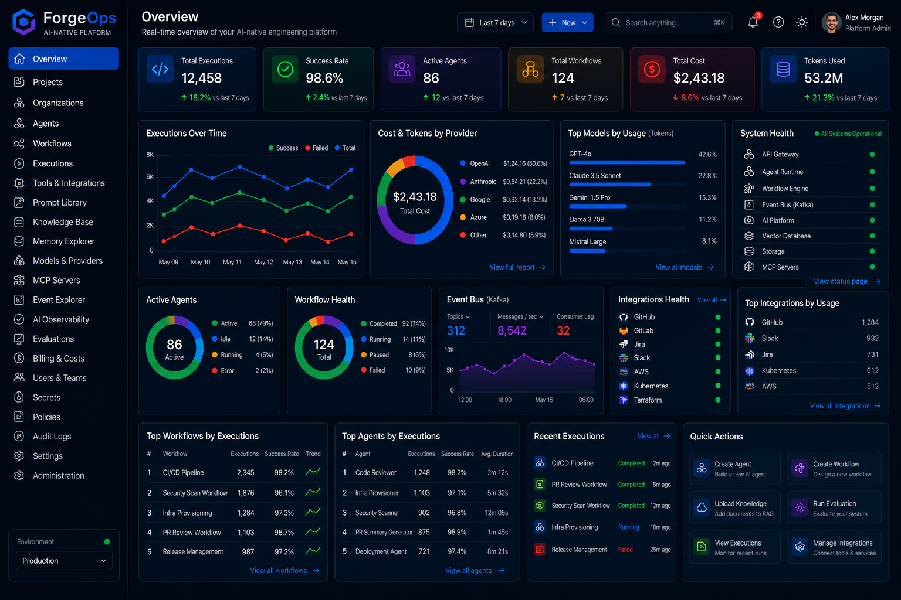
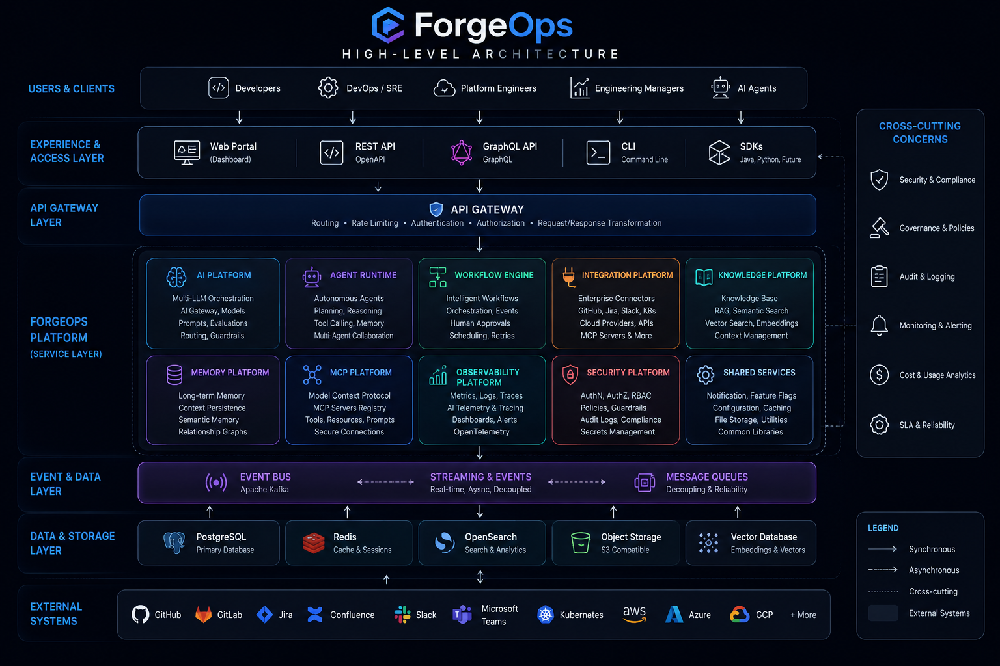

# 🚀 ForgeOps

<p align="center">
  

</p>

<h1 align="center">
ForgeOps
</h1>

<p align="center">

### Build Intelligent Engineering Platforms with Autonomous AI

**An Open Source AI-Native Engineering Platform that will orchestrate autonomous AI agents, intelligent workflows, enterprise integrations and cloud-native infrastructure for modern software organizations.**

</p>

<p align="center">

[](LICENSE)
[]()
[]()
[]()
[]()
[]()
[]()
[]()
[]()
[]()
[]()
[]()
[]()
[]()
[]()
[]()
[]()
[]()
[]()
[]()
[]()

</p>

---

# 🚧 Project Status

> **ForgeOps is currently under active development.**

ForgeOps is a long-term open source initiative focused on building an enterprise-grade AI-native engineering platform.

The project is being designed and implemented incrementally through production-ready milestones. Each release will introduce functional capabilities that can be adopted independently while contributing to the long-term vision of the platform.

The architectural concepts, diagrams and platform modules presented throughout this repository describe the target architecture of ForgeOps. Some capabilities are already being developed, while others are planned for future releases.

Our goal is not to deliver every feature at once, but to build a solid, extensible and production-oriented platform that will evolve continuously with contributions from the open source community.

---

# 🌍 The Future of Software Engineering Starts Here

Modern software engineering depends on an ever-growing ecosystem of tools, cloud platforms, automation pipelines and AI assistants.

Although these technologies have dramatically improved productivity, engineering teams still spend a significant amount of time switching between disconnected systems, maintaining custom integrations and manually coordinating complex workflows.

ForgeOps is being designed to address this challenge.

Instead of becoming another isolated AI assistant, ForgeOps will provide an intelligent orchestration layer capable of connecting autonomous AI agents, enterprise systems, cloud-native infrastructure and engineering workflows into a single, extensible platform.

The long-term vision is to enable software organizations to design, build, deploy, operate and continuously improve software through collaborative AI, shared organizational knowledge and intelligent automation.

---

# 🖥 Platform Dashboard

ForgeOps is being designed around a single unified engineering portal where developers, DevOps engineers, platform teams, architects and engineering managers will interact with every platform capability.

Rather than switching between multiple disconnected tools, users will have a centralized workspace for managing AI agents, workflows, executions, infrastructure, knowledge, integrations and platform governance.

The dashboard below represents the long-term product vision and illustrates how the user experience is expected to evolve as new platform capabilities are delivered.

<p align="center">
  
</p>

> 🚧 **Status:** Product Vision (Work in Progress)
>
> The dashboard shown below represents the target user experience of ForgeOps. Screens and features will be implemented incrementally as the platform evolves through production-ready milestones.

---

## Dashboard Overview

The Overview dashboard will provide a real-time operational view of the entire AI-native engineering platform.

Users will be able to monitor platform health, AI agent activity, workflow executions, infrastructure usage, model consumption and engineering productivity from a single location.

### Key Areas

| Area | Description |
|------|-------------|
| 📊 Executive Metrics | High-level KPIs including executions, active agents, workflows, platform costs and AI token consumption. |
| 🤖 AI Agents | Monitor autonomous agents, execution statistics, success rate and operational status. |
| 🔄 Workflow Engine | Track intelligent workflow executions, orchestration pipelines and automation health. |
| ⚡ Event Platform | Observe Kafka topics, streaming metrics, throughput and messaging health. |
| 🧠 AI Models | Analyze model utilization, provider distribution and token consumption across OpenAI, Anthropic, Google and future providers. |
| 🔌 Integrations | Monitor connected enterprise systems such as GitHub, Jira, Slack, Kubernetes and cloud providers. |
| 📚 Knowledge Platform | Access enterprise knowledge bases, semantic search, RAG datasets and vector memory. |
| 📈 Observability | Centralized monitoring of metrics, logs, traces, alerts and distributed telemetry. |
| 💰 Cost Management | Track infrastructure expenses, AI model costs and platform resource utilization. |
| ⚙️ Quick Actions | Create agents, launch workflows, upload knowledge, configure integrations and execute platform operations. |

---

## Navigation Experience

The left navigation menu will expose every major capability of the ForgeOps platform, including:

- 🏠 Overview
- 📁 Projects
- 🏢 Organizations
- 🤖 Agents
- 🔄 Workflows
- ▶️ Executions
- 🔌 Tools & Integrations
- 📝 Prompt Library
- 📚 Knowledge Base
- 🧠 Memory Explorer
- 🤖 Models & Providers
- 🔗 MCP Servers
- ⚡ Event Explorer
- 📊 AI Observability
- ✅ Evaluations
- 💳 Billing & Costs
- 👥 Users & Teams
- 🔐 Secrets
- 📜 Policies
- 📋 Audit Logs
- ⚙️ Settings
- 🛡️ Administration

Every module in the navigation will evolve independently while remaining integrated through the unified ForgeOps platform architecture.

<p align="right">
  <a href="#-forgeops">⬆ Back to Top</a>
</p>

---
# 🏛 High-Level Architecture

ForgeOps is being designed as a modular, AI-native engineering platform composed of independent services that communicate through APIs, events and shared intelligence.

Instead of a monolithic application, the platform will evolve as a collection of specialized modules that can be developed, deployed and scaled independently while remaining fully integrated through a unified architecture.

The diagram below illustrates the long-term target architecture of ForgeOps.

<p align="center">
  
</p>

> **Long-Term Target Architecture — Work in Progress**

The platform is organized into five architectural layers.

| Layer | Purpose |
|--------|---------|
| 👥 **Experience Layer** | Web Portal, CLI, SDKs and external APIs used by developers and engineering teams. |
| 🚪 **API Gateway** | Centralized authentication, authorization, routing, rate limiting and API governance. |
| 🧠 **Core Platform Services** | AI Platform, Agent Runtime, Workflow Engine, Knowledge Platform, Integrations, Memory, Security and Observability. |
| ⚡ **Event Platform** | Asynchronous communication powered by Apache Kafka, enabling scalable event-driven workflows and inter-service messaging. |
| ☁ **Infrastructure Layer** | Kubernetes, PostgreSQL, Redis, Object Storage, Cloud Services and supporting infrastructure components. |

## Architectural Principles

ForgeOps is being designed around a small set of architectural principles that will guide every module developed within the platform.

- 🧩 **Modular by Design** — Every capability will evolve as an independent platform module.
- 🤖 **AI-Native** — Artificial Intelligence will be a core architectural component rather than an optional integration.
- ⚡ **Event-Driven** — Services will communicate asynchronously whenever possible to improve scalability and resilience.
- ☁ **Cloud-Native** — Every component will be containerized and designed to run on Kubernetes.
- 🔐 **Secure by Default** — Security, governance and compliance will be embedded into every layer.
- 📊 **Observable Everything** — Platform services, workflows and AI executions will expose metrics, logs and distributed traces.
- 🔌 **API First** — Every platform capability will expose well-defined APIs for automation and integrations.
- 📈 **Incremental Evolution** — The architecture represents the long-term vision and will be implemented progressively through production-ready milestones.

This architecture serves as the technical blueprint for the entire ForgeOps ecosystem and provides a common reference for contributors, architects and engineering teams as the platform evolves.

<p align="right">
  <a href="#-forgeops">⬆ Back to Top</a>
</p>

---

# 📚 Table of Contents

- [🚧 Project Status](#-project-status)
- [🌍 The Future of Software Engineering Starts Here](#-the-future-of-software-engineering-starts-here)
- [🖥 Platform Overview](#-platform-overview)
- [🎯 Why ForgeOps?](#-why-forgeops)
- [💼 What Can ForgeOps Do for Your Organization?](#-what-can-forgeops-do-for-your-organization)
- [🌎 Designed for Every Industry](#-designed-for-every-industry)
- [👥 Who Is ForgeOps Built For?](#-who-is-forgeops-built-for)
- [🚀 Platform Capabilities](#-platform-capabilities)
- [🏗 Platform Modules](#-platform-modules)
- [🧭 Platform Architecture](#-platform-architecture)
- [📁 Repository Structure](#-repository-structure)
- [🛠 Technology Stack](#-technology-stack)
- [🚀 Quick Start](#-quick-start)
- [📖 Documentation](#-documentation)
- [🗺 Development Roadmap](#-development-roadmap)
- [🤝 Contributing](#-contributing)
- [🌟 Community](#-community)
- [📄 License](#-license)

---

# 🎯 Why ForgeOps?

Software engineering has never had access to so many powerful technologies.

Cloud platforms, containers, Kubernetes, Infrastructure as Code, observability platforms, CI/CD pipelines and Large Language Models have transformed the way software is built and operated.

However, engineering teams still spend an enormous amount of time integrating disconnected systems instead of solving business problems.

A modern software organization often depends on dozens of independent platforms that rarely understand each other's context.

Developers constantly switch between source control, project management systems, documentation portals, cloud consoles, monitoring dashboards, AI assistants and deployment pipelines.

Knowledge becomes fragmented.

Automation becomes increasingly complex.

Engineering decisions become difficult to trace.

Artificial Intelligence often operates without understanding the architecture, standards or history of the organization.

ForgeOps is being designed to solve this problem.

Instead of introducing another isolated tool, ForgeOps will become an intelligent engineering platform capable of connecting AI, software delivery, cloud infrastructure and organizational knowledge into a unified ecosystem.

Rather than replacing existing technologies, ForgeOps will orchestrate them.

---

# 💼 What Can ForgeOps Do for Your Organization?

ForgeOps is being designed to support the entire software delivery lifecycle.

Instead of focusing on a single discipline, the platform will progressively provide intelligent capabilities across engineering, operations and platform management.

| Engineering Area | Planned Capabilities |
|------------------|----------------------|
| 🤖 Artificial Intelligence | Multi-provider AI orchestration, Prompt Engineering, AI Gateway, LLM Routing |
| 🧠 Autonomous Agents | Engineering agents, planning, reasoning, memory, tool calling |
| 💻 Software Development | Code generation, documentation, code review, architecture validation |
| 🚀 DevOps | CI/CD automation, deployment orchestration, release management |
| ☁ Platform Engineering | Kubernetes operations, platform automation, Internal Developer Platform support |
| 📦 Infrastructure | Infrastructure as Code, provisioning, cloud automation |
| 📊 Observability | Metrics, logs, traces, AI telemetry and operational dashboards |
| 🔐 Security | Governance, RBAC, secrets management, compliance and AI guardrails |
| 📚 Knowledge Management | Enterprise documentation, semantic search and Retrieval-Augmented Generation (RAG) |
| 🔄 Workflow Automation | Intelligent engineering workflows and business process automation |

The objective is to create a unified operational experience where engineering teams can interact with a single platform instead of dozens of disconnected tools.

---

# 🌎 Designed for Every Industry

Although ForgeOps will initially focus on software engineering, its architecture is being designed to support organizations across multiple industries.

Examples include:

| Industry | Example Use Cases |
|----------|-------------------|
| 🏦 Financial Services | Platform engineering, compliance automation, secure AI workflows |
| 🛒 Retail & E-commerce | Cloud operations, release automation, AI-assisted development |
| 🏥 Healthcare | Infrastructure governance, secure documentation, workflow orchestration |
| 🏭 Manufacturing | Industrial platform operations and intelligent automation |
| 🎓 Education | AI-powered learning platforms and developer environments |
| ☁ SaaS Companies | Developer productivity, platform engineering and autonomous operations |
| 🛰 Government | Secure engineering workflows, governance and infrastructure automation |

The modular architecture of ForgeOps will allow organizations to adopt only the capabilities that match their business and operational requirements.

---

# 👥 Who Is ForgeOps Built For?

ForgeOps is being designed for multidisciplinary engineering organizations.

The platform will support professionals across different technical domains while promoting collaboration through shared context and intelligent automation.

| Role | Planned Benefits |
|------|------------------|
| 👨‍💻 Software Developers | AI-assisted development, documentation, code reviews and engineering workflows |
| ⚙ DevOps Engineers | Deployment automation, CI/CD orchestration and infrastructure management |
| ☁ Platform Engineers | Internal developer platforms, Kubernetes automation and self-service infrastructure |
| 📈 Site Reliability Engineers (SRE) | Observability, incident response and operational intelligence |
| 🏗 Software Architects | Architecture validation, ADR management and technical governance |
| 🔐 Security Engineers | Compliance automation, AI governance and policy enforcement |
| 📊 Engineering Managers | Visibility into engineering operations, delivery metrics and platform governance |
| 👔 Technology Leaders | Strategic insights into software delivery, AI adoption and platform maturity |

ForgeOps is intended to become a collaborative platform where every engineering discipline benefits from shared knowledge and coordinated automation.

---

<p align="right">
<a href="#-forgeops">⬆ Back to Top</a>
</p>

---

# 🚀 Platform Capabilities

ForgeOps is being designed as a modular AI-native engineering platform capable of supporting every stage of the modern software delivery lifecycle.

Rather than concentrating all functionality into a single application, the platform will progressively introduce specialized capabilities that work together through a unified architecture, shared context, event-driven communication and autonomous AI agents.

Each capability will evolve independently while remaining fully integrated with the rest of the platform.

---

## 🤖 Artificial Intelligence

ForgeOps will provide a centralized AI platform capable of orchestrating multiple Large Language Models through a unified interface.

### Planned Capabilities

- Multi-LLM orchestration
- Provider routing
- Prompt management
- Prompt versioning
- Prompt evaluation
- Structured outputs
- AI Gateway
- Cost optimization
- AI governance
- Model benchmarking

---

## 🧠 Autonomous Agents

One of the core objectives of ForgeOps is to provide a runtime capable of executing collaborative AI agents.

These agents will operate with shared organizational context, long-term memory and access to enterprise tools.

### Planned Capabilities

- Planning
- Reasoning
- Reflection
- Tool Calling
- Memory
- Multi-Agent Collaboration
- Human-in-the-loop
- Goal-oriented execution
- Self-evaluation
- Autonomous decision support

---

## 🔄 Intelligent Workflows

ForgeOps will progressively introduce an AI-native workflow engine capable of orchestrating engineering and business processes.

Instead of static automation pipelines, workflows will become context-aware, event-driven and AI-assisted.

### Planned Capabilities

- Workflow orchestration
- Event-driven execution
- Human approvals
- AI-assisted decisions
- Retry strategies
- Scheduling
- Long-running workflows
- State management
- Process visualization

---

## 🔌 Enterprise Integrations

Modern engineering depends on dozens of external platforms.

ForgeOps will unify those integrations through standardized connectors.

### Planned Integrations

- GitHub
- GitLab
- Azure DevOps
- Jira
- Confluence
- Slack
- Microsoft Teams
- Kubernetes
- Docker
- Terraform
- Jenkins
- Argo CD
- Prometheus
- Grafana
- HashiCorp Vault
- SonarQube
- Cloud Providers
- REST APIs
- MCP Servers

---

## 📚 Knowledge & Context

Artificial Intelligence becomes significantly more valuable when it understands organizational knowledge.

ForgeOps will provide an enterprise knowledge platform capable of transforming documentation into contextual intelligence.

### Planned Capabilities

- Knowledge Base
- Semantic Search
- Vector Search
- Retrieval-Augmented Generation (RAG)
- Documentation Indexing
- Embeddings
- Context Management
- Organizational Knowledge
- Technical Documentation
- Architecture Knowledge

---

## ☁ Cloud-Native Platform

ForgeOps is being designed as a cloud-native platform from day one.

Every component will support modern deployment strategies and enterprise scalability requirements.

### Planned Capabilities

- Kubernetes-native deployment
- Container-first architecture
- Horizontal scalability
- High availability
- Multi-environment support
- Infrastructure as Code
- Service discovery
- Configuration management
- Secret management

---

## 📊 Observability

Observability will extend beyond infrastructure into Artificial Intelligence itself.

ForgeOps will provide complete visibility across platform services, workflows and AI executions.

### Planned Capabilities

- Metrics
- Logs
- Distributed tracing
- AI telemetry
- Prompt tracing
- Cost monitoring
- Performance dashboards
- Workflow monitoring
- Agent execution history
- OpenTelemetry integration

---

## 🔐 Enterprise Security

Security and governance are fundamental architectural principles of ForgeOps.

Every platform component is being designed with enterprise-grade security in mind.

### Planned Capabilities

- Authentication
- Authorization
- RBAC
- Policy Engine
- Audit Logs
- Compliance
- Encryption
- Secret Management
- AI Guardrails
- Governance

---

# ⚡ Platform at a Glance

| Capability | Description | Planned |
|------------|-------------|:-------:|
| 🤖 AI Platform | Multi-provider AI orchestration | ✅ |
| 🧠 Agent Runtime | Autonomous engineering agents | ✅ |
| 🔄 Workflow Engine | AI-native workflow automation | ✅ |
| 🔌 Integrations | Enterprise connectors | ✅ |
| 📚 Knowledge Platform | RAG, Semantic Search and Context | ✅ |
| ☁ Infrastructure | Cloud-native platform services | ✅ |
| 📊 Observability | Platform and AI telemetry | ✅ |
| 🔐 Security | Governance and enterprise security | ✅ |
| 🌐 Web Portal | Unified engineering dashboard | ✅ |
| 📦 SDKs | Java, Python and future SDKs | ✅ |

---

> **Every capability presented above represents the long-term vision of ForgeOps and will be delivered progressively through incremental, production-ready milestones.**

<p align="right">
<a href="#-forgeops">⬆ Back to Top</a>
</p>

---

# 🏗 Platform Modules

ForgeOps is being designed as a modular AI-native engineering platform.

Instead of concentrating every capability inside a monolithic application, ForgeOps will be composed of multiple platform modules, each responsible for a specific business domain while sharing a common architecture, security model, AI runtime and event-driven communication layer.

Every module will evolve independently, expose well-defined APIs and integrate seamlessly with the rest of the platform.

This architecture will allow organizations to adopt ForgeOps incrementally while enabling contributors to work on isolated components without affecting the overall platform.

---

## 🗺 Platform Landscape

```text
                           ForgeOps Platform

 ┌────────────────────────────────────────────────────────────────────┐
 │                         Experience Layer                           │
 │                                                                    │
 │  Web Portal • REST API • GraphQL • CLI • SDKs • Authentication     │
 └────────────────────────────────────────────────────────────────────┘

 ┌────────────────────────────────────────────────────────────────────┐
 │                        Intelligence Layer                          │
 │                                                                    │
 │ AI Platform • Agent Runtime • Workflow Engine • MCP Platform       │
 └────────────────────────────────────────────────────────────────────┘

 ┌────────────────────────────────────────────────────────────────────┐
 │                     Engineering Services Layer                     │
 │                                                                    │
 │ Knowledge • Integrations • Memory • Observability • Security       │
 └────────────────────────────────────────────────────────────────────┘

 ┌────────────────────────────────────────────────────────────────────┐
 │                      Platform Foundation                           │
 │                                                                    │
 │ Infrastructure • Event Platform • Shared Services                  │
 └────────────────────────────────────────────────────────────────────┘
```

---

# 📦 Platform Modules Overview

| Module | Purpose | Status |
|---------|---------|:------:|
| 🌐 Web Portal | Unified engineering experience | 🚧 Planned |
| 🤖 AI Platform | Multi-provider AI orchestration | 🚧 Planned |
| 🧠 Agent Runtime | Autonomous AI execution environment | 🚧 Planned |
| 🔄 Workflow Engine | Intelligent workflow orchestration | 🚧 Planned |
| 🔌 Integration Platform | Enterprise connectors | 🚧 Planned |
| 📚 Knowledge Platform | Organizational knowledge and RAG | 🚧 Planned |
| 🧠 Memory Platform | Long-term contextual memory | 🚧 Planned |
| 🧩 MCP Platform | Model Context Protocol ecosystem | 🚧 Planned |
| 📊 Observability Platform | AI and platform telemetry | 🚧 Planned |
| 🛡 Security Platform | Governance, RBAC and compliance | 🚧 Planned |
| 📡 Event Platform | Event-driven communication | 🚧 Planned |
| ☁ Infrastructure Platform | Cloud-native services | 🚧 Planned |
| ⚙ Shared Services | Common platform services | 🚧 Planned |

---

# 🤖 AI Platform

The AI Platform will become the intelligence hub of ForgeOps.

It will abstract multiple Large Language Model providers behind a unified API, enabling applications, workflows and AI agents to consume different models without vendor lock-in.

### Planned capabilities

- Multi-provider orchestration
- AI Gateway
- Prompt Library
- Prompt Versioning
- Model Registry
- Structured Outputs
- AI Routing
- Cost Optimization
- AI Governance

📖 **Documentation**

```text
docs/modules/ai-platform.md
```

---

# 🧠 Agent Runtime

The Agent Runtime will provide the execution environment for autonomous engineering agents.

Agents will collaborate, share organizational context, access enterprise tools and execute long-running engineering tasks.

### Planned capabilities

- Planning
- Reasoning
- Reflection
- Tool Calling
- Memory
- Multi-Agent Collaboration
- Human Approval
- Self Evaluation

📖 **Documentation**

```text
docs/modules/agent-runtime.md
```

---

# 🔄 Workflow Engine

The Workflow Engine will orchestrate engineering processes across AI agents, enterprise integrations and cloud infrastructure.

Rather than executing static pipelines, workflows will be capable of making contextual decisions and interacting with human operators whenever necessary.

### Planned capabilities

- State Machines
- Event Processing
- Scheduling
- Retry Policies
- Human Approvals
- AI Decision Making
- Long Running Processes

📖 **Documentation**

```text
docs/modules/workflow-engine.md
```

---

# 🔌 Integration Platform

The Integration Platform will connect ForgeOps with the engineering ecosystem.

Instead of creating custom integrations for every module, the platform will expose standardized connectors that can be reused throughout the entire system.

### Planned integrations

- GitHub
- GitLab
- Azure DevOps
- Jira
- Confluence
- Slack
- Kubernetes
- Docker
- Terraform
- Jenkins
- SonarQube
- Prometheus
- Grafana
- Vault
- REST APIs
- MCP Servers

📖 **Documentation**

```text
docs/modules/integration-platform.md
```

---

# 📚 Knowledge Platform

The Knowledge Platform will transform documentation into organizational intelligence.

Enterprise documentation, ADRs, architecture diagrams, API specifications and engineering standards will become searchable and consumable by AI agents through Retrieval-Augmented Generation (RAG).

### Planned capabilities

- Knowledge Base
- Semantic Search
- Vector Search
- RAG
- Documentation Indexing
- Embeddings
- Context Engine

📖 **Documentation**

```text
docs/modules/knowledge-platform.md
```

---

# ☁ Infrastructure Platform

The Infrastructure Platform will provide the cloud-native foundation required to operate ForgeOps at enterprise scale.

### Planned capabilities

- Kubernetes
- Docker
- PostgreSQL
- Redis
- Kafka
- OpenSearch
- Object Storage
- Service Discovery
- Configuration Management

📖 **Documentation**

```text
docs/modules/infrastructure-platform.md
```

---

# 🛡 Cross-Cutting Platform Services

Several platform services will be shared across every ForgeOps module.

These capabilities will ensure architectural consistency while reducing duplication throughout the platform.

| Service | Responsibility |
|----------|----------------|
| 🔐 Authentication | Identity and Access Management |
| 👥 Authorization | RBAC and Permissions |
| 📊 Observability | Metrics, Logs and Traces |
| 📡 Event Platform | Asynchronous Communication |
| 📝 Audit | Operational Audit Trail |
| ⚙ Configuration | Centralized Configuration |
| 🔑 Secrets | Secret Management |
| 📬 Notifications | Event Notifications |
| 📈 Monitoring | Platform Health |
| 🧾 Licensing | Future Enterprise Features |

---

> **Each platform module will have its own dedicated documentation under the `docs/modules` directory, where architecture, APIs, workflows and implementation details will be documented as development progresses.**

<p align="right">
<a href="#-forgeops">⬆ Back to Top</a>
</p>

---

# 🖥 Platform Dashboard

The ForgeOps Web Portal is being designed to become the primary operational interface for the platform.

Rather than exposing dozens of disconnected administration consoles, the dashboard will provide a unified workspace where engineering teams will be able to manage AI agents, engineering workflows, platform operations and organizational knowledge from a single interface.

Every screen is being designed around one central principle:

> **Engineering teams should spend their time solving problems—not navigating tools.**

The dashboard will progressively evolve alongside the platform, introducing new capabilities as each module reaches production readiness.

> **The user interface presented throughout this repository represents the target product vision and will evolve during implementation.**

---

# 🎨 Dashboard Philosophy

ForgeOps will not simply expose APIs.

It will provide an operational experience designed for software organizations.

The Web Portal will become the command center for every engineering activity.

From one interface, users will be able to:

- Monitor autonomous AI agents
- Execute engineering workflows
- Review platform health
- Observe AI executions
- Manage enterprise integrations
- Search organizational knowledge
- Configure platform services
- Manage projects and organizations
- Administer users and permissions
- Monitor infrastructure
- Analyze engineering metrics

---

# 🖼 Dashboard Overview

<p align="center">


</p>

The dashboard above illustrates the long-term vision for the ForgeOps user experience.

As development progresses, additional widgets, visualizations and engineering capabilities will be introduced while preserving a consistent and intuitive interface.

---

# 🧭 Main Navigation

The left navigation menu will organize every platform capability into logical domains.

| Navigation | Description |
|------------|-------------|
| 🏠 Dashboard | Platform overview, health and operational insights |
| 🤖 AI Platform | Providers, prompts, models and AI configuration |
| 🧠 Agents | Autonomous engineering agents and execution history |
| 🔄 Workflows | Workflow orchestration and automation |
| ⚡ Executions | Running jobs, tasks and AI executions |
| 📚 Knowledge | Documentation, semantic search and RAG |
| 🔌 Integrations | Enterprise connectors and external services |
| 📦 Projects | Engineering projects managed by ForgeOps |
| 🏢 Organizations | Multi-tenant organization management |
| 📊 Observability | Metrics, logs, traces and AI telemetry |
| ☁ Infrastructure | Kubernetes clusters and cloud resources |
| 🔐 Security | Authentication, RBAC and governance |
| ⚙ Administration | Platform configuration and settings |

---

# 📊 Operational Dashboard

The Dashboard home page will provide a real-time operational overview of the entire platform.

Examples of information that will be available include:

- Active AI Agents
- Running Workflows
- Recent Deployments
- Infrastructure Health
- Kubernetes Cluster Status
- AI Usage
- Token Consumption
- Cost Analytics
- Event Stream Activity
- Platform Alerts

Engineering teams will immediately understand the operational status of the platform without navigating through multiple systems.

---

# 🤖 AI Workspace

The AI Platform interface will centralize every AI capability available inside ForgeOps.

Users will be able to:

- Configure providers
- Register models
- Create prompts
- Manage prompt versions
- Execute prompt evaluations
- Compare model responses
- Configure routing policies
- Monitor AI costs
- Review execution history

This workspace will become the foundation for every AI-powered capability within the platform.

---

# 🧠 Agent Workspace

The Agent Workspace will provide complete visibility into autonomous AI agents.

Users will be able to:

- Create engineering agents
- Configure agent behavior
- Assign tools
- Review execution history
- Inspect reasoning traces
- Manage memory
- Monitor collaboration
- Observe agent health

Future releases will progressively introduce more specialized engineering agents.

---

# 🔄 Workflow Workspace

The Workflow interface will allow engineering teams to design, execute and monitor intelligent workflows.

Examples include:

- CI/CD pipelines
- Infrastructure provisioning
- Release automation
- Documentation generation
- Pull Request reviews
- Incident response
- AI-assisted engineering tasks

Workflows will combine AI agents, enterprise integrations and human approvals within a unified execution model.

---

# 📚 Knowledge Workspace

Knowledge will become a first-class platform capability.

The Knowledge interface will provide access to:

- Documentation
- ADRs
- Architecture diagrams
- API specifications
- Technical standards
- Engineering playbooks
- Semantic search
- Organizational memory

AI agents will use this knowledge to provide context-aware assistance.

---

# 📊 Observability Workspace

The Observability interface will extend beyond traditional infrastructure monitoring.

Engineering teams will also gain visibility into AI behavior.

Future dashboards will include:

- AI execution traces
- Prompt history
- Token usage
- Latency
- Workflow metrics
- Platform telemetry
- Cost analytics
- Infrastructure health

---

# 🔐 Administration

Platform administrators will manage every operational aspect of ForgeOps through a centralized administration experience.

Capabilities will include:

- User management
- Organizations
- Roles and permissions
- Authentication providers
- Secret management
- Licensing
- Platform configuration
- Feature flags
- Audit logs

---

# 🚀 Designed for Continuous Growth

The dashboard will evolve together with the platform.

New modules, engineering capabilities and AI services will be integrated into the interface without changing the overall user experience.

This incremental approach will allow ForgeOps to remain intuitive while continuously expanding its capabilities over time.

---

> **The dashboard is not just an administration console. It is being designed to become the operational control center for AI-native software engineering.**

<p align="right">
<a href="#-forgeops">⬆ Back to Top</a>
</p>

---

---

# 🚀 Platform Capabilities

ForgeOps is being designed as a complete AI-native engineering platform composed of independent yet fully integrated capabilities.

Instead of providing isolated automation tools, ForgeOps will offer a unified ecosystem where autonomous AI agents, workflow orchestration, enterprise integrations, semantic knowledge, observability and cloud-native infrastructure work together through a common orchestration layer.

Each capability is being developed as an independent platform module while sharing common security, governance, memory and event-driven services.

> 🚧 **Implementation Status**
>
> The capabilities described below represent the target platform architecture. They will be delivered incrementally through multiple production-ready milestones as the project evolves.

---

# 🤖 AI Platform

The AI Platform will become the intelligence layer of ForgeOps.

It will provide unified access to multiple Large Language Models (LLMs), prompt orchestration, evaluation pipelines, routing strategies and AI governance.

Rather than depending on a single AI provider, the platform will dynamically route requests to the most appropriate model according to cost, latency, reasoning quality, security policies and business requirements.

### Responsibilities

- Multi-LLM orchestration
- Prompt execution
- Model routing
- AI guardrails
- Prompt versioning
- Evaluation framework
- Token management
- Cost optimization
- AI governance

**Planned Integrations**

- OpenAI
- Anthropic
- Google Gemini
- Azure OpenAI
- Ollama
- Mistral
- Cohere
- Future providers

---

# 🤖 Agent Runtime

The Agent Runtime will execute autonomous engineering agents capable of performing complex software engineering activities.

Agents will reason, plan, execute tools, collaborate with other agents and continuously improve their execution using platform memory.

### Responsibilities

- Agent lifecycle
- Planning
- Reasoning
- Tool execution
- Multi-agent collaboration
- Context management
- Long-running executions
- Human approvals
- Autonomous decision making

Example agents include:

- Code Reviewer
- Infrastructure Engineer
- Security Analyst
- Documentation Writer
- PR Reviewer
- Deployment Agent
- Incident Responder
- Cost Optimizer

---

# 🔄 Workflow Engine

The Workflow Engine will orchestrate intelligent engineering processes across the platform.

Unlike traditional workflow engines, ForgeOps workflows will combine deterministic automation with autonomous AI decision making.

### Responsibilities

- Workflow orchestration
- AI task execution
- Human approvals
- Scheduling
- Retry policies
- Parallel execution
- Conditional routing
- Event-driven execution
- Long-running workflows

Example workflows

- CI/CD
- Release Management
- Incident Response
- Security Scanning
- Infrastructure Provisioning
- Documentation Generation
- Pull Request Review

---

# 📚 Knowledge Platform

The Knowledge Platform will centralize organizational knowledge and make it available to both engineers and AI agents.

Instead of isolated documentation repositories, ForgeOps will create a semantic engineering knowledge graph.

### Responsibilities

- Knowledge Base
- Semantic Search
- RAG
- Document indexing
- Embeddings
- Enterprise search
- Versioned documentation
- Knowledge ingestion

Supported sources will include:

- GitHub
- Confluence
- Notion
- Jira
- Markdown
- PDFs
- Wikis
- APIs

---

# 🧠 Memory Platform

The Memory Platform will provide persistent memory for AI agents.

Agents will retain engineering context across executions while respecting organizational security boundaries.

### Responsibilities

- Long-term memory
- Context persistence
- Semantic memory
- Relationship graphs
- Conversation history
- Project memory
- Team memory
- Organizational memory

This capability will significantly reduce repetitive prompting while improving agent reasoning over time.

---

# 🔌 Integration Platform

ForgeOps will integrate with enterprise development ecosystems through a unified connector framework.

Instead of implementing custom integrations for every workflow, all platform modules will consume standardized connectors.

### Responsibilities

- External APIs
- Webhooks
- Cloud providers
- Source control
- CI/CD
- Messaging systems
- Ticketing systems
- Enterprise authentication

Example integrations

- GitHub
- GitLab
- Bitbucket
- Jira
- Slack
- Microsoft Teams
- Kubernetes
- AWS
- Azure
- Google Cloud

---

# 🔗 MCP Platform

ForgeOps will natively support the Model Context Protocol (MCP), enabling secure communication between AI models and external tools.

The MCP Platform will expose enterprise resources using standardized protocols while maintaining governance and security.

### Responsibilities

- MCP Servers
- MCP Registry
- Tool discovery
- Resource management
- Secure communication
- Tool authorization
- Protocol management

---

# 📊 Observability Platform

Observability will be treated as a first-class platform capability.

Every workflow, agent, model and infrastructure component will generate metrics, logs and traces by default.

### Responsibilities

- Metrics
- Logs
- Distributed tracing
- Dashboards
- Alerting
- AI telemetry
- Workflow monitoring
- Agent monitoring
- Platform analytics

Supported ecosystem

- Prometheus
- Grafana
- OpenTelemetry
- Loki
- Jaeger

---

# 🔐 Security Platform

Security will be embedded throughout the platform rather than implemented as an isolated module.

Every capability will inherit centralized authentication, authorization, auditing and policy enforcement.

### Responsibilities

- Authentication
- Authorization
- RBAC
- Secrets Management
- Policy Engine
- Audit Logs
- Compliance
- Encryption
- Security Events

---

# 🌐 API Gateway

All client applications will communicate with ForgeOps through a centralized API Gateway.

The gateway will provide a secure and unified access layer for every platform capability.

### Responsibilities

- Routing
- Authentication
- Authorization
- Rate Limiting
- Request Validation
- API Versioning
- GraphQL Gateway
- REST Gateway
- Traffic Management

---

# 🖥 Web Portal

The Web Portal will become the primary interface for platform users.

It will provide a unified engineering workspace where teams can manage every platform capability through a single experience.

Users will be able to:

- Manage AI agents
- Execute workflows
- Monitor infrastructure
- Configure integrations
- Manage prompts
- Explore organizational knowledge
- Observe AI executions
- Track costs
- Manage users
- Configure policies

---

> Together, these platform capabilities will form a unified AI-native engineering ecosystem capable of orchestrating software delivery, infrastructure automation, enterprise integrations and autonomous engineering workflows from a single cloud-native platform.

<p align="right">
  <a href="#-forgeops">⬆ Back to Top</a>
</p>

---


---

# 🏗 Platform Modules

ForgeOps is being developed as a collection of independent yet fully integrated platform modules.

Each module has a clearly defined responsibility, lifecycle and public APIs while sharing a common architectural foundation based on AI-native services, cloud-native infrastructure and event-driven communication.

This modular approach enables teams to evolve individual capabilities independently without impacting the overall platform architecture.

Every module will expose well-defined interfaces and will be capable of evolving through independent production releases.

---

# 📦 Module Landscape

| Module | Responsibility | Status |
|----------|----------------|:------:|
| 🌐 Web Portal | Unified engineering experience | 🚧 Planned |
| 🚪 API Gateway | Authentication, Routing and APIs | 🚧 Planned |
| 🤖 AI Platform | AI orchestration and model management | 🚧 Planned |
| 🧠 Agent Runtime | Autonomous engineering agents | 🚧 Planned |
| 🔄 Workflow Engine | Intelligent workflow orchestration | 🚧 Planned |
| 📚 Knowledge Platform | Enterprise knowledge and RAG | 🚧 Planned |
| 🧠 Memory Platform | Long-term AI memory | 🚧 Planned |
| 🔌 Integration Platform | Enterprise integrations | 🚧 Planned |
| 🔗 MCP Platform | Model Context Protocol services | 🚧 Planned |
| 📊 Observability Platform | Monitoring and AI telemetry | 🚧 Planned |
| 🔐 Security Platform | Authentication and Governance | 🚧 Planned |
| ⚡ Event Platform | Event-driven communication | 🚧 Planned |
| ☁ Infrastructure Platform | Cloud-native runtime | 🚧 Planned |
| ⚙ Shared Services | Cross-cutting platform services | 🚧 Planned |

---

# 🌐 Web Portal

The Web Portal will provide the primary user experience for ForgeOps.

It will become the operational control center where engineering teams interact with AI agents, workflows, projects, observability dashboards and enterprise integrations.

**Primary Responsibilities**

- Dashboard
- Administration
- User Experience
- Platform Management
- Visualization
- Engineering Workspace

---

# 🚪 API Gateway

The API Gateway will become the single entry point for every client application.

It will centralize authentication, authorization, routing, API versioning and traffic management.

**Primary Responsibilities**

- REST APIs
- GraphQL
- Authentication
- Authorization
- Routing
- Rate Limiting
- API Governance

---

# 🤖 AI Platform

The AI Platform will provide unified orchestration for every Large Language Model consumed by ForgeOps.

Rather than coupling applications directly to providers, every AI request will pass through this module.

**Primary Responsibilities**

- Provider Management
- Prompt Library
- Prompt Evaluation
- AI Routing
- AI Gateway
- Cost Management

---

# 🧠 Agent Runtime

The Agent Runtime will execute every autonomous engineering agent.

It will manage planning, reasoning, memory, tool execution and collaboration between agents.

**Primary Responsibilities**

- Agent Execution
- Planning
- Tool Calling
- Reflection
- Collaboration
- Memory Integration

---

# 🔄 Workflow Engine

The Workflow Engine will coordinate engineering processes throughout the platform.

Instead of executing simple pipelines, workflows will combine AI reasoning, human interaction and enterprise integrations.

**Primary Responsibilities**

- Orchestration
- Scheduling
- Human Approval
- Event Processing
- State Management

---

# 📚 Knowledge Platform

The Knowledge Platform will transform enterprise documentation into contextual intelligence.

Knowledge will become available for both human users and AI agents.

**Primary Responsibilities**

- Documentation
- RAG
- Semantic Search
- Embeddings
- Knowledge Base

---

# 🧠 Memory Platform

The Memory Platform will persist engineering context across executions.

Agents will remember projects, conversations, workflows and organizational knowledge while respecting security boundaries.

**Primary Responsibilities**

- Long-Term Memory
- Semantic Memory
- Project Memory
- Organizational Context

---

# 🔌 Integration Platform

The Integration Platform will expose reusable enterprise connectors shared across the entire platform.

Every workflow and AI agent will consume integrations through standardized interfaces.

**Primary Responsibilities**

- GitHub
- Jira
- Slack
- Kubernetes
- Cloud Providers
- REST APIs
- Webhooks

---

# 🔗 MCP Platform

The MCP Platform will provide native support for the Model Context Protocol.

This module will allow ForgeOps to communicate securely with external tools and enterprise resources.

**Primary Responsibilities**

- MCP Servers
- Tool Registry
- Resource Discovery
- Secure Tool Access

---

# 📊 Observability Platform

Every component of ForgeOps will emit telemetry by default.

The Observability Platform will consolidate metrics, logs, traces and AI execution insights into unified operational dashboards.

**Primary Responsibilities**

- Metrics
- Logs
- Traces
- Dashboards
- AI Telemetry

---

# 🔐 Security Platform

Security is considered a cross-cutting concern across the entire platform.

Authentication, authorization and governance will be centralized while remaining transparent for application modules.

**Primary Responsibilities**

- Authentication
- Authorization
- RBAC
- Audit Logs
- Compliance
- Secrets Management

---

# ⚡ Event Platform

The Event Platform will connect every platform module through asynchronous messaging.

This architecture will reduce coupling while improving scalability and resilience.

**Primary Responsibilities**

- Apache Kafka
- Event Streaming
- Event Bus
- Async Communication
- Event Routing

---

# ☁ Infrastructure Platform

The Infrastructure Platform will provide the cloud-native runtime where every platform service will execute.

**Primary Responsibilities**

- Kubernetes
- Docker
- PostgreSQL
- Redis
- OpenSearch
- Object Storage

---

# ⚙ Shared Services

Shared Services will provide reusable capabilities consumed by every platform module.

Examples include:

- Configuration Management
- Notifications
- Feature Flags
- Scheduling
- Licensing
- Common Utilities
- Shared Libraries

---

## 📐 Modular Architecture

Every module follows the same architectural principles.

- Independent lifecycle
- API-first communication
- Event-driven integration
- Shared security model
- Cloud-native deployment
- AI-native capabilities
- Independent scalability
- Production-ready observability

This modular design allows ForgeOps to grow incrementally while maintaining a consistent engineering architecture across the entire platform.

> 📖 Each module will have its own detailed documentation under the **docs/modules/** directory, including architecture diagrams, APIs, workflows, ADRs and implementation guides.

<p align="right">
<a href="#-forgeops">⬆ Back to Top</a>
</p>

---

---

# 🛠 Technology Stack

ForgeOps is being designed using modern, production-proven technologies that support scalability, resilience, cloud-native deployment and enterprise-grade AI workloads.

Rather than depending on a single technology stack, the platform combines best-in-class open source projects across software engineering, Artificial Intelligence, cloud infrastructure and observability.

Every technology has been selected based on four principles:

- Enterprise readiness
- Cloud-native architecture
- Open standards
- Long-term maintainability

---

# 🏗 Core Platform

| Category | Technology | Purpose |
|----------|------------|---------|
| Language | Java 24 | Primary backend language |
| Framework | Spring Boot 4 | Enterprise application framework |
| Build | Maven 4 | Dependency and build management |
| API | Spring Web | REST APIs |
| GraphQL | Spring GraphQL | GraphQL Gateway |
| Documentation | OpenAPI 3 | API specification |

---

# 🤖 Artificial Intelligence

| Category | Technology | Purpose |
|----------|------------|---------|
| AI Framework | LangGraph | Multi-agent orchestration |
| AI Framework | LangChain | LLM abstractions |
| Protocol | MCP | Model Context Protocol |
| Providers | OpenAI | Commercial LLM |
| Providers | Anthropic | Claude Models |
| Providers | Google Gemini | Gemini Models |
| Providers | Azure OpenAI | Enterprise AI |
| Providers | Ollama | Local Models |

Future providers will be supported without requiring changes to application code.

---

# 🌐 Frontend

| Category | Technology | Purpose |
|----------|------------|---------|
| Framework | React | User Interface |
| Framework | Next.js | Web Application |
| Language | TypeScript | Frontend Development |
| Styling | Tailwind CSS | Design System |
| Charts | Apache ECharts | Dashboards |
| Icons | Lucide Icons | UI Components |

The Web Portal is being designed as a modern AI-native operational workspace.

---

# ☁ Cloud Native

| Category | Technology | Purpose |
|----------|------------|---------|
| Containers | Docker | Containerization |
| Orchestration | Kubernetes | Runtime Platform |
| Package Manager | Helm | Deployments |
| Service Mesh | Istio *(Future)* | Service Communication |
| Ingress | NGINX Ingress | External Access |

---

# 🗄 Data Platform

| Category | Technology | Purpose |
|----------|------------|---------|
| Database | PostgreSQL | Relational Data |
| Cache | Redis | High-speed Cache |
| Search | OpenSearch | Search Engine |
| Vector Search | pgvector | Semantic Search |
| Object Storage | MinIO / S3 | Documents |

---

# ⚡ Event Platform

| Category | Technology | Purpose |
|----------|------------|---------|
| Streaming | Apache Kafka | Event Platform |
| Serialization | Apache Avro | Event Contracts |
| Messaging | Spring Kafka | Event Processing |

The platform architecture follows an Event-Driven Architecture (EDA) to maximize scalability and loose coupling.

---

# 📊 Observability

| Category | Technology | Purpose |
|----------|------------|---------|
| Metrics | Prometheus | Metrics Collection |
| Dashboards | Grafana | Visualization |
| Tracing | OpenTelemetry | Distributed Tracing |
| Logs | Loki | Log Aggregation |
| Tracing UI | Jaeger | Trace Analysis |

Every service will expose telemetry by default.

---

# 🔐 Security

| Category | Technology | Purpose |
|----------|------------|---------|
| Authentication | Keycloak *(Planned)* | Identity Provider |
| Authorization | Spring Security | Access Control |
| Secrets | HashiCorp Vault | Secret Management |
| Certificates | cert-manager | TLS Certificates |

Security is considered a foundational capability rather than an optional platform feature.

---

# 🧪 Testing

| Category | Technology | Purpose |
|----------|------------|---------|
| Unit Tests | JUnit 5 | Backend Testing |
| Integration | Testcontainers | Infrastructure Testing |
| API Tests | REST Assured | REST Validation |
| Frontend | Playwright | UI Testing |
| Python | Pytest | AI Components |

---

# 🚀 DevOps

| Category | Technology | Purpose |
|----------|------------|---------|
| CI/CD | GitHub Actions | Automation |
| IaC | Terraform | Infrastructure as Code |
| GitOps | Argo CD *(Future)* | Continuous Delivery |
| Code Quality | SonarQube | Static Analysis |
| Security | CodeQL | Security Analysis |

---

# 📖 Documentation

| Category | Technology | Purpose |
|----------|------------|---------|
| Markdown | GitHub Markdown | Documentation |
| ADR | Architecture Decision Records | Technical Decisions |
| Mermaid | Architecture Diagrams | Documentation |
| Draw.io | Architecture Design | Visual Models |

Documentation is treated as a first-class citizen and evolves together with the platform.

---

# 🎯 Engineering Principles

The technology stack has been selected according to the following architectural principles:

- 🤖 AI-Native
- ☁ Cloud-Native
- 📡 Event-Driven
- 🔌 API-First
- 📊 Observable by Default
- 🔐 Secure by Design
- 📚 Documentation as Code
- ⚙ Infrastructure as Code
- 🧩 Modular Architecture
- 🌍 Open Standards
- 🚀 Incremental Delivery

Rather than chasing technology trends, ForgeOps prioritizes proven open source technologies that can support long-term platform evolution.

<p align="right">
<a href="#-forgeops">⬆ Back to Top</a>
</p>

---


---

# 📁 Repository Structure

ForgeOps is being organized as a modular monorepository.

Rather than distributing related services across multiple repositories, the platform will consolidate all major components into a single repository while preserving clear boundaries between platform modules.

This approach simplifies dependency management, encourages architectural consistency and enables contributors to navigate the platform more efficiently.

Every module will remain independently deployable while sharing common engineering standards, documentation, CI/CD pipelines and platform libraries.

---

# 🗂 Repository Layout

```text
forge-ops/

├── frontend/                 # Web Portal
├── gateway/                  # API Gateway
├── ai-platform/              # AI Platform Services
├── agent-runtime/            # Autonomous Agent Runtime
├── workflow-engine/          # Workflow Orchestration
├── knowledge-platform/       # Knowledge & RAG
├── memory-platform/          # AI Memory Services
├── integration-platform/     # Enterprise Connectors
├── mcp-platform/             # Model Context Protocol
├── observability-platform/   # Monitoring & Telemetry
├── security-platform/        # Security Services
├── shared-services/          # Shared Libraries
├── infrastructure/           # Infrastructure Components
├── deployments/              # Kubernetes & Helm
├── docs/                     # Documentation
├── examples/                 # Sample Projects
├── scripts/                  # Automation Scripts
├── tools/                    # Development Utilities
├── assets/                   # Images & Static Assets
├── .github/                  # GitHub Configuration
└── README.md
```

---

# 📦 Module Organization

Each module follows a consistent internal structure to simplify navigation and maintenance.

```text
module/

├── src/
├── docs/
├── api/
├── config/
├── scripts/
├── tests/
├── Dockerfile
├── pom.xml
└── README.md
```

This standardized organization ensures that contributors can quickly understand any module regardless of its business responsibility.

---

# 📚 Documentation Organization

Documentation is maintained alongside the platform and follows a dedicated structure.

```text
docs/

├── architecture/
├── adr/
├── api/
├── concepts/
├── diagrams/
├── guides/
├── modules/
├── reference/
├── roadmap/
├── security/
├── workflows/
└── tutorials/
```

Each documentation area serves a specific purpose:

| Directory | Purpose |
|-----------|---------|
| architecture | Platform architecture and design documents |
| adr | Architecture Decision Records |
| api | API references and specifications |
| concepts | Core platform concepts |
| diagrams | UML, C4 and architecture diagrams |
| guides | Step-by-step implementation guides |
| modules | Detailed module documentation |
| reference | Technical reference documentation |
| roadmap | Product roadmap and milestones |
| security | Security architecture and best practices |
| workflows | Engineering workflows and automation |
| tutorials | Learning materials and hands-on examples |

---

# 🧩 Engineering Standards

Every platform module follows the same engineering conventions.

### Code Organization

- Consistent project layout
- Domain-driven package organization
- API-first development
- Separation of concerns
- Clean Architecture principles

### Documentation

- README for every module
- ADRs for architectural decisions
- OpenAPI specifications
- Architecture diagrams
- Sequence diagrams
- Deployment guides

### Testing

Every module will include:

- Unit Tests
- Integration Tests
- Contract Tests
- End-to-End Tests
- Performance Tests

---

# 🚀 Modular Development

The repository has been designed to support incremental delivery.

New platform capabilities can be developed without affecting existing modules.

This enables:

- Independent module evolution
- Parallel development
- Easier maintenance
- Faster onboarding
- Better contributor experience

As ForgeOps grows, new modules can be introduced while preserving the overall repository organization and architectural consistency.

---

> **The repository structure is expected to evolve alongside the platform while preserving the modular principles that define the ForgeOps architecture.**

<p align="right">
<a href="#-forgeops">⬆ Back to Top</a>
</p>

---


---

# 🗺 Development Roadmap

ForgeOps is being developed as a long-term open source initiative through incremental, production-ready milestones.

Rather than attempting to deliver the complete platform at once, development is organized into progressive phases where each milestone introduces valuable capabilities that can be adopted independently.

Every phase builds upon the previous one while maintaining architectural consistency across the entire platform.

> 🚧 **Roadmap Status**
>
> The roadmap presented below represents the current long-term vision of the project.
> Priorities may evolve as new requirements emerge, community contributions increase and the platform matures.

---

# 🎯 Development Strategy

ForgeOps follows five engineering principles throughout its development lifecycle.

- Deliver production-ready increments
- Build reusable platform capabilities
- Prioritize architectural quality over feature quantity
- Maintain backward compatibility whenever possible
- Continuously improve documentation alongside implementation

This approach ensures that every milestone contributes meaningful value while progressively moving the platform toward its long-term vision.

---

# 🏗 Phase 1 — Platform Foundation

**Objective**

Establish the technical foundations required to support every future platform capability.

### Planned Deliverables

- Repository structure
- Development standards
- Documentation
- CI/CD pipelines
- Docker environment
- Kubernetes foundation
- Shared libraries
- API Gateway foundation
- Authentication infrastructure

**Expected Outcome**

A stable engineering foundation capable of supporting future platform modules.

**Status**

🚧 In Progress

---

# 🤖 Phase 2 — AI Foundation

**Objective**

Introduce the first AI-native capabilities.

### Planned Deliverables

- AI Platform
- Prompt Library
- Provider Management
- Multi-LLM Support
- Prompt Evaluation
- AI Gateway
- Model Registry

**Expected Outcome**

A unified AI layer capable of serving every ForgeOps module.

**Status**

🚧 Planned

---

# 🧠 Phase 3 — Autonomous Engineering Agents

**Objective**

Introduce the first autonomous engineering agents.

### Planned Deliverables

- Agent Runtime
- Planning Engine
- Tool Calling
- Memory Integration
- Multi-Agent Collaboration
- Agent Monitoring

Initial engineering agents may include:

- Pull Request Reviewer
- Documentation Generator
- Infrastructure Assistant
- Code Reviewer

**Status**

🚧 Planned

---

# 🔄 Phase 4 — Intelligent Workflow Platform

**Objective**

Enable AI-driven workflow orchestration.

### Planned Deliverables

- Workflow Engine
- Human Approval
- Scheduling
- Event Processing
- Long-running Workflows
- Workflow Designer

Engineering teams will begin automating complex software delivery processes.

**Status**

🚧 Planned

---

# 📚 Phase 5 — Knowledge Platform

**Objective**

Transform organizational documentation into engineering intelligence.

### Planned Deliverables

- Semantic Search
- Vector Database
- RAG
- Knowledge Base
- Documentation Indexing
- Enterprise Context

AI agents will begin using organizational knowledge during reasoning and execution.

**Status**

🚧 Planned

---

# 🔌 Phase 6 — Enterprise Platform

**Objective**

Expand ForgeOps into a complete engineering ecosystem.

### Planned Deliverables

- Enterprise Integrations
- Observability
- Governance
- Security Platform
- Cost Management
- Multi-Tenancy
- Organization Management

**Status**

🚧 Planned

---

# 🌍 Phase 7 — Platform Ecosystem

**Objective**

Enable community-driven platform expansion.

### Planned Deliverables

- Plugin System
- Marketplace
- SDKs
- Public APIs
- Community Extensions
- MCP Registry

This phase will allow organizations to extend ForgeOps without modifying the platform core.

**Status**

🚧 Future Vision

---

# 🎯 Long-Term Vision

When the platform reaches architectural maturity, ForgeOps is expected to provide:

- 🤖 AI-Native Engineering Platform
- 🧠 Autonomous Engineering Agents
- 🔄 Intelligent Workflow Automation
- ☁ Cloud-Native Operations
- 📚 Organizational Knowledge Intelligence
- 🔐 Enterprise Governance
- 📊 Full Platform Observability
- 🌐 Extensible Plugin Ecosystem

The vision is to create an open, extensible and enterprise-grade platform that helps engineering organizations design, build, deploy and operate software through collaborative Artificial Intelligence.

---

# 🤝 Community Contributions

Community contributions are welcome throughout every development phase.

Contributors may participate by:

- Improving documentation
- Developing platform modules
- Creating integrations
- Reporting issues
- Reviewing pull requests
- Designing architecture
- Proposing new capabilities

As the project evolves, community participation will play an increasingly important role in shaping the future of ForgeOps.

---

> **ForgeOps is not being built as a single release. It is being built as a continuously evolving engineering platform where every milestone contributes to a larger long-term vision.**

<p align="right">
<a href="#-forgeops">⬆ Back to Top</a>
</p>

---

---

# 🚀 Quick Start

ForgeOps is currently under active development.

While the complete platform is not yet available, contributors can already explore the repository structure, documentation, architecture and development guidelines.

As production-ready modules become available, this section will be continuously updated with installation and deployment instructions.

## Prerequisites

The following tools are expected to become part of the standard development environment.

| Requirement | Version |
|-------------|---------|
| Java | 24+ |
| Maven | 4.x |
| Python | 3.13+ |
| Node.js | 22+ |
| Docker | Latest |
| Docker Compose | Latest |
| Kubernetes | 1.31+ (Recommended) |
| Git | Latest |

---

## Clone Repository

```bash
git clone https://github.com/<organization>/forge-ops.git

cd forge-ops
```

---

## Development Environment

Future releases will provide a complete local development environment including:

- Docker Compose
- Kubernetes manifests
- Helm Charts
- Development Profiles
- Mock Services
- Sample Data
- Local AI Providers
- Test Infrastructure

---

## Planned Deployment Options

ForgeOps is being designed to support multiple deployment strategies.

| Environment | Planned Support |
|-------------|-----------------|
| Local Development | ✅ |
| Docker Compose | ✅ |
| Kubernetes | ✅ |
| On-Premises | ✅ |
| AWS | ✅ |
| Azure | ✅ |
| Google Cloud | ✅ |

---

# 📖 Documentation

Documentation is considered a first-class component of the ForgeOps platform.

Every module, architectural decision and engineering workflow will be documented as implementation progresses.

## Documentation Structure

| Documentation | Description |
|---------------|-------------|
| Architecture | Platform architecture and design |
| Modules | Detailed module documentation |
| ADRs | Architecture Decision Records |
| API | REST and GraphQL documentation |
| Guides | Step-by-step implementation guides |
| Tutorials | Learning materials |
| Workflows | Engineering workflows |
| Diagrams | C4, UML and sequence diagrams |
| Reference | Technical reference documentation |

Documentation is available under the **docs/** directory.

```text
docs/
```

---

# 🤝 Contributing

ForgeOps is an open source project and community contributions are welcome.

Whether you are a software engineer, DevOps engineer, platform engineer, technical writer or AI enthusiast, there are many ways to contribute.

Examples include:

- Documentation improvements
- Bug reports
- Feature requests
- Architecture discussions
- Engineering proposals
- Source code contributions
- Testing
- Diagrams
- Examples
- Tutorials

Please read the contribution guidelines before submitting Pull Requests.

```text
CONTRIBUTING.md
```

---

# 🌍 Community

As ForgeOps evolves, additional community channels will become available.

Future community resources may include:

- GitHub Discussions
- Community Meetings
- Discord
- Technical Blog
- Documentation Portal
- Public Roadmap

Community participation will help shape the future direction of the platform.

---

# 📄 License

ForgeOps is released as an open source project under the **MIT License**.

See the LICENSE file for complete licensing information.

```text
LICENSE
```

---

# ⭐ Acknowledgements

ForgeOps is inspired by decades of innovation across the open source ecosystem.

The project builds upon ideas, standards and technologies created by incredible communities, including but not limited to:

- Kubernetes
- Spring Boot
- LangGraph
- LangChain
- Model Context Protocol (MCP)
- OpenTelemetry
- Apache Kafka
- PostgreSQL
- Redis
- OpenSearch
- Docker
- Terraform
- GitHub

We are grateful to every open source maintainer whose work makes ambitious projects like ForgeOps possible.

---

<p align="center">

## 🚀 Building the Future of AI-Native Software Engineering

**ForgeOps is more than a platform.**

It is a long-term vision for how Artificial Intelligence, Platform Engineering, Cloud-Native Computing and Autonomous Software Delivery can work together to help engineering teams build better software.

Every milestone delivered will bring the platform one step closer to that vision.

If this mission resonates with you, we invite you to join us in building the future of AI-native engineering.

⭐ **Star the repository**

🐛 **Report issues**

💡 **Share ideas**

🤝 **Contribute**

📖 **Improve the documentation**

Together, we will build ForgeOps.

</p>

---

<p align="center">

Made with ❤️ by the ForgeOps Community.

</p>
